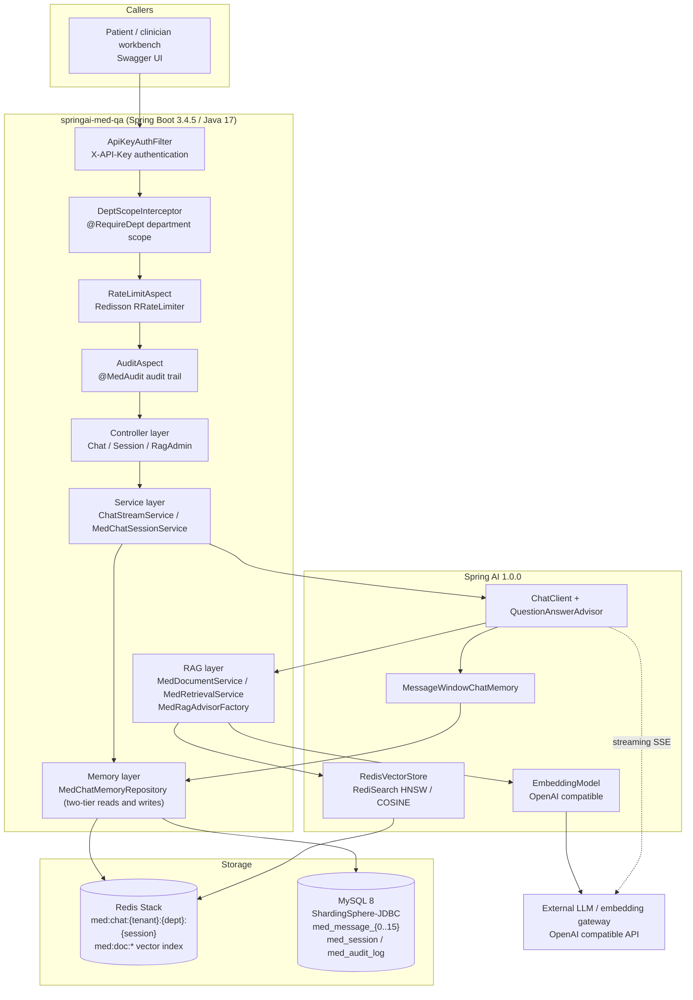

# springai-med-qa

<div align="center">

[](https://github.com/xxinjie21/springai-med-qa/actions/workflows/ci.yml)
[](https://github.com/xxinjie21/springai-med-qa/actions/workflows/docker-publish.yml)
[](https://github.com/xxinjie21/springai-med-qa/pkgs/container/springai-med-qa)
[](https://openjdk.org/)
[](https://spring.io/projects/spring-boot)
[](https://spring.io/projects/spring-ai)
[](./LICENSE)

A hospital-grade AI consultation backend built on **Spring Boot 3 + Spring AI**.

**English** ｜ [简体中文](./README.md)

</div>

> The "front-end business system" for medical AI question answering plus distributed conversation
> memory. The storage contract, field definitions and serialization protocol are strictly aligned
> with [`med-langchain-memory`](https://github.com/xxinjie21/med-langchain-memory) (the Python
> middleware), so the two repositories can read and migrate each other's data even though the code
> bases are completely independent and share zero dependencies.

---

## Table of contents

- [What this service is](#what-this-service-is)
- [Architecture](#architecture)
- [Tech stack and component choices](#tech-stack-and-component-choices)
- [Module layout](#module-layout)
- [Unified storage contract](#unified-storage-contract)
- [API surface](#api-surface)
- [Error codes](#error-codes)
- [Environment variables](#environment-variables)
- [Quick start](#quick-start)
- [Testing and coverage](#testing-and-coverage)
- [Alerting](#alerting)
- [CI/CD](#cicd)
- [Deployment](#deployment)
- [Roadmap progress](#roadmap-progress)
- [License](#license)

---

## What this service is

| Dimension | Description |
|---|---|
| Role | AI consultation backend (a working system for patients and clinicians) |
| Storage foundation | The shared medical conversation storage contract (Redis keys, 16 MySQL shards, Protobuf) |
| Capabilities | SSE streaming consultation, RAG over medical knowledge, patient ownership and department scoping, operation audit trail, privacy masking, rate limiting |
| Engineering principle | **Use mature commercial or mainstream open-source components** instead of rebuilding primitives |

---

## Architecture



**What happens on a request**

1. Authentication (`ApiKeyAuthFilter`) then department scope (`@RequireDept`) then rate limiting
   (`@RateLimit`) then auditing (`@MedAudit`): all four cross-cutting concerns are carried by
   framework mechanisms (a servlet filter, a handler interceptor, AOP) rather than hand-written code.
2. A consultation turn goes through `ChatClient` plus `QuestionAnswerAdvisor`; the context is
   supplied by `MessageWindowChatMemory`, whose short-term window is persisted through a custom
   `ChatMemoryRepository` into the two-tier store.
3. RAG performs vector similarity search with three metadata TAG filters
   (`tenant_id`, `dept_id`, `patient_id`) and **never parses or extracts entities from text**.
4. MySQL is the source of truth and Redis is a cache window: a failed cache read degrades to a miss
   (falling back to MySQL), while a failed cache write or delete is propagated.

---

## Tech stack and component choices

| Capability | Component | Notes |
|---|---|---|
| Base framework | Spring Boot 3.4.5 | Web, IoC, AOP, graceful shutdown |
| Model calls and streaming | Spring AI 1.0.0 | `ChatClient`, SSE streaming, `EmbeddingModel` |
| Vector store and RAG | Spring AI `RedisVectorStore` + `QuestionAnswerAdvisor` | HNSW with COSINE similarity, metadata TAG filtering |
| MySQL sharding | ShardingSphere-JDBC 5.5.2 | Only the `crc32(session_id) % 16` algorithm plugin is ours; routing belongs to the framework |
| Distributed lock and rate limiting | Redisson 3.45.1 (`RLock` / `RRateLimiter`) | Session lock with watchdog renewal, annotation-driven rate limiting |
| ORM and migrations | MyBatis 3.0.4 + Flyway | Data access and versioned DDL (V1 to V3) |
| Serialization | Protobuf 4.29.3 | Cross-language conversation protocol, stored as binary |
| Masking | Hutool `DesensitizedUtil` 5.8.37 | ID card, phone number and medical record number masking triggered by a Jackson annotation |
| API documentation | SpringDoc OpenAPI 2.8.5 | Swagger UI with chat, session and rag groups |
| Health checks | Spring Boot Actuator | `/actuator/health` with per-component MySQL and Redis probes, `/actuator/info` version matrix, Kubernetes liveness and readiness probe groups |
| Metrics and alerting | Micrometer, Prometheus, Alertmanager | `/actuator/prometheus` scrape endpoint; `com.med.qa.alert` pushes alerts to the log and to `med_qa_alert_total`, with rules and routing under `deploy/` |
| Testing | JUnit 5, Mockito, H2, Testcontainers | The unit suite is fully offline; integration tests skip themselves when Docker is unavailable |
| Coverage | JaCoCo 0.8.13 | Bound to `verify`; the report is a CI artifact and the `check` gate fails the build below the thresholds |

---

## Module layout

```
src/main/java/com/med/qa/
├── common/            # ApiResult/PageResult, ErrorCode/BizException, global exception handling
│   └── ratelimit/     # @RateLimit annotation plus the Redisson RRateLimiter aspect
├── config/            # Redis, Redisson, VectorStore, Embedding, ChatMemory, Security, OpenAPI wiring
├── domain/            # ChatMessageDO/ChatSessionDO/AuditLogDO plus RoleType/SessionStatus/AuditOutcome
├── memory/            # Official ChatMemory repository bridge, two-tier reads/writes, cache, lock, shard algorithm, Protobuf codec
├── rag/               # Document ingestion, tag-filtered retrieval, QuestionAnswerAdvisor factory
├── mapper/            # MyBatis mappers over the ShardingSphere data source plus type handlers
├── service/           # ChatStreamService / MedChatSessionService / AuditService
├── security/          # ApiKeyAuthFilter, PatientAccessGuard, @RequireDept department authorization
├── audit/             # @MedAudit annotation, AOP aspect, audit persistence
├── privacy/           # @Desensitize annotation, Jackson serializer, MaskType
├── actuator/          # MedStorageHealthIndicator plus MedComponentInfoContributor
├── alert/             # Alert chain: storage monitor, policy and deduplication, log and Micrometer sinks
├── controller/        # REST and SSE endpoints plus DTOs
└── MedQaApplication.java

src/main/resources/
├── application.yml             # Shared configuration with every environment placeholder
├── application-dev.yml / -prod.yml
├── sharding/med-sharding.yaml  # ShardingSphere rules (SHARDING plus SINGLE)
├── mapper/*.xml                # MyBatis SQL
├── db/migration/               # Flyway V1 to V3 DDL
└── META-INF/services/...       # Shard algorithm SPI registration

docs/                            # Deployment handbook
docker/mysql/init/               # Compose MySQL init script (database plus least-privilege account)
deploy/prometheus/               # Prometheus scrape config and alert rules
deploy/alertmanager/             # Alertmanager routing and inhibition rules
scripts/verify-docker-build.sh   # Real container build verification
```

---

## Unified storage contract

| Item | Rule |
|---|---|
| Redis key | `med:chat:{tenant}:{dept}:{session}` |
| MySQL shard | `med_message_{crc32(session_id) % 16}` (16 physical tables) |
| Message fields | `message_id(UUIDv7)`, `session_id`, `tenant_id`, `dept_id`, `patient_id`, `role`, `content`, `token_count`, `masked`, `created_at(epoch millis)`, `metadata` |
| Role enum | `PATIENT=0` / `DOCTOR=1` / `ASSISTANT=2` / `SYSTEM=3` |
| Serialization | Protobuf (`med_session.proto`, the cross-language protocol) in storage; JSON for API DTOs |

Both systems therefore write interoperable data: identical fields, keys, shard routing and encoding.

---

## API surface

Every endpoint requires the `X-API-Key` header (configurable through `MED_SECURITY_HEADER`).
Swagger UI: `http://localhost:8080/swagger-ui.html`. OpenAPI document: `/v3/api-docs`.

| Method | Path | Purpose | Notes |
|---|---|---|---|
| `POST` | `/api/chat/stream` | SSE streaming consultation (`text/event-stream`) | `@RateLimit` plus department-scoped RAG |
| `POST` | `/api/sessions` | Create a consultation session | `@RateLimit` |
| `GET` | `/api/sessions/{sessionId}` | Read one session | Patients may only read their own |
| `POST` | `/api/sessions/{sessionId}/close` | Close a session (idempotent) | |
| `POST` | `/api/sessions/{sessionId}/archive` | Archive a session (idempotent) | An archived session can no longer be closed |
| `GET` | `/api/sessions` | Paged session listing | `tenantId`, `deptId`, `patientId`, `page`, `size` |
| `POST` | `/api/rag/documents/ingest` | Batch ingestion of medical documents | `@RateLimit`, staff only |
| `POST` | `/api/rag/documents/delete` | Delete by id list or by isolation scope | |
| `POST` | `/api/rag/documents/search` | Tag-scoped retrieval preview | Passes through `topK`, `threshold`, `includeShared` |
| `GET` | `/actuator/health` | Health check | Container and orchestrator probes |
| `GET` | `/actuator/prometheus` | Prometheus metrics | Scrape endpoint of the monitoring stack |

Unified response envelope:

```json
{ "code": 0, "message": "success", "data": { } }
```

Department-level documents use the reserved `patient_id` value `__shared__`; a patient query filters
with `patient_id IN [patient, __shared__]`, while tenant and department are equality conditions
combined with AND.

#### Identifier escaping (D36)

RediSearch's `TAG` query grammar reserves a set of characters (`-`, `.`, `:` and others), and the
official `RedisFilterExpressionConverter` writes the values it receives into the query **verbatim**.
`MedRetrievalFilters` therefore passes every tag value through `escapeTagValue`: reserved characters
get a backslash, so `patient-1` becomes `patient\-1`.

This is not optional. D36 measured two symptoms against a real Redis Stack:

| Case | Result without escaping |
|---|---|
| Equality filter `tenant_id == tenant-rag-a` | Redis rejects the query: `Syntax error at offset 24 near a`, so every retrieval in that department fails |
| `IN` filter `patient_id IN [patient-rag-1, __shared__]` | **No error at all**, but only `__shared__` comes back: the patient's own record is silently dropped and the answer rests on department guidelines alone |

Escaping applies to the **query** only. The metadata written into the index keeps the raw identifier,
and the `MedRetrievalFilters.matches` fallback check still compares raw values — the escaping lives
exactly at the query-syntax boundary. An identifier made of letters, digits and `_` escapes to
itself, so the common case produces a byte-identical query.

---

## Error codes

| Code | Meaning | Typical situation |
|---|---|---|
| `0` | Success | |
| `40000` | Validation failed | Missing identity triple, `topK` out of range |
| `40100` | Unauthenticated | Missing or invalid `X-API-Key` |
| `40300` | Forbidden | Patient reading another patient's session, cross-department access |
| `40400` | Not found | Unknown session |
| `40500` | Method not allowed | |
| `40900` | Session lock held | Concurrent writes to one session, retry shortly |
| `42900` | Rate limited | Redisson `RRateLimiter` bucket exhausted |
| `50000` | Internal error | |
| `50201` | LLM or embedding service unavailable | Model gateway timeout or error |
| `50301` | Storage unavailable | MySQL or Redis failure |

> Failure semantics are layered: `IllegalArgumentException` means a programming error by the caller,
> while `BizException` (carrying an `ErrorCode`) means a business error. A cache read degrades to a
> miss because MySQL is the source of truth; the lock and the rate limiter never degrade silently.

---

## Environment variables

| Variable | Default | Purpose |
|---|---|---|
| `SPRING_PROFILES_ACTIVE` | `dev` | Active profile (`dev` or `prod`) |
| `SERVER_PORT` | `8080` | HTTP port |
| `REDIS_HOST` / `REDIS_PORT` / `REDIS_DATABASE` | `localhost` / `6379` / `0` | Shared by cache, lock, rate limiter and vector index |
| `MED_MYSQL_HOST` / `MED_MYSQL_PORT` / `MED_MYSQL_DATABASE` | `127.0.0.1` / `3306` / `med_qa` | ShardingSphere data source and the Flyway migration target (one set of coordinates) |
| `MED_MYSQL_USERNAME` / `MED_MYSQL_PASSWORD` | `med_qa` / `med_qa` | Application account and migration account |
| `MED_MIGRATION_URL` | empty | Optional: replaces the assembled JDBC URL entirely |
| `MED_MIGRATION_LOCATIONS` | `classpath:db/migration` | Flyway migration locations |
| `OPENAI_BASE_URL` / `OPENAI_API_KEY` | `https://api.openai.com` / empty | Any OpenAI-compatible gateway |
| `MED_EMBEDDING_MODEL` / `MED_EMBEDDING_DIMENSIONS` | `text-embedding-3-small` / `1536` | Must match the index vector width |
| `MED_SECURITY_ENABLED` / `MED_SECURITY_REQUIRE_AUTH` | `true` / `true` | API key authentication switches |
| `MED_SECURITY_DEPT_SCOPE_ENABLED` | `true` | Department annotation authorization switch |
| `MED_SECURITY_HEADER` | `X-API-Key` | Authentication header |
| `MED_RATE_LIMIT_ENABLED` | `true` | Rate limiting switch (set to `false` for offline tests) |
| `MED_AUDIT_ENABLED` | `true` | Audit persistence switch |
| `MED_CACHE_TTL` / `MED_CACHE_MAX_MESSAGES` | `30m` / `200` | Conversation cache window |
| `MED_CHAT_MAX_MESSAGES` | `20` | Short-term memory window |
| `MED_CHAT_STREAM_HEARTBEAT` / `MED_CHAT_STREAM_TIMEOUT` | `15` / `120` | SSE heartbeat and timeout in seconds |
| `MED_LOCK_WAIT_TIME` / `MED_LOCK_LEASE_TIME` / `MED_LOCK_WATCHDOG_TIMEOUT` | `3s` / `0s` / `30s` | Session lock (a lease of `0` hands renewal to the watchdog) |
| `MED_RAG_INDEX_NAME` / `MED_RAG_KEY_PREFIX` | `med-doc-index` / `med:doc:` | Vector index |
| `MED_RAG_TOP_K` / `MED_RAG_MAX_TOP_K` / `MED_RAG_SIMILARITY_THRESHOLD` | `4` / `50` / `0.0` | Retrieval parameters |
| `MED_RAG_INGEST_BATCH_SIZE` / `MED_RAG_INGEST_MAX_DOCUMENTS` | `25` / `500` | Ingestion limits |
| `MED_RAG_INDEX_ENABLED` | `true` | Vector-index health probe switch (a non-Redis-Stack deployment must set `false`) |
| `MED_RAG_INDEX_CHECK_INTERVAL` / `MED_RAG_INDEX_INITIAL_DELAY` | `5m` / `1m` | Index probe period and startup grace period |
| `MED_ALERT_ENABLED` | `true` | Master switch of the alert chain (no alert bean exists when `false`) |
| `MED_ALERT_CHECK_INTERVAL` / `MED_ALERT_INITIAL_DELAY` | `60s` / `30s` | Storage probe period and startup grace period |
| `MED_ALERT_COOLDOWN` | `10m` | Suppression window per `code:component` fingerprint (`0` disables deduplication) |
| `MED_ALERT_MINIMUM_SEVERITY` | `INFO` | Severity floor (raise to `WARNING` to silence recovery notices) |
| `MED_ALERT_KEY_PREFIX` | `med:alert:` | Redis namespace of the deduplication map |

The full operational reference lives in the [deployment handbook](./docs/DEPLOYMENT.md).

---

## Quick start

### Option 1: the whole stack with Docker Compose (recommended)

```bash
# One command brings up mysql, redis-stack and the application, which starts only after both
# dependencies report healthy.
docker compose up -d

# Follow the startup log
docker compose logs -f app

# Verify
curl http://localhost:8080/actuator/health
open http://localhost:8080/swagger-ui.html
```

> Compose disables authentication and rate limiting by default (`MED_SECURITY_ENABLED=false` and
> friends) so the stack runs out of the box. For production, follow the deployment handbook.

### Option 2: local Maven development

```bash
# The bundled Maven Wrapper means no Maven installation is required; JDK 17 or newer.
./mvnw clean verify          # compile, full unit suite, JaCoCo coverage

# Start only Redis Stack (cache and vector index) and use a local MySQL
docker compose up -d redis-stack

# Run the application
./mvnw spring-boot:run
```

> The unit suite uses H2 and Mockito doubles, so it is green without any middleware; Testcontainers
> integration tests skip themselves when no Docker daemon is running.

### First requests (optional)

```bash
# 1) Create a session
curl -X POST http://localhost:8080/api/sessions \
  -H 'Content-Type: application/json' \
  -d '{"tenantId":"t-1001","deptId":"dept-cardio","patientId":"pat-7731","title":"Hypertension follow-up"}'

# 2) Streaming consultation over SSE
curl -N -X POST http://localhost:8080/api/chat/stream \
  -H 'Content-Type: application/json' \
  -d '{"tenant":"t-1001","dept":"dept-cardio","session":"sess-9f2c1a","patientId":"pat-7731","message":"Can I take ibuprofen while on an ACE inhibitor?"}'
```

---

## Testing and coverage

| Item | Description |
|---|---|
| Unit tests | JUnit 5 and Mockito; every external dependency is mocked or replaced by H2, so `mvn test` is offline and green |
| Build contract tests | Parse `pom.xml`, `Dockerfile`, `docker-compose.yml` and `.github/workflows/*.yml` and assert the key contracts |
| Integration tests | `src/test/java/com/med/qa/integration`: Testcontainers boots a real MySQL and Redis Stack to exercise the storage and lock chain (D30) and the RAG tag-filtered retrieval chain (D36) |
| Integration skip switch | Without Docker the class is disabled by default (a local convenience); once Docker is declared mandatory the same condition becomes a hard failure, see below |
| Coverage | JaCoCo is bound to `verify`; the report lands in `target/site/jacoco/index.html` |
| Coverage gate | The `jacoco-coverage-gate` execution (bound to `verify`, `haltOnFailure`) enforces instructions at 90 percent or more, branches at 80 percent or more and lines at 90 percent or more, with the floors declared as `jacoco.min.*` properties; falling below fails the build so CI cannot merge it |

```bash
./mvnw clean verify          # full unit suite, coverage report and the gate
./mvnw clean test            # unit tests only, without the gate
./mvnw test -Dtest='com.med.qa.integration.*IntegrationTest' -DfailIfNoTests=true   # integration tests only
```

### The "no silent skip" switch for integration tests (D35)

The integration suite used to be able to disable itself quietly. When the Docker probe answered
false, `DockerAvailableCondition` reported the whole class as skipped, the build stayed green, and
the real-middleware assertions never ran once. That is exactly how the two defects found in D34 -
both of which stopped the service from starting in any environment - survived every single build.

Skipping is therefore now an explicit decision: it is only allowed while nobody declares Docker
mandatory.

| Switch | Form | Default | Meaning |
|---|---|---|---|
| `med.test.integration.required` | JVM system property, highest precedence | unset | `-Dmed.test.integration.required=true` declares Docker mandatory |
| `MED_TEST_INTEGRATION_REQUIRED` | Environment variable | unset | The CI integration stage sets this |

The truthy values are `true`, `1`, `yes` and `on`, case-insensitive. A system property, once present,
outranks the environment variable, so a developer can force
`-Dmed.test.integration.required=false` to go back to the skippable behaviour. When Docker is
declared mandatory and is unavailable, the integration test raises an `IllegalStateException` from its
`@BeforeAll` naming that switch, instead of reporting itself skipped.

The build contracts guarded by the gate are themselves covered:
`com.med.qa.ci.CoverageGateConfigTest` parses `pom.xml` with DOM and asserts that the gate exists,
is bound to `verify`, and takes all three counter floors from properties within `[0,1]`.
`com.med.qa.ci.CiIntegrationStageConfigTest` parses `.github/workflows/ci.yml` and asserts that the
integration stage exists, exports the mandatory switch, narrows `-Dtest` while enabling
`failIfNoSpecifiedTests` and `failIfNoTests`, keeps the image layer cache key in step with the image
coordinates, and leaves no `continue-on-error` escape hatch anywhere in the workflow.

### Real-middleware verification of RAG tag retrieval (D36)

`MedRagRetrievalIntegrationTest` boots a real Redis Stack with Testcontainers and wires the whole RAG
chain onto it: the official `RedisVectorStore` built by `VectorStoreConfig.buildVectorStore`, the
index its `FT.CREATE` creates, the JSON documents written into Redis, the `TAG` filters translated by
the official store, and the official `QuestionAnswerAdvisor` assembled by `MedRagAdvisorFactory`. The
assertions cover department/patient tag filtering, tenant isolation, cross-department isolation, the
rule that a department-wide query returns guidelines and never a chart, that `QuestionAnswerAdvisor`
injects only in-scope evidence into the prompt, and the boundary of `deleteByScope`.

The one collaborator replaced by a double is the embedding gateway
(`DeterministicEmbeddingModel`): the real `EmbeddingModel` is an HTTP client for an external model
API, which a test can neither authenticate nor make reproducible. The double performs the single
transformation the gateway performs - text to vector. Similarity scoring, Top-K selection, ranking
and filter evaluation all still happen inside Redis Stack, so the retrieval behaviour itself remains
genuinely verified.

The suite found the tag-escaping defect above on the day it landed: its identifiers contain hyphens
(`dept-cardio`, `patient-rag-1`), whereas every earlier offline test used identifiers such as `hosp1`
and `p9001`, which happen to avoid RediSearch's reserved characters entirely.

### Vector-index health and schema-drift detection (D37)

D36 proved the RAG chain **can** work against a real Redis Stack. Nothing answered the next question:
is it **still** working? `MedStorageHealthIndicator` only answers "is Redis reachable", and that is not
the same question — the gap between the two is exactly where the retrieval layer fails without
raising anything:

| Situation | Symptom | What the clinician sees |
|---|---|---|
| The index is absent (dropped by hand, or `FT.CREATE` never succeeded because the instance is not a Redis Stack build) | HTTP 200, nothing retrieved | An answer assembled from the model's own knowledge |
| The index exists but its TAG schema drifted from the configuration (a field was renamed or added after the index was created) | HTTP 200, the filter expression matches no document | The same |

Neither throws, so no connectivity probe can ever notice them. `MedVectorIndexProbe` reads the
index's **existence, document count, scanned prefixes and TAG fields** through the official Jedis
`FT.LIST` / `FT.INFO` commands — metadata only, no vector or search computation — and
`MedVectorIndexHealthIndicator` turns it into an explicit health component:

| `reason` | Raised when |
|---|---|
| `index-missing` | `FT.LIST` does not report the index |
| `schema-drift` | the index exists but does not declare one of `med.rag.index.expected-tag-fields` |
| `unreachable` | the probe itself threw, so no verdict could be reached |

`MedVectorIndexAlertMonitor` pushes the transitions through the existing `MedAlertNotifier` chain:
degradation as `WARNING` (consultations still work, only the evidence shrinks — it must not page),
recovery as `INFO`, a throwing probe as `CRITICAL`. The Prometheus rule `MedQaRagIndexDegraded`
consumes `med_qa_alert_total{code="rag-index-degraded"}`.

> `med.rag.index.expected-tag-fields` must stay in step with the `TAG` entries of
> `med.rag.vector-store.metadata-fields` — the probe can only detect the drift it is told to look for.
> A deployment running the cache on a plain Redis build must set `MED_RAG_INDEX_ENABLED=false`: on such
> a deployment the RAG layer genuinely cannot work, and the probe would honestly report the pod as
> unhealthy.

`MedVectorIndexProbeIntegrationTest` verifies against a real Redis Stack that the probe reads back the
very index the official `RedisVectorStore` created (TAG fields, prefix, and a document count that
tracks ingestion), and that dropping the index with `FT.DROPINDEX` flips the verdict to
`index-missing` instead of raising. There is a second reason that suite exists: `FT.INFO`'s nested
structures come back from Jedis 5.x as **flat alternating lists**, not maps, so a hand-written offline
reply cannot prove the decoder matches the real client — and if the two ever diverge, every index reads
as "zero TAG fields", which is indistinguishable from the drift the probe is meant to catch.

### Controlled index rebuild (D38)

D37 makes a broken index **visible**. It does not make it **repairable**. Both failures it detects —
the index is absent, or its TAG schema drifted — have the same repair: drop the index and recreate it
from the current configuration. Until this iteration that meant an operator typing `FT.DROPINDEX` into
a production Redis by hand, with no mutual exclusion (two operators, or an operator and a cron job,
both dropping), no check that the new index actually works, and no record of who did it.

`MedVectorIndexRebuilder` turns that into an operation with a mutex, a verification step and a report,
and it reuses the official components rather than re-implementing anything:

| Step | Component reused |
|---|---|
| Mutual exclusion | Redisson `RLock`, key `med:lock:rag:index:rebuild:{index}` (a namespace of its own, distinct from the `med:lock:chat:` session lock) |
| Dropping the index | the official Jedis `FT.DROPINDEX` / `FT.DROPINDEX … DD` |
| Recreating the schema | `RedisVectorStore#afterPropertiesSet()` — the official lifecycle hook, which issues `FT.CREATE` from `med.rag.vector-store.*`; there is no hand-written `FT.CREATE` anywhere in this project |
| Writing the corpus back | `MedDocumentService.ingestAll`, i.e. the ordinary ingestion path, so embedding and tagging are identical |
| Acceptance | `MedVectorIndexProbe` — success is the same "can it still answer a scoped query" test `/actuator/health` uses |

Two modes, and the safe one is the default:

| Mode | Action | Purpose |
|---|---|---|
| `INDEX_ONLY` (default) | `FT.DROPINDEX`, documents **kept** | Repairing schema drift. RediSearch re-indexes every existing JSON document under the prefix when the index is recreated, so **not a single document is lost and not a single embedding call is made** |
| `DROP_AND_REINGEST` | `FT.DROPINDEX … DD`, documents deleted, then a caller-supplied corpus is written back | A corrupted or superseded corpus. **Destructive**, so it needs two switches: the request must ask for the mode explicitly, and the deployment must set `MED_RAG_INDEX_REBUILD_ALLOW_DELETE=true` |

The rebuild is **off by default** (`MED_RAG_INDEX_REBUILD_ENABLED` defaults to `false`) — the opposite
of every other RAG switch here. It is the only code path in the service that can drop a search index
and the only one that can delete indexed documents, so a misconfigured deployment should have no such
path at all rather than a guarded one. `allow-document-deletion` is a **second, independent key**:
enabling the rebuild is the routine repair of a drifted index, authorising the deletion of the whole
corpus is not, and whoever can trigger a rebuild must not acquire the second permission through the
first.

The outcome comes back as a `MedIndexRebuildReport` (`outcome` is one of `completed`,
`verification-failed`, `failed`, `skipped-lock-held` or `refused`, carrying `documentsBefore →
documentsAfter`, documents written back, batches and duration) and is pushed through the existing
`MedAlertNotifier` chain: `INFO` on success, `WARNING` when it was skipped or refused, `CRITICAL` on
failure — a failed rebuild can leave the index gone or empty, which is worse than the drift it was
repairing, so that rule pages. The Prometheus rule `MedQaRagIndexRebuildFailed` consumes
`med_qa_alert_total{code="rag-index-rebuild-failed"}`. Every stage and every batch publishes a
`MedIndexRebuildProgress` snapshot (`currentProgress()`) carrying counts and stage names only, so it
is safe to log.

> The rebuild is deliberately **not exposed over HTTP**: writing the corpus back needs the corpus, and
> the corpus does not live in this service's database — the documents exist only in the vector index,
> which is the very thing being dropped. How to trigger it is the caller's decision and an endpoint
> belongs to a later iteration; that also avoids widening the attack surface of `RagAdminController`
> before its authorisation boundary is repaired.

`MedIndexRebuildIntegrationTest` verifies against a real Redis Stack the half a mock cannot prove:
after `FT.DROPINDEX` (without `DD`) an `INDEX_ONLY` rebuild leaves the documents in Redis, `FT.CREATE`
re-indexes all of them, and tag-scoped retrieval answers the same query again; after
`DROP_AND_REINGEST` the old document keys are really gone and the new corpus is retrievable; and while
another Redisson client holds the mutex the rebuild returns `skipped-lock-held` without changing a
single byte of the index.

---

## Alerting

Actuator only answers when somebody asks, which is not good enough for a hospital backend. The
`com.med.qa.alert` package adds the push side:

```
MedStorageAlertMonitor  (scheduled poll of the existing MedStorageHealthIndicator)
        -> MedAlertNotifier  (policy filtering plus Redisson TTL-map deduplication)
                -> LoggingMedAlertSink   writes a structured key=value line to the application log
                -> MetricsMedAlertSink   increments med_qa_alert_total (Micrometer)
```

- **Policy** lives in `med.alert.*`: master switch, polling interval, suppression window, severity
  floor and muted codes, all overridable through the environment.
- **Deduplication** keys on the `code:component` fingerprint in `med:alert:dedupe`, a Redisson
  `RMapCache` whose TTL equals the cooldown, so every replica shares one suppression window and a
  single outage pages once instead of once per pod.
- **Fail-open**: if the deduplication store is unreachable the alert is dispatched anyway, because an
  unreachable Redis is itself one of the conditions this chain reports.
- **Recovery notices**: a component that answers again raises an `INFO` alert, so an engineer joining
  mid-incident can tell "still broken" from "fixed twenty minutes ago".

An optional monitoring stack sits behind the `observability` Compose profile and is not started by a
plain `docker compose up -d`:

```bash
docker compose --profile observability up -d
# Prometheus UI:   http://localhost:9090
# Alertmanager UI: http://localhost:9093
```

| File | Purpose |
|---|---|
| `deploy/prometheus/prometheus.yml` | Scrapes `app:8080/actuator/prometheus` every 15 seconds, loads the rules and points at Alertmanager |
| `deploy/prometheus/med-qa-alerts.yml` | `MedQaTargetDown`, `MedQaStorageUnavailable`, `MedQaStorageProbeFailed`, `MedQaAlertStorm`, `MedQaHighServerErrorRate`, `MedQaConsultationLatencyHigh`, `MedQaRateLimitStorm` |
| `deploy/alertmanager/alertmanager.yml` | Groups by `alertname` and `component`, routes `critical` to a dedicated receiver with a shorter repeat interval, and inhibits the symptoms of a wider outage |

> The `webhook_configs.url` values in the Alertmanager config are placeholders: Alertmanager does not
> expand environment variables inside its configuration file, so the real relay endpoint has to be
> substituted at deploy time. Until then alerts remain visible in the Alertmanager UI but are not
> pushed to a phone.

Custom meters: `med_qa_alert_total{severity,code,component}` (counter) and
`med_qa_alert_last_epoch_seconds` (timestamp of the most recent alert, usable for a dead-man's-switch
rule).

---

## CI/CD

| Workflow | Trigger | Action |
|---|---|---|
| `ci.yml`, `verify` job | Push or pull request to `main` | Temurin JDK 17 with Maven caching, then `./mvnw verify`, then uploads the JaCoCo and Surefire reports |
| `ci.yml`, `integration` job | Push or pull request to `main` | Temurin JDK 17 with a middleware image layer cache, then `com.med.qa.integration.*IntegrationTest` only - against a real MySQL 8.0 and Redis Stack - under `MED_TEST_INTEGRATION_REQUIRED=true`; any failure blocks the change |
| `docker-publish.yml` | Push of a `v*` tag or manual `workflow_dispatch` | Multi-stage build inside the container, login to GHCR, push `ghcr.io/xxinjie21/springai-med-qa` |

The integration stage uses three independent locks against the silent skip: (1) the environment
variable turns "no Docker" into a hard failure; (2) a narrowed `-Dtest` plus `failIfNoSpecifiedTests`
and `failIfNoTests` fails the build when a test class is renamed or deleted; (3) the runner is
`ubuntu-latest`, which ships a Docker daemon. The middleware images are archived with `docker save`
and restored with `docker load` through `actions/cache`, and the cache key spells out
`mysql-8.0.36` and `redis-stack-7.4.0-v3` - bumping a tag without bumping the key fails the guard
test.

---

## Deployment

The complete handbook (image acquisition, the full environment variable table, health checks and
alerting, troubleshooting, backup and rollback, security hardening) is
**[`docs/DEPLOYMENT.md`](./docs/DEPLOYMENT.md)**.

**Container build verification**: `scripts/verify-docker-build.sh` runs a real `docker build` and
then asserts the OCI labels, the non-root user, the layered layout and the launcher entrypoint. It
exits cleanly with code 2 when no Docker daemon is available, so it never blocks a pipeline.

**Health components**: besides MySQL and Redis reachability, `/actuator/health` carries
`med-vector-index` (D37) — index existence and TAG field consistency. Its `reason` is one of
`index-missing`, `schema-drift` or `unreachable`; a deployment without Redis Stack removes the
component with `MED_RAG_INDEX_ENABLED=false`.

**Index rebuild**: `MedVectorIndexRebuilder` is only wired when
`MED_RAG_INDEX_REBUILD_ENABLED=true` (off by default). The `INDEX_ONLY` mode drops the index but keeps
its documents and is the recommended repair for schema drift; `DROP_AND_REINGEST` deletes the indexed
documents and additionally requires `MED_RAG_INDEX_REBUILD_ALLOW_DELETE=true`.

---

## Roadmap progress

Delivery follows the phases in [`ROADMAP.md`](./ROADMAP.md), one iteration per day, each closing
the loop of code, unit tests, commit and push:

| Phase | Iterations | Status |
|---|---|---|
| Phase 0, engineering foundation | D1 to D5 | Done |
| Phase 1, conversation memory | D6 to D12 | Done |
| Phase 2, RAG retrieval | D13 to D18 | Done |
| Phase 3, business capabilities | D19 to D26 | Done |
| Phase 4, deployment and wrap-up | D27 to D31 | Done |
| Phase 5, operations hardening | D32 to D33 | Done |
| Phase 6, production startup and real middleware | D34 to D36 | Done (D34 migration chain, D35 CI integration stage, D36 RAG retrieval verification) |
| Phase 7, RAG index operations and retrieval observability | D37 to D39 | In progress (D37 index health and drift detection and D38 controlled index rebuild done; D39 retrieval-quality regression baseline planned) |

---

## License

[MIT](./LICENSE)
