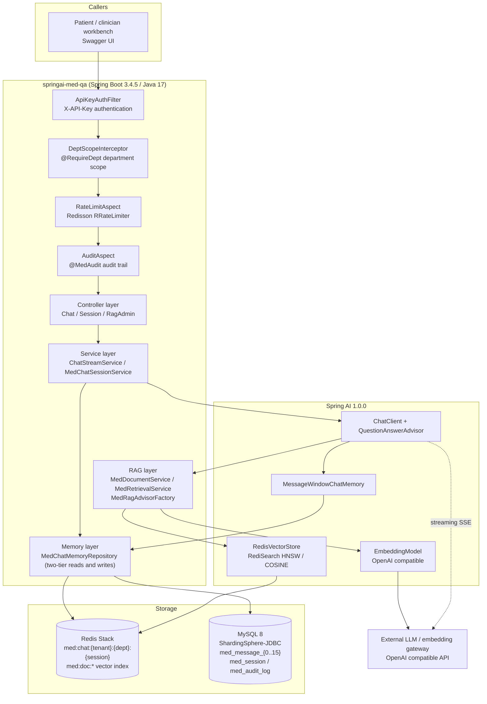

# springai-med-qa

<div align="center">

[](https://github.com/xxinjie21/springai-med-qa/actions/workflows/ci.yml)
[](https://github.com/xxinjie21/springai-med-qa/actions/workflows/docker-publish.yml)
[](https://github.com/xxinjie21/springai-med-qa/pkgs/container/springai-med-qa)
[](https://openjdk.org/)
[](https://spring.io/projects/spring-boot)
[](https://spring.io/projects/spring-ai)
[](./LICENSE)

A hospital-grade AI consultation backend built on **Spring Boot 3 + Spring AI**.

**English** ｜ [简体中文](./README.md)

</div>

> The "front-end business system" for medical AI question answering plus distributed conversation
> memory. The storage contract, field definitions and serialization protocol are strictly aligned
> with [`med-langchain-memory`](https://github.com/xxinjie21/med-langchain-memory) (the Python
> middleware), so the two repositories can read and migrate each other's data even though the code
> bases are completely independent and share zero dependencies.

---

## Table of contents

- [What this service is](#what-this-service-is)
- [Architecture](#architecture)
- [Tech stack and component choices](#tech-stack-and-component-choices)
- [Module layout](#module-layout)
- [Unified storage contract](#unified-storage-contract)
- [API surface](#api-surface)
- [Error codes](#error-codes)
- [Environment variables](#environment-variables)
- [Quick start](#quick-start)
- [Testing and coverage](#testing-and-coverage)
- [Alerting](#alerting)
- [CI/CD](#cicd)
- [Deployment](#deployment)
- [Roadmap progress](#roadmap-progress)
- [License](#license)

---

## What this service is

| Dimension | Description |
|---|---|
| Role | AI consultation backend (a working system for patients and clinicians) |
| Storage foundation | The shared medical conversation storage contract (Redis keys, 16 MySQL shards, Protobuf) |
| Capabilities | SSE streaming consultation, RAG over medical knowledge, patient ownership and department scoping, operation audit trail, privacy masking, rate limiting |
| Engineering principle | **Use mature commercial or mainstream open-source components** instead of rebuilding primitives |

---

## Architecture


```mermaid
flowchart TB
    subgraph Client["Callers"]
        WEB["Patient / clinician workbench<br/>Swagger UI"]
    end

    subgraph App["springai-med-qa (Spring Boot 3.4.5 / Java 17)"]
        FILTER["ApiKeyAuthFilter<br/>X-API-Key authentication"]
        INTERCEPTOR["DeptScopeInterceptor<br/>@RequireDept department scope"]
        RATELIMIT["RateLimitAspect<br/>Redisson RRateLimiter"]
        AUDIT["AuditAspect<br/>@MedAudit audit trail"]
        CTRL["Controller layer<br/>Chat / Session / RagAdmin"]
        SVC["Service layer<br/>ChatStreamService / MedChatSessionService"]
        MEM["Memory layer<br/>MedChatMemoryRepository (two-tier reads and writes)"]
        RAG["RAG layer<br/>MedDocumentService / MedRetrievalService<br/>MedRagAdvisorFactory"]
    end

    subgraph AI["Spring AI 1.0.0"]
        CC["ChatClient + QuestionAnswerAdvisor"]
        EM["EmbeddingModel<br/>OpenAI compatible"]
        VS["RedisVectorStore<br/>RediSearch HNSW / COSINE"]
        CM["MessageWindowChatMemory"]
    end

    subgraph Store["Storage"]
        REDIS[("Redis Stack<br/>med:chat:{tenant}:{dept}:{session}<br/>med:doc:* vector index")]
        MYSQL[("MySQL 8<br/>ShardingSphere-JDBC<br/>med_message_{0..15}<br/>med_session / med_audit_log")]
    end

    LLM["External LLM / embedding gateway<br/>OpenAI compatible API"]

    WEB --> FILTER --> INTERCEPTOR --> RATELIMIT --> AUDIT --> CTRL
    CTRL --> SVC
    SVC --> CC
    SVC --> MEM
    CC --> CM --> MEM
    CC --> RAG
    RAG --> VS
    RAG --> EM --> LLM
    CC -.streaming SSE.-> LLM
    MEM --> REDIS
    MEM --> MYSQL
    VS --> REDIS
```

**What happens on a request**

1. Authentication (`ApiKeyAuthFilter`) then department scope (`@RequireDept`) then rate limiting
   (`@RateLimit`) then auditing (`@MedAudit`): all four cross-cutting concerns are carried by
   framework mechanisms (a servlet filter, a handler interceptor, AOP) rather than hand-written code.
2. A consultation turn goes through `ChatClient` plus `QuestionAnswerAdvisor`; the context is
   supplied by `MessageWindowChatMemory`, whose short-term window is persisted through a custom
   `ChatMemoryRepository` into the two-tier store.
3. RAG performs vector similarity search with three metadata TAG filters
   (`tenant_id`, `dept_id`, `patient_id`) and **never parses or extracts entities from text**.
4. MySQL is the source of truth and Redis is a cache window: a failed cache read degrades to a miss
   (falling back to MySQL), while a failed cache write or delete is propagated.

---

## Tech stack and component choices

| Capability | Component | Notes |
|---|---|---|
| Base framework | Spring Boot 3.4.5 | Web, IoC, AOP, graceful shutdown |
| Model calls and streaming | Spring AI 1.0.0 | `ChatClient`, SSE streaming, `EmbeddingModel` |
| Vector store and RAG | Spring AI `RedisVectorStore` + `QuestionAnswerAdvisor` | HNSW with COSINE similarity, metadata TAG filtering |
| MySQL sharding | ShardingSphere-JDBC 5.5.2 | Only the `crc32(session_id) % 16` algorithm plugin is ours; routing belongs to the framework |
| Distributed lock and rate limiting | Redisson 3.45.1 (`RLock` / `RRateLimiter`) | Session lock with watchdog renewal, annotation-driven rate limiting |
| ORM and migrations | MyBatis 3.0.4 + Flyway | Data access and versioned DDL (V1 to V3) |
| Serialization | Protobuf 4.29.3 | Cross-language conversation protocol, stored as binary |
| Masking | Hutool `DesensitizedUtil` 5.8.37 | ID card, phone number and medical record number masking triggered by a Jackson annotation |
| API documentation | SpringDoc OpenAPI 2.8.5 | Swagger UI with chat, session and rag groups |
| Health checks | Spring Boot Actuator | `/actuator/health` with per-component MySQL and Redis probes, `/actuator/info` version matrix, Kubernetes liveness and readiness probe groups |
| Metrics and alerting | Micrometer, Prometheus, Alertmanager | `/actuator/prometheus` scrape endpoint; `com.med.qa.alert` pushes alerts to the log and to `med_qa_alert_total`, with rules and routing under `deploy/` |
| Testing | JUnit 5, Mockito, H2, Testcontainers | The unit suite is fully offline; integration tests skip themselves when Docker is unavailable |
| Coverage | JaCoCo 0.8.13 | Bound to `verify`; the report is a CI artifact and the `check` gate fails the build below the thresholds |

---

## Module layout

```
src/main/java/com/med/qa/
├── common/            # ApiResult/PageResult, ErrorCode/BizException, global exception handling
│   └── ratelimit/     # @RateLimit annotation plus the Redisson RRateLimiter aspect
├── config/            # Redis, Redisson, VectorStore, Embedding, ChatMemory, Security, OpenAPI wiring
├── domain/            # ChatMessageDO/ChatSessionDO/AuditLogDO plus RoleType/SessionStatus/AuditOutcome
├── memory/            # Official ChatMemory repository bridge, two-tier reads/writes, cache, lock, shard algorithm, Protobuf codec
├── rag/               # Document ingestion, tag-filtered retrieval, QuestionAnswerAdvisor factory
├── mapper/            # MyBatis mappers over the ShardingSphere data source plus type handlers
├── service/           # ChatStreamService / MedChatSessionService / AuditService
├── security/          # ApiKeyAuthFilter, PatientAccessGuard, @RequireDept department authorization
├── audit/             # @MedAudit annotation, AOP aspect, audit persistence
├── privacy/           # @Desensitize annotation, Jackson serializer, MaskType
├── actuator/          # MedStorageHealthIndicator plus MedComponentInfoContributor
├── alert/             # Alert chain: storage monitor, policy and deduplication, log and Micrometer sinks
├── controller/        # REST and SSE endpoints plus DTOs
└── MedQaApplication.java

src/main/resources/
├── application.yml             # Shared configuration with every environment placeholder
├── application-dev.yml / -prod.yml
├── sharding/med-sharding.yaml  # ShardingSphere rules (SHARDING plus SINGLE)
├── mapper/*.xml                # MyBatis SQL
├── db/migration/               # Flyway V1 to V3 DDL
└── META-INF/services/...       # Shard algorithm SPI registration

docs/                            # Deployment handbook
docker/mysql/init/               # Compose MySQL init script (database plus least-privilege account)
deploy/prometheus/               # Prometheus scrape config and alert rules
deploy/alertmanager/             # Alertmanager routing and inhibition rules
scripts/verify-docker-build.sh   # Real container build verification
```

---

## Unified storage contract

| Item | Rule |
|---|---|
| Redis key | `med:chat:{tenant}:{dept}:{session}` |
| MySQL shard | `med_message_{crc32(session_id) % 16}` (16 physical tables) |
| Message fields | `message_id(UUIDv7)`, `session_id`, `tenant_id`, `dept_id`, `patient_id`, `role`, `content`, `token_count`, `masked`, `created_at(epoch millis)`, `metadata` |
| Role enum | `PATIENT=0` / `DOCTOR=1` / `ASSISTANT=2` / `SYSTEM=3` |
| Serialization | Protobuf (`med_session.proto`, the cross-language protocol) in storage; JSON for API DTOs |

Both systems therefore write interoperable data: identical fields, keys, shard routing and encoding.

---

## API surface

Every endpoint requires the `X-API-Key` header (configurable through `MED_SECURITY_HEADER`).
Swagger UI: `http://localhost:8080/swagger-ui.html`. OpenAPI document: `/v3/api-docs`.

| Method | Path | Purpose | Notes |
|---|---|---|---|
| `POST` | `/api/chat/stream` | SSE streaming consultation (`text/event-stream`) | `@RateLimit` plus an identity taken from the API key (D41) |
| `POST` | `/api/sessions` | Create a consultation session | `@RateLimit` |
| `GET` | `/api/sessions/{sessionId}` | Read one session | Patients may only read their own |
| `POST` | `/api/sessions/{sessionId}/close` | Close a session (idempotent) | |
| `POST` | `/api/sessions/{sessionId}/archive` | Archive a session (idempotent) | An archived session can no longer be closed |
| `GET` | `/api/sessions` | Paged session listing | `tenantId`, `deptId`, `patientId`, `page`, `size` |
| `POST` | `/api/rag/documents/ingest` | Batch ingestion of medical documents | `@RateLimit`, staff only, identity taken from the API key (D42) |
| `POST` | `/api/rag/documents/delete` | Delete by isolation scope | Staff only; a department-wide delete needs `confirmDepartmentWide=true` (D42) |
| `POST` | `/api/rag/documents/search` | Tag-scoped retrieval preview | Staff only; forwards `topK`, `threshold` and `includeShared` (D42) |
| `POST` | `/api/rag/documents/search` | Tag-scoped retrieval preview | Passes through `topK`, `threshold`, `includeShared` |
| `GET` | `/actuator/health` | Health check | Container and orchestrator probes |
| `GET` | `/actuator/prometheus` | Prometheus metrics | Scrape endpoint of the monitoring stack |

Unified response envelope:

```json
{ "code": 0, "message": "success", "data": { } }
```

Department-level documents use the reserved `patient_id` value `__shared__`; a patient query filters
with `patient_id IN [patient, __shared__]`, while tenant and department are equality conditions
combined with AND.

#### Identifier escaping (D36)

RediSearch's `TAG` query grammar reserves a set of characters (`-`, `.`, `:` and others), and the
official `RedisFilterExpressionConverter` writes the values it receives into the query **verbatim**.
`MedRetrievalFilters` therefore passes every tag value through `escapeTagValue`: reserved characters
get a backslash, so `patient-1` becomes `patient\-1`.

This is not optional. D36 measured two symptoms against a real Redis Stack:

| Case | Result without escaping |
|---|---|
| Equality filter `tenant_id == tenant-rag-a` | Redis rejects the query: `Syntax error at offset 24 near a`, so every retrieval in that department fails |
| `IN` filter `patient_id IN [patient-rag-1, __shared__]` | **No error at all**, but only `__shared__` comes back: the patient's own record is silently dropped and the answer rests on department guidelines alone |

Escaping applies to the **query** only. The metadata written into the index keeps the raw identifier,
and the `MedRetrievalFilters.matches` fallback check still compares raw values — the escaping lives
exactly at the query-syntax boundary. An identifier made of letters, digits and `_` escapes to
itself, so the common case produces a byte-identical query.

#### Where a streaming consultation gets its identity (D41)

The tenant / department / patient of `POST /api/chat/stream` come from the **authenticated principal,
never from the request body**. `ApiKeyAuthFilter` resolves the API key into a `MedPrincipal`,
`ChatStreamService` builds the session coordinate (`med:chat:{tenant}:{dept}:{session}`) and the RAG
isolation scope from it, and the body's `tenant` / `dept` / `patientId` are demoted to *consistency
claims* checked by `RequestIdentityGuard`:

| Claim in the body | Outcome |
|---|---|
| absent or blank | Accepted. The principal already carries the identity, so a client never has to repeat itself |
| matches the principal (surrounding whitespace ignored) | Accepted; the turn runs in the principal's scope |
| contradicts the principal | **403** (`tenant mismatch` / `department mismatch` / `patient mismatch`) |

The details: STAFF is department-scoped, so it may name any patient of its own department (that is how
a clinician opens a patient's consultation); PATIENT may only name itself, and a patient principal that
carries no patient id at all is refused rather than quietly widened into a department-wide scope. The
outcome collapses into one value object, `MedCallerScope` (the tenant/department/patient triple), from
which both the session coordinate and the RAG isolation scope are built — so the two can never end up
sourced from different identities.

Before the model is reached the endpoint also runs `PatientAccessGuard.assertScope` (scope-level
authorization) and `MedChatSessionService.requireWritableSession` (the session exists, belongs to the
caller and still accepts messages — a closed or archived transcript must never grow). Authorization
runs **before** capability: no refusal ever pays for an LLM call.

Every synchronous failure is answered before the SSE stream opens, with the matching status and a
single `error` event, instead of falling through to the global advice: `403` (identity or ownership),
`404` (unknown session), `400` (missing `session`/`message`, invalid scope combination) and `503` (no
model configured). The reason is practical — a `text/event-stream` response cannot render the advice's
JSON envelope, so letting it through would surface as an opaque content-negotiation error. The
cross-component contract is guarded by `StreamingIdentityContractTest`, which runs the real
API key → principal → controller → service → guards chain and asserts both that a body claiming
someone else's identity is refused and that, when the body claims nothing, the coordinates reaching the
session layer are the **principal's**. That is exactly the class of defect the review found when 1389
single-component tests could not notice that a guard was never called.

**That contract test immediately caught a defect (D41).** `ChatStreamService`'s javadoc promised that a
deployment without a `ChatClient.Builder` is rejected with `LLM_SERVICE_ERROR`, but Spring AI declares
that builder with a **mandatory** `ChatModel` parameter and `ObjectProvider.getIfAvailable()` does not
swallow an instantiation failure — so a deployment with no model received a bean-creation stack trace
and a `500` instead of the documented 503. The fix folds `BeansException` and "returned null" into the
same business error (`resolveChatClientBuilder`). This is precisely the "the comment promises one thing,
the code does another" category the review named, and it is only visible to a test that drives the
**real** `ObjectProvider` — a mock always returns null, which is why 1389 tests never saw it.

#### Where the RAG administration surface gets its scope (D42)

The three `/api/rag/**` endpoints (ingest, delete, search) take their tenant / department / patient
**from the API key as well**. The identity fields in the body are consistency claims checked by the same
`RequestIdentityGuard`: absent means "use the principal's own value", and a contradiction is refused.
Before D42 these endpoints treated the body's scope as authoritative, so any staff key could read, write
and even physically delete another department's vectors just by putting that department's `deptId` in the
JSON — P0-3 of the 2026-09-25 review.

| Change | Why |
|---|---|
| The body's tenant/dept/patient are demoted from authority to claims | Letting the request body decide who sees what is what caused P0-3; the scope can now only come from the authenticated identity |
| Deletion no longer accepts `ids` | The store keys documents by id, the isolation tags live inside the JSON value and RediSearch does not index the key, so "these ids **and** my scope" cannot be expressed as one filter — and a scope-less `VectorStore#delete(List)` can never be made safe. The primitive was removed rather than guarded |
| A department-wide delete must set `confirmDepartmentWide=true` | A department scope takes the department's shared guidelines with it, after which every consultation there answers from a corpus without its protocols. A destructive action has to be confirmed (the same two-switch idea as D38) |
| The controller re-checks the staff role itself | `MED_SECURITY_DEPT_SCOPE_ENABLED=false` removes the `@RequireDept` interceptor while leaving authentication intact; the extra check makes the surface fail closed on its own |

A refusal shows up in two shapes, both deliberate and both pre-existing conventions: a refusal written by
the **interceptor** is a real HTTP `403`, whereas a `BizException` raised **inside the handler** (a
contradicting identity claim, an unconfirmed department-wide delete) follows the project-wide convention
of HTTP `200` with the business code `40300` / `40000` in the `ApiResult` envelope — **the business code
is the authoritative signal, not the status line**.

The cross-component contract is guarded by `RagAdminAuthorizationContractTest`, which runs the real API
key → interceptor → controller → guard → service chain and asserts both that a body claiming someone
else's identity is refused with no service interaction at all, and that when the body claims nothing the
coordinates reaching the services are the **principal's**. Following project convention the guard was
**watched failing first**: restoring "body wins" broke 12 cases across the two test classes.

#### What the durable transcript keeps (D44)

`MessageWindowChatMemory` decides **how many messages the model may see** (`MED_CHAT_MAX_MESSAGES`,
20 by default). It is not the record of the consultation. Yet the write path up to D43 was
"`deleteSession`, then `appendAll`" — and what Spring AI hands to `saveAll` is precisely the **trimmed
window**, so every turn physically deleted the messages that had scrolled out of it: after a
consultation of several dozen turns the database permanently held the last 20, while the repository's own
javadoc called MySQL the "authoritative copy". With two instances serving the same session it was worse
still: two turns deleted each other's messages.

D44 turns "the window is a view, the transcript is the record" into a code fact:

| Tier | What it holds | Bound |
|---|---|---|
| MySQL `med_message_{crc32(session_id)%16}` | the **full transcript**; every turn is only ever added | none |
| Redis `med:chat:{tenant}:{dept}:{session}` | the most recent `MED_CACHE_MAX_MESSAGES` (200 by default) | a bounded cache, re-read from MySQL on a miss |
| `MessageWindowChatMemory` | the most recent `MED_CHAT_MAX_MESSAGES` (20 by default) | bounds the prompt only |

- `ChatMessageMapper.insertIfAbsent` (`INSERT … ON DUPLICATE KEY UPDATE message_id = message_id`)
  deduplicates by primary key: `1` means "inserted", `0` means "already stored". `INSERT IGNORE` was
  rejected because it would also swallow truncation and other constraint failures.
- `MedChatMemoryRepository.saveWindow` only ever appends idempotently — **no code path deletes any more** —
  and then publishes the window it wrote to the Redis cache, so the cache matches what the model sees. A
  cold-cache replay is truncated to `MED_CACHE_MAX_MESSAGES`: MySQL now holds the whole transcript, and an
  untruncated replay would push a long consultation's entire history into the model prompt.
- The write runs under `SessionLockService`'s `RLock` (`med:lock:chat:…`): a second concurrent turn for the
  same session fails fast with `SESSION_LOCKED` instead of interleaving its write.
- **No `@Transactional`, deliberately**: the write is idempotent and Spring AI re-sends the whole window on
  every turn, so a partial batch heals itself on the next turn — whereas refreshing Redis inside a
  transaction that later rolls back would leave a window holding messages the database never accepted,
  the one inconsistency this layer refuses to create. The trade-off is documented on `saveWindow`.

The cross-component contract is guarded by `ChatMemoryWindowIntegrationTest` (offline: a 2-message window
against a 5-message transcript) and by
`MedStorageAndLockIntegrationTest#memoryWindowTrimsButTranscriptKeepsEveryTurn` (real MySQL + Redis Stack:
a 4-message window against 10 rows in the shard). Single-component tests cannot see the difference — the
bridge test only observes the messages handed to the repository, and the repository test never runs the
window.

**That contract test found a second defect on its first run** (D44): `med_message.patient_id` is `NOT NULL`
in the unified storage spec, but the messages Spring AI hands over carry **no project identity at all** —
the patient is not part of the conversation id (`tenant:dept:session`) and the assistant message is built
entirely by the framework. Every turn of every consultation therefore failed to persist with
`Column 'patient_id' cannot be null`: every unit test mocked the mapper and every integration test used
`sampleMessage`, which sets the patient explicitly, so no test ever exercised "a framework message is
stored". The fix resolves the session's patient through `ChatSessionMapper.selectById` before the window is
written (the session is the only authority on who a message belongs to); a patient id carried by the
message itself wins, and an unknown session or a session without a patient refuses the write with
`STORAGE_ERROR` rather than storing an unattributable medical record.

---

## Error codes

| Code | Meaning | Typical situation |
|---|---|---|
| `0` | Success | |
| `40000` | Validation failed | Missing `session` / `message`, `topK` out of range (the identity fields are optional claims, see D41); an unconfirmed department-wide RAG delete (see D42) |
| `40100` | Unauthenticated | Missing or invalid `X-API-Key` |
| `40300` | Forbidden | Patient reading another patient's session, cross-department access, a body identity that contradicts the API key (D41 and D42), or a non-staff call to `/api/rag/**` |
| `40400` | Not found | Unknown session |
| `40500` | Method not allowed | |
| `40900` | Session lock held | Concurrent writes to one session, retry shortly |
| `42900` | Rate limited | Redisson `RRateLimiter` bucket exhausted |
| `50000` | Internal error | |
| `50201` | LLM or embedding service unavailable | Model gateway timeout or error |
| `50301` | Storage unavailable | MySQL or Redis failure |

> Failure semantics are layered: `IllegalArgumentException` means a programming error by the caller,
> while `BizException` (carrying an `ErrorCode`) means a business error. A cache read degrades to a
> miss because MySQL is the source of truth; the lock and the rate limiter never degrade silently.

---

## Environment variables

| Variable | Default | Purpose |
|---|---|---|
| `SPRING_PROFILES_ACTIVE` | `dev` | Active profile (`dev` or `prod`) |
| `SERVER_PORT` | `8080` | HTTP port |
| `REDIS_HOST` / `REDIS_PORT` / `REDIS_DATABASE` | `localhost` / `6379` / `0` | Shared by cache, lock, rate limiter and vector index |
| `MED_MYSQL_HOST` / `MED_MYSQL_PORT` / `MED_MYSQL_DATABASE` | `127.0.0.1` / `3306` / `med_qa` | ShardingSphere data source and the Flyway migration target (one set of coordinates) |
| `MED_MYSQL_USERNAME` / `MED_MYSQL_PASSWORD` | `med_qa` / `med_qa` | Application account and migration account |
| `MED_MIGRATION_URL` | empty | Optional: replaces the assembled JDBC URL entirely |
| `MED_MIGRATION_LOCATIONS` | `classpath:db/migration` | Flyway migration locations |
| `OPENAI_BASE_URL` / `OPENAI_API_KEY` | `https://api.openai.com` / empty | Any OpenAI-compatible gateway |
| `MED_EMBEDDING_MODEL` / `MED_EMBEDDING_DIMENSIONS` | `text-embedding-3-small` / `1536` | Must match the index vector width |
| `MED_SECURITY_ENABLED` / `MED_SECURITY_REQUIRE_AUTH` | `true` / `true` | API key authentication switches |
| `MED_SECURITY_DEPT_SCOPE_ENABLED` | `true` | Department annotation authorization switch |
| `MED_SECURITY_HEADER` | `X-API-Key` | Authentication header |
| `MED_RATE_LIMIT_ENABLED` | `true` | Rate limiting switch (set to `false` for offline tests) |
| `MED_AUDIT_ENABLED` | `true` | Audit persistence switch |
| `MED_CACHE_TTL` / `MED_CACHE_MAX_MESSAGES` | `30m` / `200` | Conversation cache window |
| `MED_CHAT_MAX_MESSAGES` | `20` | Short-term memory window |
| `MED_CHAT_STREAM_HEARTBEAT` / `MED_CHAT_STREAM_TIMEOUT` | `15` / `120` | SSE heartbeat and timeout in seconds |
| `MED_LOCK_WAIT_TIME` / `MED_LOCK_LEASE_TIME` / `MED_LOCK_WATCHDOG_TIMEOUT` | `3s` / `0s` / `30s` | Session lock (a lease of `0` hands renewal to the watchdog) |
| `MED_RAG_INDEX_NAME` / `MED_RAG_KEY_PREFIX` | `med-doc-index` / `med:doc:` | Vector index |
| `MED_RAG_TOP_K` / `MED_RAG_MAX_TOP_K` / `MED_RAG_SIMILARITY_THRESHOLD` | `4` / `50` / `0.0` | Retrieval parameters |
| `MED_RAG_INGEST_BATCH_SIZE` / `MED_RAG_INGEST_MAX_DOCUMENTS` | `25` / `500` | Ingestion limits |
| `MED_RAG_INDEX_ENABLED` | `true` | Vector-index health probe switch (a non-Redis-Stack deployment must set `false`) |
| `MED_RAG_INDEX_CHECK_INTERVAL` / `MED_RAG_INDEX_INITIAL_DELAY` | `5m` / `1m` | Index probe period and startup grace period |
| `MED_ALERT_ENABLED` | `true` | Master switch of the alert chain (no alert bean exists when `false`) |
| `MED_ALERT_CHECK_INTERVAL` / `MED_ALERT_INITIAL_DELAY` | `60s` / `30s` | Storage probe period and startup grace period |
| `MED_ALERT_COOLDOWN` | `10m` | Suppression window per `code:component` fingerprint (`0` disables deduplication) |
| `MED_ALERT_MINIMUM_SEVERITY` | `INFO` | Severity floor (raise to `WARNING` to silence recovery notices) |
| `MED_ALERT_KEY_PREFIX` | `med:alert:` | Redis namespace of the deduplication map |

The full operational reference lives in the [deployment handbook](./docs/DEPLOYMENT.md).

---

## Quick start

### Option 1: the whole stack with Docker Compose (recommended)

```bash
# One command brings up mysql, redis-stack and the application, which starts only after both
# dependencies report healthy.
docker compose up -d

# Follow the startup log
docker compose logs -f app

# Verify
curl http://localhost:8080/actuator/health
open http://localhost:8080/swagger-ui.html
```

> Compose disables authentication and rate limiting by default (`MED_SECURITY_ENABLED=false` and
> friends) so the stack runs out of the box. For production, follow the deployment handbook.

### Option 2: local Maven development

```bash
# The bundled Maven Wrapper means no Maven installation is required; JDK 17 or newer.
./mvnw clean verify          # compile, full unit suite, JaCoCo coverage

# Start only Redis Stack (cache and vector index) and use a local MySQL
docker compose up -d redis-stack

# Run the application
./mvnw spring-boot:run
```

> The unit suite uses H2 and Mockito doubles, so it is green without any middleware; Testcontainers
> integration tests skip themselves when no Docker daemon is running.

### First requests (optional)

```bash
# 1) Create a session
curl -X POST http://localhost:8080/api/sessions \
  -H 'Content-Type: application/json' \
  -d '{"tenantId":"t-1001","deptId":"dept-cardio","patientId":"pat-7731","title":"Hypertension follow-up"}'

# 2) Streaming consultation over SSE
curl -N -X POST http://localhost:8080/api/chat/stream \
  -H 'Content-Type: application/json' \
  -d '{"tenant":"t-1001","dept":"dept-cardio","session":"sess-9f2c1a","patientId":"pat-7731","message":"Can I take ibuprofen while on an ACE inhibitor?"}'
```

---

## Testing and coverage

| Item | Description |
|---|---|
| Unit tests | JUnit 5 and Mockito; every external dependency is mocked or replaced by H2, so `mvn test` is offline and green |
| Build contract tests | Parse `pom.xml`, `Dockerfile`, `docker-compose.yml` and `.github/workflows/*.yml` and assert the key contracts |
| Cross-component contract tests | Assert that the components are really wired to each other, not merely that each works alone: `ApplicationProfileContractTest` binds the effective configuration value across profiles (D40), `StreamingIdentityContractTest` runs the real API key to principal to controller to service to guards chain (D41), `RagAdminAuthorizationContractTest` runs that same chain again over `/api/rag/**` (D42), and `AlertDeliveryContractTest` runs the real probe to health indicator to alert monitor to notifier to sink chain (D43). The 2026-09-25 review traced "1389 green tests missed three P0 defects" to the absence of exactly this layer |
| Integration tests | `src/test/java/com/med/qa/integration`: Testcontainers boots a real MySQL and Redis Stack to exercise the storage and lock chain (D30) and the RAG tag-filtered retrieval chain (D36) |
| Integration skip switch | Without Docker the class is disabled by default (a local convenience); once Docker is declared mandatory the same condition becomes a hard failure, see below |
| Coverage | JaCoCo is bound to `verify`; the report lands in `target/site/jacoco/index.html` |
| Coverage gate | The `jacoco-coverage-gate` execution (bound to `verify`, `haltOnFailure`) enforces instructions at 90 percent or more, branches at 80 percent or more and lines at 90 percent or more, with the floors declared as `jacoco.min.*` properties; falling below fails the build so CI cannot merge it |

```bash
./mvnw clean verify          # full unit suite, coverage report and the gate
./mvnw clean test            # unit tests only, without the gate
./mvnw test -Dtest='com.med.qa.integration.*IntegrationTest' -DfailIfNoTests=true   # integration tests only
```

### The "no silent skip" switch for integration tests (D35)

The integration suite used to be able to disable itself quietly. When the Docker probe answered
false, `DockerAvailableCondition` reported the whole class as skipped, the build stayed green, and
the real-middleware assertions never ran once. That is exactly how the two defects found in D34 -
both of which stopped the service from starting in any environment - survived every single build.

Skipping is therefore now an explicit decision: it is only allowed while nobody declares Docker
mandatory.

| Switch | Form | Default | Meaning |
|---|---|---|---|
| `med.test.integration.required` | JVM system property, highest precedence | unset | `-Dmed.test.integration.required=true` declares Docker mandatory |
| `MED_TEST_INTEGRATION_REQUIRED` | Environment variable | unset | The CI integration stage sets this |

The truthy values are `true`, `1`, `yes` and `on`, case-insensitive. A system property, once present,
outranks the environment variable, so a developer can force
`-Dmed.test.integration.required=false` to go back to the skippable behaviour. When Docker is
declared mandatory and is unavailable, the integration test raises an `IllegalStateException` from its
`@BeforeAll` naming that switch, instead of reporting itself skipped.

The build contracts guarded by the gate are themselves covered:
`com.med.qa.ci.CoverageGateConfigTest` parses `pom.xml` with DOM and asserts that the gate exists,
is bound to `verify`, and takes all three counter floors from properties within `[0,1]`.
`com.med.qa.ci.CiIntegrationStageConfigTest` parses `.github/workflows/ci.yml` and asserts that the
integration stage exists, exports the mandatory switch, narrows `-Dtest` while enabling
`failIfNoSpecifiedTests` and `failIfNoTests`, keeps the image layer cache key in step with the image
coordinates, and leaves no `continue-on-error` escape hatch anywhere in the workflow.

### Real-middleware verification of RAG tag retrieval (D36)

`MedRagRetrievalIntegrationTest` boots a real Redis Stack with Testcontainers and wires the whole RAG
chain onto it: the official `RedisVectorStore` built by `VectorStoreConfig.buildVectorStore`, the
index its `FT.CREATE` creates, the JSON documents written into Redis, the `TAG` filters translated by
the official store, and the official `QuestionAnswerAdvisor` assembled by `MedRagAdvisorFactory`. The
assertions cover department/patient tag filtering, tenant isolation, cross-department isolation, the
rule that a department-wide query returns guidelines and never a chart, that `QuestionAnswerAdvisor`
injects only in-scope evidence into the prompt, and the boundary of `deleteByScope`.

The one collaborator replaced by a double is the embedding gateway
(`DeterministicEmbeddingModel`): the real `EmbeddingModel` is an HTTP client for an external model
API, which a test can neither authenticate nor make reproducible. The double performs the single
transformation the gateway performs - text to vector. Similarity scoring, Top-K selection, ranking
and filter evaluation all still happen inside Redis Stack, so the retrieval behaviour itself remains
genuinely verified.

The suite found the tag-escaping defect above on the day it landed: its identifiers contain hyphens
(`dept-cardio`, `patient-rag-1`), whereas every earlier offline test used identifiers such as `hosp1`
and `p9001`, which happen to avoid RediSearch's reserved characters entirely.

### Vector-index health and schema-drift detection (D37)

D36 proved the RAG chain **can** work against a real Redis Stack. Nothing answered the next question:
is it **still** working? `MedStorageHealthIndicator` only answers "is Redis reachable", and that is not
the same question — the gap between the two is exactly where the retrieval layer fails without
raising anything:

| Situation | Symptom | What the clinician sees |
|---|---|---|
| The index is absent (dropped by hand, or `FT.CREATE` never succeeded because the instance is not a Redis Stack build) | HTTP 200, nothing retrieved | An answer assembled from the model's own knowledge |
| The index exists but its TAG schema drifted from the configuration (a field was renamed or added after the index was created) | HTTP 200, the filter expression matches no document | The same |

Neither throws, so no connectivity probe can ever notice them. `MedVectorIndexProbe` reads the
index's **existence, document count, scanned prefixes and TAG fields** through the official Jedis
`FT.LIST` / `FT.INFO` commands — metadata only, no vector or search computation — and
`MedVectorIndexHealthIndicator` turns it into an explicit health component:

| `reason` | Raised when |
|---|---|
| `index-missing` | `FT.LIST` does not report the index |
| `schema-drift` | the index exists but does not declare one of `med.rag.index.expected-tag-fields` |
| `unreachable` | the probe itself threw, so no verdict could be reached |

`MedVectorIndexAlertMonitor` pushes the transitions through the existing `MedAlertNotifier` chain:
degradation as `WARNING` (consultations still work, only the evidence shrinks — it must not page),
recovery as `INFO`, a throwing probe as `CRITICAL`. The Prometheus rule `MedQaRagIndexDegraded`
consumes `med_qa_alert_total{code="rag-index-degraded"}`.

> `med.rag.index.expected-tag-fields` must stay in step with the `TAG` entries of
> `med.rag.vector-store.metadata-fields` — the probe can only detect the drift it is told to look for.
> A deployment running the cache on a plain Redis build must set `MED_RAG_INDEX_ENABLED=false`: on such
> a deployment the RAG layer genuinely cannot work, and the probe would honestly report the pod as
> unhealthy.

`MedVectorIndexProbeIntegrationTest` verifies against a real Redis Stack that the probe reads back the
very index the official `RedisVectorStore` created (TAG fields, prefix, and a document count that
tracks ingestion), and that dropping the index with `FT.DROPINDEX` flips the verdict to
`index-missing` instead of raising. There is a second reason that suite exists: `FT.INFO`'s nested
structures come back from Jedis 5.x as **flat alternating lists**, not maps, so a hand-written offline
reply cannot prove the decoder matches the real client — and if the two ever diverge, every index reads
as "zero TAG fields", which is indistinguishable from the drift the probe is meant to catch.

### Controlled index rebuild (D38)

D37 makes a broken index **visible**. It does not make it **repairable**. Both failures it detects —
the index is absent, or its TAG schema drifted — have the same repair: drop the index and recreate it
from the current configuration. Until this iteration that meant an operator typing `FT.DROPINDEX` into
a production Redis by hand, with no mutual exclusion (two operators, or an operator and a cron job,
both dropping), no check that the new index actually works, and no record of who did it.

`MedVectorIndexRebuilder` turns that into an operation with a mutex, a verification step and a report,
and it reuses the official components rather than re-implementing anything:

| Step | Component reused |
|---|---|
| Mutual exclusion | Redisson `RLock`, key `med:lock:rag:index:rebuild:{index}` (a namespace of its own, distinct from the `med:lock:chat:` session lock) |
| Dropping the index | the official Jedis `FT.DROPINDEX` / `FT.DROPINDEX … DD` |
| Recreating the schema | `RedisVectorStore#afterPropertiesSet()` — the official lifecycle hook, which issues `FT.CREATE` from `med.rag.vector-store.*`; there is no hand-written `FT.CREATE` anywhere in this project |
| Writing the corpus back | `MedDocumentService.ingestAll`, i.e. the ordinary ingestion path, so embedding and tagging are identical |
| Acceptance | `MedVectorIndexProbe` — success is the same "can it still answer a scoped query" test `/actuator/health` uses |

Two modes, and the safe one is the default:

| Mode | Action | Purpose |
|---|---|---|
| `INDEX_ONLY` (default) | `FT.DROPINDEX`, documents **kept** | Repairing schema drift. RediSearch re-indexes every existing JSON document under the prefix when the index is recreated, so **not a single document is lost and not a single embedding call is made** |
| `DROP_AND_REINGEST` | `FT.DROPINDEX … DD`, documents deleted, then a caller-supplied corpus is written back | A corrupted or superseded corpus. **Destructive**, so it needs two switches: the request must ask for the mode explicitly, and the deployment must set `MED_RAG_INDEX_REBUILD_ALLOW_DELETE=true` |

The rebuild is **off by default** (`MED_RAG_INDEX_REBUILD_ENABLED` defaults to `false`) — the opposite
of every other RAG switch here. It is the only code path in the service that can drop a search index
and the only one that can delete indexed documents, so a misconfigured deployment should have no such
path at all rather than a guarded one. `allow-document-deletion` is a **second, independent key**:
enabling the rebuild is the routine repair of a drifted index, authorising the deletion of the whole
corpus is not, and whoever can trigger a rebuild must not acquire the second permission through the
first.

The outcome comes back as a `MedIndexRebuildReport` (`outcome` is one of `completed`,
`verification-failed`, `failed`, `skipped-lock-held` or `refused`, carrying `documentsBefore →
documentsAfter`, documents written back, batches and duration) and is pushed through the existing
`MedAlertNotifier` chain: `INFO` on success, `WARNING` when it was skipped or refused, `CRITICAL` on
failure — a failed rebuild can leave the index gone or empty, which is worse than the drift it was
repairing, so that rule pages. The Prometheus rule `MedQaRagIndexRebuildFailed` consumes
`med_qa_alert_total{code="rag-index-rebuild-failed"}`. Every stage and every batch publishes a
`MedIndexRebuildProgress` snapshot (`currentProgress()`) carrying counts and stage names only, so it
is safe to log.

> The rebuild is deliberately **not exposed over HTTP**: writing the corpus back needs the corpus, and
> the corpus does not live in this service's database — the documents exist only in the vector index,
> which is the very thing being dropped. How to trigger it is the caller's decision and an endpoint
> belongs to a later iteration; that also avoids widening the attack surface of `RagAdminController`
> before its authorisation boundary is repaired.

`MedIndexRebuildIntegrationTest` verifies against a real Redis Stack the half a mock cannot prove:
after `FT.DROPINDEX` (without `DD`) an `INDEX_ONLY` rebuild leaves the documents in Redis, `FT.CREATE`
re-indexes all of them, and tag-scoped retrieval answers the same query again; after
`DROP_AND_REINGEST` the old document keys are really gone and the new corpus is retrievable; and while
another Redisson client holds the mutex the rebuild returns `skipped-lock-held` without changing a
single byte of the index.

### Retrieval-quality regression baseline (D39)

D37 makes a broken index **visible** and D38 makes it **repairable**, but both answer a question about
the index layer. What actually reaches a clinician is **retrieval quality**: the record that came back
yesterday, the order the evidence arrives in, and the documents that must never appear. None of those
failures turns a probe red — the service is healthy, the endpoint returns 200, the index exists with
the configured TAG schema; the answers simply rest on less evidence, or on evidence in the wrong order.

D39 turns that into an assertion CI can fail on: a **frozen golden question set**
(`src/test/resources/rag/retrieval-baseline.json`) plus a **frozen corpus** (the fixture inside
`MedRetrievalBaselineIntegrationTest`), evaluated end to end against a real Redis Stack. One case below
its expectations fails the build.

Each case asserts up to three things, one per silent failure mode:

| Assertion | Fields | The regression it catches |
|---|---|---|
| Recall | `expectedDocumentIds` + `minRecall` | A filter eating documents that should have come back (the D36 `IN` predicate silently dropping a patient's own record) |
| Ranking | `expectedTopDocumentId` | Every document present, but the most relevant one is not first — a presence-only baseline cannot see this |
| Isolation | `forbiddenDocumentIds` | A document that must never appear, appearing: a cross-patient, cross-department or cross-tenant leak |

An empty `expectedDocumentIds` is legal and means a **negative case**: assert that nothing comes back.
Such a case has to declare `minRecall: 0.0` and a non-empty `forbiddenDocumentIds`, otherwise it
asserts nothing at all. It is what catches a tag filter that stopped filtering: the moment the
predicate stops working, that scope starts returning another tenant's or department's documents.

The pieces, all of them measuring rather than retrieving:

| Class | Responsibility |
|---|---|
| `MedRetrievalBaselineCase` / `MedRetrievalBaseline` | The case and the set; immutable value objects that validate on construction |
| `MedRetrievalBaselineLoader` | Reads the JSON and **rejects unknown fields** (Jackson's default is to ignore them, which would let a mistyped key silently become "no assertion"); errors carry the JSON path, e.g. `$.cases[3].minRecall` |
| `MedRetrievalBaselineEvaluator` | Runs each case through the production `MedRetrievalService` and hands the identifiers to the result object; it computes no similarity of its own |
| `MedRetrievalBaselineCaseResult` / `MedRetrievalBaselineReport` | Recall, first-hit rank, mean reciprocal rank, leaked identifiers and a failure summary |

> Similarity, Top-K, ranking and filter evaluation still happen entirely inside Redis, performed by the
> official `RedisVectorStore`; the evaluator compares **document identifiers only** and never reads
> document text, scores or an ordering of its own. A retrieval that *fails* — the embedding gateway is
> down, Redis errors, a document outside the requested scope comes back — propagates instead of being
> recorded as "zero recall", because an outage and a quality regression are not the same thing.

The question text of a case never appears in a log, a report or a `toString()` (the same rule
`MedRetrievalQuery` follows): a golden set may be pointed at real consultation questions, and a written
question is patient data. Reports identify cases by name.

Three self-checks keep the baseline from quietly decaying, and they run offline in
`MedRetrievalBaselineResourceTest`: (1) the set is well formed — named, versioned, uniquely named cases,
at least five of them; (2) **every case can fail** — it expects something or forbids something, and every
case forbids at least one document; (3) **the set is not vacuous** — evaluated against a retriever that
returns nothing and one that returns everything, it must fail both times.

`MedRetrievalBaselineIntegrationTest` additionally keeps the golden set and the corpus from drifting
apart: using the production `MedRetrievalFilters.matches` predicate it checks that every expected
document really sits inside its case's scope and every forbidden one really sits outside it. A mistyped
identifier or an inverted scope fails there, instead of masquerading as a collapse in retrieval quality.

Run it with `.\mvnw.cmd "-Dtest=MedRetrievalBaselineIntegrationTest" test` (Docker required; the CI
`integration` job already covers it).

---

## Alerting

Actuator only answers when somebody asks, which is not good enough for a hospital backend. The
`com.med.qa.alert` package adds the push side:

```
MedStorageAlertMonitor  (scheduled poll of the existing MedStorageHealthIndicator)
        -> MedAlertNotifier  (policy filtering plus Redisson TTL-map deduplication)
                -> LoggingMedAlertSink   writes a structured key=value line to the application log
                -> MetricsMedAlertSink   increments med_qa_alert_total (Micrometer)
```

- **Policy** lives in `med.alert.*`: master switch, polling interval, suppression window, severity
  floor and muted codes, all overridable through the environment.
- **Deduplication** keys on the `code:component` fingerprint in `med:alert:dedupe`, a Redisson
  `RMapCache` whose TTL equals the cooldown, so every replica shares one suppression window and a
  single outage pages once instead of once per pod. The fingerprint is written **after** a sink
  accepted the alert, never before (see D43 below).
- **Fail-open**: if the deduplication store is unreachable the alert is dispatched anyway, because an
  unreachable Redis is itself one of the conditions this chain reports.
- **Recovery notices**: a component that answers again raises an `INFO` alert, so an engineer joining
  mid-incident can tell "still broken" from "fixed twenty minutes ago".

#### Delivery order and the probe-failure signal (D43)

Two spots on this chain had a comment promising one behaviour while the code did the opposite. Neither
made a test fail; both made an alert disappear at the moment it mattered most.

| Defect | What an operator saw | Fix |
|---|---|---|
| The cooldown fingerprint was written before the delivery (P1-5) | `MedAlertNotifier` used the return value of `putIfAbsent` to answer both "was it delivered before?" and "claim it now". When every sink failed at once (a full log volume, an unreachable metrics collector) the fingerprint was already in `med:alert:dedupe`, so the alert was **silently discarded for the whole cooldown window** — exactly the situation in which it matters most | The check is now a **read** (`RMapCache#containsKey`; Redisson evaluates the entry TTL inside its Lua script), and the fingerprint is written only **after** `dispatch` reports that at least one sink accepted the alert. A failed delivery leaves nothing behind, so the next poll raises the alert again |
| The `INDEX_PROBE_FAILED` branch was unreachable (P1-6) | `AbstractHealthIndicator#health()` is `final` and swallows the exception into a plain `DOWN`, so wrapping `health()` in a `try`/`catch` never fires on the production path. With Redis completely down the monitor only raised the `WARNING` `rag-index-degraded`, the same severity as a repairable index | "The probe itself failed" is now an **explicit signal**: the health detail `reason=unreachable` is written by `MedVectorIndexHealthIndicator` itself (it wraps its own `probe()` call), and `MedVectorIndexAlertMonitor.isProbeFailure` reads that reason to choose the severity — `unreachable` becomes `CRITICAL`, while `index-missing` and `schema-drift` stay `WARNING` |

Both are the "component written but never wired into the call chain, or a comment contradicting the
behaviour" class the review named, not a constant to flip: recording before delivering marks a delivery
that may still fail, and detecting a probe failure by exception is simply unreachable behind Actuator's
`final` method.

The split also brings its own rule: `rag-index-probe-failed` is consumed by `MedQaRagIndexProbeFailed`
(`critical`). A reachable `CRITICAL` alert with no rule on it would only land in the log and the metric,
which is half a fix — the point of `CRITICAL` is that it pages. It has to stay a separate rule from
`MedQaRagIndexDegraded` (`warning`), otherwise a total Redis outage gets merged into a schema drift.

The cross-component contract is guarded by `AlertDeliveryContractTest`: a real `MedVectorIndexProbe`
(with the Jedis client told to fail), a real `MedVectorIndexHealthIndicator`, a real
`MedVectorIndexAlertMonitor`, a real `MedAlertNotifier` and a real sink, asserting that an unreachable
Redis produces the `CRITICAL` `rag-index-probe-failed`, that a merely absent index stays a `WARNING`,
and that "every sink failed" leaves no fingerprint so the next poll raises the alert again. A
single-component test cannot see either defect — `MedVectorIndexAlertMonitorTest` hands the monitor a
**hand-written** `Health`, so it asserts the classifier but never that the real indicator *produces*
the classified shape. Following the project convention, the guards were **seen to fail**: restoring
both defects turned 6 cases red across 3 test classes.

An optional monitoring stack sits behind the `observability` Compose profile and is not started by a
plain `docker compose up -d`:

```bash
docker compose --profile observability up -d
# Prometheus UI:   http://localhost:9090
# Alertmanager UI: http://localhost:9093
```

| File | Purpose |
|---|---|
| `deploy/prometheus/prometheus.yml` | Scrapes `app:8080/actuator/prometheus` every 15 seconds, loads the rules and points at Alertmanager |
| `deploy/prometheus/med-qa-alerts.yml` | `MedQaTargetDown`, `MedQaStorageUnavailable`, `MedQaStorageProbeFailed`, `MedQaAlertStorm`, `MedQaHighServerErrorRate`, `MedQaConsultationLatencyHigh`, `MedQaRateLimitStorm` |
| `deploy/alertmanager/alertmanager.yml` | Groups by `alertname` and `component`, routes `critical` to a dedicated receiver with a shorter repeat interval, and inhibits the symptoms of a wider outage |

> The `webhook_configs.url` values in the Alertmanager config are placeholders: Alertmanager does not
> expand environment variables inside its configuration file, so the real relay endpoint has to be
> substituted at deploy time. Until then alerts remain visible in the Alertmanager UI but are not
> pushed to a phone.

Custom meters: `med_qa_alert_total{severity,code,component}` (counter) and
`med_qa_alert_last_epoch_seconds` (timestamp of the most recent alert, usable for a dead-man's-switch
rule).

> **A profile replaces a list property, it does not merge it (D40).** Spring Boot overwrites a list
> value wholesale when a profile re-declares it, and both the `Dockerfile` and `docker-compose.yml`
> activate `prod` — so the exposure list that governs production is the one in
> `application-prod.yml`. Omitting `prometheus` there makes `/actuator/prometheus` a 404, Prometheus
> can no longer scrape `med_qa_alert_total`, and every rule under `deploy/prometheus/` is
> unreachable: the service keeps answering 200 while the failure stays completely silent.
> `ApplicationProfileContractTest` guards the contract by overlaying the files in profile precedence
> and binding the value that would really take effect.

---

## CI/CD

| Workflow | Trigger | Action |
|---|---|---|
| `ci.yml`, `verify` job | Push or pull request to `main` | Temurin JDK 17 with Maven caching, then `./mvnw verify`, then uploads the JaCoCo and Surefire reports |
| `ci.yml`, `integration` job | Push or pull request to `main` | Temurin JDK 17 with a middleware image layer cache, then `com.med.qa.integration.*IntegrationTest` only - against a real MySQL 8.0 and Redis Stack - under `MED_TEST_INTEGRATION_REQUIRED=true`; any failure blocks the change |
| `docker-publish.yml` | Push of a `v*` tag or manual `workflow_dispatch` | Multi-stage build inside the container, login to GHCR, push `ghcr.io/xxinjie21/springai-med-qa` |

The integration stage uses three independent locks against the silent skip: (1) the environment
variable turns "no Docker" into a hard failure; (2) a narrowed `-Dtest` plus `failIfNoSpecifiedTests`
and `failIfNoTests` fails the build when a test class is renamed or deleted; (3) the runner is
`ubuntu-latest`, which ships a Docker daemon. The middleware images are archived with `docker save`
and restored with `docker load` through `actions/cache`, and the cache key spells out
`mysql-8.0.36` and `redis-stack-7.4.0-v3` - bumping a tag without bumping the key fails the guard
test.

---

## Deployment

The complete handbook (image acquisition, the full environment variable table, health checks and
alerting, troubleshooting, backup and rollback, security hardening) is
**[`docs/DEPLOYMENT.md`](./docs/DEPLOYMENT.md)**.

**Container build verification**: `scripts/verify-docker-build.sh` runs a real `docker build` and
then asserts the OCI labels, the non-root user, the layered layout and the launcher entrypoint. It
exits cleanly with code 2 when no Docker daemon is available, so it never blocks a pipeline.

**Health components**: besides MySQL and Redis reachability, `/actuator/health` carries
`med-vector-index` (D37) — index existence and TAG field consistency. Its `reason` is one of
`index-missing`, `schema-drift` or `unreachable`; a deployment without Redis Stack removes the
component with `MED_RAG_INDEX_ENABLED=false`.

**Index rebuild**: `MedVectorIndexRebuilder` is only wired when
`MED_RAG_INDEX_REBUILD_ENABLED=true` (off by default). The `INDEX_ONLY` mode drops the index but keeps
its documents and is the recommended repair for schema drift; `DROP_AND_REINGEST` deletes the indexed
documents and additionally requires `MED_RAG_INDEX_REBUILD_ALLOW_DELETE=true`.

---

## Roadmap progress

Delivery follows the phases in [`ROADMAP.md`](./ROADMAP.md), one iteration per day, each closing
the loop of code, unit tests, commit and push:

| Phase | Iterations | Status |
|---|---|---|
| Phase 0, engineering foundation | D1 to D5 | Done |
| Phase 1, conversation memory | D6 to D12 | Done |
| Phase 2, RAG retrieval | D13 to D18 | Done |
| Phase 3, business capabilities | D19 to D26 | Done |
| Phase 4, deployment and wrap-up | D27 to D31 | Done |
| Phase 5, operations hardening | D32 to D33 | Done |
| Phase 6, production startup and real middleware | D34 to D36 | Done (D34 migration chain, D35 CI integration stage, D36 RAG retrieval verification) |
| Phase 7, RAG index operations and retrieval observability | D37 to D39 | Done (D37 index health and drift detection, D38 controlled index rebuild, D39 retrieval-quality regression baseline) |
| Phase 8, security boundaries and production configuration contracts | D40 to D43 | Complete (D40: prod-profile exposure contract plus the `ApplicationProfileContractTest` cross-file contract test; D41: streaming identity taken from the principal, `RequestIdentityGuard` and the `StreamingIdentityContractTest`; D42: RAG admin scope taken from the principal, scope-only deletion and the `RagAdminAuthorizationContractTest`; D43: the cooldown fingerprint is written only after a delivery, the probe failure became an explicit `CRITICAL` signal, and the `AlertDeliveryContractTest`) |
| Phase 9, durable transcript and retrieval-metadata isolation | D44 to D46 | In progress (D44: MySQL keeps the full transcript, the window write path became an idempotent append serialized by an `RLock`, guarded by `ChatMemoryWindowIntegrationTest` and `MedStorageAndLockIntegrationTest`; D45 keeping isolation metadata out of the embedded text and D46 documentation corrections are still to come) |

---

## License

[MIT](./LICENSE)
