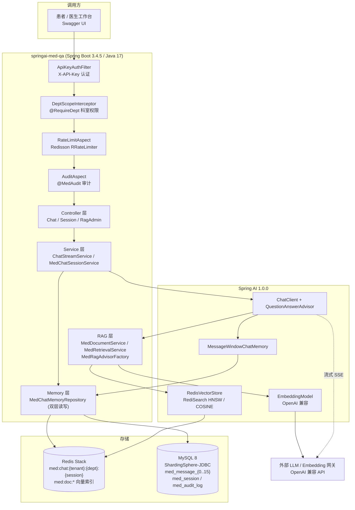

# springai-med-qa

<div align="center">

[](https://github.com/xxinjie21/springai-med-qa/actions/workflows/ci.yml)
[](https://github.com/xxinjie21/springai-med-qa/actions/workflows/docker-publish.yml)
[](https://github.com/xxinjie21/springai-med-qa/pkgs/container/springai-med-qa)
[](https://openjdk.org/)
[](https://spring.io/projects/spring-boot)
[](https://spring.io/projects/spring-ai)
[](./LICENSE)

基于 **Spring Boot 3 + Spring AI** 的医院生产级 AI 问诊后端服务。

[English](./README.en.md) ｜ **简体中文**

</div>

> 医疗 AI 知识问答 + 分布式会话记忆存储的「前端业务系统」。会话存储规范、字段定义、序列化协议与
> [`med-langchain-memory`](https://github.com/xxinjie21/med-langchain-memory)（Python 底层中间件）严格对齐，
> 两仓库数据可互读互迁，但代码完全独立、零依赖。

---

## 目录

- [核心定位](#核心定位)
- [架构图](#架构图)
- [技术栈与组件选型](#技术栈与组件选型)
- [模块结构](#模块结构)
- [统一存储对接规范](#统一存储对接规范)
- [API 一览](#api-一览)
- [错误码](#错误码)
- [环境变量](#环境变量)
- [快速开始](#快速开始)
- [测试与覆盖率](#测试与覆盖率)
- [CI/CD](#cicd)
- [部署](#部署)
- [迭代进度](#迭代进度)
- [License](#license)

---

## 核心定位

| 维度 | 说明 |
|---|---|
| 角色 | AI 问诊问答后端（面向患者 / 医生的工作系统） |
| 存储底座 | 复用同一套医疗会话存储规范（Redis 键、MySQL 16 分表、Protobuf） |
| 能力 | SSE 流式问诊、RAG 医疗知识检索、患者归属与科室权限、操作审计、隐私脱敏、限流 |
| 技术路线 | **全面使用成熟商业化 / 主流开源组件**，不重复造底层轮子 |

---

## 架构图



**请求链路要点**

1. 认证（`ApiKeyAuthFilter`）→ 科室权限（`@RequireDept`）→ 限流（`@RateLimit`）→ 审计（`@MedAudit`），四道横切关注点全部由框架机制（Filter / HandlerInterceptor / AOP）承载；
2. 问诊走 `ChatClient` + `QuestionAnswerAdvisor`，上下文由 `MessageWindowChatMemory` 提供，短期记忆经自定义 `ChatMemoryRepository` 落到双层存储；
3. RAG 只做向量相似度检索 + `tenant_id / dept_id / patient_id` 三个 TAG 过滤，**不解析文本、不抽取实体**；
4. MySQL 是真相源，Redis 是缓存窗口；缓存读失败降级为 miss（回源 MySQL），缓存写/删失败必须上抛。

---

## 技术栈与组件选型

| 能力 | 组件 | 说明 |
|---|---|---|
| 基础框架 | Spring Boot 3.4.5 | Web / IOC / AOP / 优雅停机 |
| AI 调用与流式 | Spring AI 1.0.0 | `ChatClient`、SSE 流式、`EmbeddingModel` |
| 向量存储与 RAG | Spring AI `RedisVectorStore` + `QuestionAnswerAdvisor` | HNSW + COSINE 相似度检索，元数据 TAG 过滤 |
| MySQL 分表 | ShardingSphere-JDBC 5.5.2 | 仅自写 `crc32(session_id) % 16` 分片算法插件，路由交给框架 |
| 分布式锁 / 限流 | Redisson 3.45.1（`RLock` / `RRateLimiter`） | 会话并发锁（看门狗续期）、注解式限流 |
| ORM / 迁移 | MyBatis 3.0.4 + Flyway | 数据访问与版本化建表（V1–V3） |
| 序列化 | Protobuf 4.29.3 | 跨语言统一会话协议，二进制落库 |
| 脱敏 | Hutool `DesensitizedUtil` 5.8.37 | 身份证 / 手机号 / 病历号字段掩码（Jackson 注解触发） |
| 接口文档 | SpringDoc OpenAPI 2.8.5 | Swagger UI，chat / session / rag 三组分组 |
| 健康检查 | Spring Boot Actuator | `/actuator/health`（含 MySQL/Redis 分组件探针）+ `/actuator/info` 版本矩阵，K8s liveness/readiness 探针组 |
| 指标与告警 | Micrometer + Prometheus + Alertmanager | `/actuator/prometheus` 抓取端点；`com.med.qa.alert` 推送告警（日志 + `med_qa_alert_total`），规则与路由见 `deploy/` |
| 测试 | JUnit 5 + Mockito + H2 + Testcontainers | 单测离线全绿；集成测试在无 Docker 时自动跳过 |
| 覆盖率 | JaCoCo 0.8.13 | 绑定 `verify` 阶段，报告上传为 CI 产物；`check` 门禁低于阈值即构建失败 |

---

## 模块结构

```
src/main/java/com/med/qa/
├── common/            # 统一响应 ApiResult/PageResult、ErrorCode/BizException、全局异常处理
│   └── ratelimit/     # @RateLimit 注解 + Redisson RRateLimiter 切面
├── config/            # Redis/Redisson/VectorStore/Embedding/ChatMemory/Security/OpenAPI 等装配
├── domain/            # 实体 ChatMessageDO/ChatSessionDO/AuditLogDO + RoleType/SessionStatus/AuditOutcome
├── memory/            # 官方 ChatMemory 仓储桥接 + 双层读写 + 缓存 + 锁 + 分片算法 + Protobuf 编解码
├── rag/               # 文档入库、标签过滤检索、QuestionAnswerAdvisor 工厂
├── mapper/            # MyBatis Mapper（走 ShardingSphere 数据源）+ TypeHandler
├── service/           # 业务编排：ChatStreamService / MedChatSessionService / AuditService
├── security/          # ApiKeyAuthFilter、PatientAccessGuard、@RequireDept 科室注解权限
├── audit/             # @MedAudit 注解 + AOP 切面 + 审计落库
├── privacy/           # @Desensitize 注解 + Jackson 序列化器 + MaskType
├── actuator/          # MedStorageHealthIndicator（MySQL/Redis 探针）+ MedComponentInfoContributor（版本矩阵）
├── alert/             # 告警链路：存储监控 → 策略/去重 → 日志 + Micrometer 双 sink
├── controller/        # REST / SSE 接口层 + DTO
└── MedQaApplication.java

src/main/resources/
├── application.yml             # 公共配置（含全部环境变量占位符）
├── application-dev.yml / -prod.yml
├── sharding/med-sharding.yaml  # ShardingSphere 分片规则（SHARDING + SINGLE）
├── mapper/*.xml                # MyBatis SQL
├── db/migration/               # Flyway V1–V3 建表脚本
└── META-INF/services/...       # 分片算法 SPI 注册

docs/                            # 部署手册等运维文档
docker/mysql/init/               # Compose MySQL 初始化脚本（建库 + 最小权限账号）
deploy/prometheus/               # Prometheus 抓取配置 + 告警规则
deploy/alertmanager/             # Alertmanager 路由与抑制规则
scripts/verify-docker-build.sh   # 真实镜像构建验证
```

---

## 统一存储对接规范（与 med-langchain-memory 互通）

| 项 | 规则 |
|---|---|
| Redis 键 | `med:chat:{tenant}:{dept}:{session}` |
| MySQL 分表 | `med_message_{crc32(session_id) % 16}`（共 16 张表） |
| 消息字段 | `message_id(UUIDv7)` / `session_id` / `tenant_id` / `dept_id` / `patient_id` / `role` / `content` / `token_count` / `masked` / `created_at(epoch millis)` / `metadata` |
| 角色枚举 | `PATIENT=0` / `DOCTOR=1` / `ASSISTANT=2` / `SYSTEM=3` |
| 序列化 | Protobuf（`med_session.proto`，跨语言统一协议）落库；API 层 DTO 用 JSON |

由此保证：两套系统写入的会话数据可互读互迁，字段、键、分表路由、编码完全一致。

---

## API 一览

所有接口均需请求头 `X-API-Key`（默认，可由 `MED_SECURITY_HEADER` 覆盖）。
Swagger UI：`http://localhost:8080/swagger-ui.html` ｜ OpenAPI 文档：`/v3/api-docs`。

| 方法 | 路径 | 说明 | 备注 |
|---|---|---|---|
| `POST` | `/api/chat/stream` | SSE 流式问诊（`text/event-stream`） | `@RateLimit` + 科室 RAG 隔离 |
| `POST` | `/api/sessions` | 创建问诊会话 | `@RateLimit` |
| `GET` | `/api/sessions/{sessionId}` | 查询单个会话 | 患者仅可查本人 |
| `POST` | `/api/sessions/{sessionId}/close` | 关闭会话（幂等） | |
| `POST` | `/api/sessions/{sessionId}/archive` | 归档会话（幂等） | 归档后不可再关闭 |
| `GET` | `/api/sessions` | 会话分页列表 | `tenantId` / `deptId` / `patientId` / `page` / `size` |
| `POST` | `/api/rag/documents/ingest` | 医疗文档批量入库 | `@RateLimit`，仅 STAFF |
| `POST` | `/api/rag/documents/delete` | 按 id 列表或隔离 scope 删除 | |
| `POST` | `/api/rag/documents/search` | 标签隔离检索预览 | 透传 `topK` / `threshold` / `includeShared` |
| `GET` | `/actuator/health` | 健康检查 | 容器 / 编排探针 |
| `GET` | `/actuator/prometheus` | Prometheus 指标 | 监控栈抓取端点 |

统一响应体：

```json
{ "code": 0, "message": "success", "data": { } }
```

科室级文档的 `patient_id` 使用保留值 `__shared__`；患者检索时过滤表达式为
`patient_id IN [patient, __shared__]`，租户与科室为等值 AND 条件。

---

## 错误码

| Code | 含义 | 典型场景 |
|---|---|---|
| `0` | 成功 | |
| `40000` | 参数校验失败 | 身份三元组缺失、topK 越界 |
| `40100` | 未认证 | 缺少或无效的 `X-API-Key` |
| `40300` | 无权限 | 患者跨会话访问、跨科室访问 |
| `40400` | 资源不存在 | 会话不存在 |
| `40500` | 方法不允许 | |
| `40900` | 会话锁占用 | 并发写入同一会话，稍后重试 |
| `42900` | 触发限流 | Redisson `RRateLimiter` 令牌耗尽 |
| `50000` | 内部错误 | |
| `50201` | LLM / Embedding 服务不可用 | 模型网关超时或返回错误 |
| `50301` | 存储不可用 | MySQL / Redis 故障 |

> 失败语义分层：`IllegalArgumentException` = 调用方编程错误；`BizException`（带 ErrorCode）= 业务错误。
> 缓存读降级为 miss（MySQL 是真相源）；锁与限流绝不静默降级。

---

## 环境变量

| 变量 | 默认值 | 说明 |
|---|---|---|
| `SPRING_PROFILES_ACTIVE` | `dev` | 生效 profile（`dev` / `prod`） |
| `SERVER_PORT` | `8080` | 服务端口 |
| `REDIS_HOST` / `REDIS_PORT` / `REDIS_DATABASE` | `localhost` / `6379` / `0` | 缓存、锁、限流、向量索引共用 |
| `MED_MYSQL_HOST` / `MED_MYSQL_PORT` / `MED_MYSQL_DATABASE` | `127.0.0.1` / `3306` / `med_qa` | ShardingSphere 数据源 |
| `MED_MYSQL_USERNAME` / `MED_MYSQL_PASSWORD` | `med_qa` / `med_qa` | 应用账号 |
| `OPENAI_BASE_URL` / `OPENAI_API_KEY` | `https://api.openai.com` / 空 | 兼容任意 OpenAI 协议网关 |
| `MED_EMBEDDING_MODEL` / `MED_EMBEDDING_DIMENSIONS` | `text-embedding-3-small` / `1536` | 需与索引向量宽度一致 |
| `MED_SECURITY_ENABLED` / `MED_SECURITY_REQUIRE_AUTH` | `true` / `true` | API Key 认证开关 |
| `MED_SECURITY_DEPT_SCOPE_ENABLED` | `true` | 科室注解权限开关 |
| `MED_SECURITY_HEADER` | `X-API-Key` | 认证头 |
| `MED_RATE_LIMIT_ENABLED` | `true` | 限流开关（离线测试置 `false`） |
| `MED_AUDIT_ENABLED` | `true` | 审计落库开关 |
| `MED_CACHE_TTL` / `MED_CACHE_MAX_MESSAGES` | `30m` / `200` | 会话缓存窗口 |
| `MED_CHAT_MAX_MESSAGES` | `20` | 短期记忆窗口 |
| `MED_CHAT_STREAM_HEARTBEAT` / `MED_CHAT_STREAM_TIMEOUT` | `15` / `120` | SSE 心跳与超时（秒） |
| `MED_LOCK_WAIT_TIME` / `MED_LOCK_LEASE_TIME` / `MED_LOCK_WATCHDOG_TIMEOUT` | `3s` / `0s` / `30s` | 会话锁（lease 0 = 看门狗续期） |
| `MED_RAG_INDEX_NAME` / `MED_RAG_KEY_PREFIX` | `med-doc-index` / `med:doc:` | 向量索引 |
| `MED_RAG_TOP_K` / `MED_RAG_MAX_TOP_K` / `MED_RAG_SIMILARITY_THRESHOLD` | `4` / `50` / `0.0` | 检索参数 |
| `MED_RAG_INGEST_BATCH_SIZE` / `MED_RAG_INGEST_MAX_DOCUMENTS` | `25` / `500` | 入库上限 |
| `MED_ALERT_ENABLED` | `true` | 告警链路总开关（`false` 时不注册任何告警 Bean） |
| `MED_ALERT_CHECK_INTERVAL` / `MED_ALERT_INITIAL_DELAY` | `60s` / `30s` | 存储探针轮询间隔与启动宽限期 |
| `MED_ALERT_COOLDOWN` | `10m` | 同一 `code:component` 指纹的抑制窗口（`0` 关闭去重） |
| `MED_ALERT_MINIMUM_SEVERITY` | `INFO` | 告警级别下限（提到 `WARNING` 可静默恢复通知） |
| `MED_ALERT_KEY_PREFIX` | `med:alert:` | 去重 Map 的 Redis 命名空间 |

完整运维说明见 [部署手册](./docs/DEPLOYMENT.md)。

---

## 快速开始

### 方式一：Docker Compose 全栈（推荐）

```bash
# 一条命令拉起 mysql + redis-stack + app（应用依赖两个存储健康检查通过后才启动）
docker compose up -d

# 观察启动日志
docker compose logs -f app

# 验证
curl http://localhost:8080/actuator/health
open http://localhost:8080/swagger-ui.html
```

> Compose 默认关闭认证 / 限流（`MED_SECURITY_ENABLED=false` 等），开箱即跑；生产部署请见部署手册。

### 方式二：本地 Maven 开发

```bash
# 使用内置 Maven Wrapper，无需预装 Maven；JDK 17+
./mvnw clean verify          # 编译 + 全量单测 + JaCoCo 覆盖率

# 只起 Redis Stack（缓存 + 向量索引），MySQL 用本地实例
docker compose up -d redis-stack

# 启动应用
./mvnw spring-boot:run
```

> 单测使用 H2 内存库与 Mockito 替身，无需任何中间件即可全绿；
> Testcontainers 集成测试在无 Docker 守护时自动跳过。

### 首次体验（可选）

```bash
# 1) 建会话
curl -X POST http://localhost:8080/api/sessions \
  -H 'Content-Type: application/json' \
  -d '{"tenantId":"t-1001","deptId":"dept-cardio","patientId":"pat-7731","title":"高血压复诊"}'

# 2) 流式问诊（SSE）
curl -N -X POST http://localhost:8080/api/chat/stream \
  -H 'Content-Type: application/json' \
  -d '{"tenant":"t-1001","dept":"dept-cardio","session":"sess-9f2c1a","patientId":"pat-7731","message":"服用 ACE 抑制剂期间能吃布洛芬吗？"}'
```

---

## 测试与覆盖率

| 项 | 说明 |
|---|---|
| 单测 | JUnit 5 + Mockito，外部依赖全部 mock 或 H2 替身，`mvn test` 离线全绿 |
| 构建类守护测试 | 解析 `pom.xml` / `Dockerfile` / `docker-compose.yml` / `.github/workflows/*.yml` 断言关键契约 |
| 集成测试 | `src/test/java/com/med/qa/integration`：Testcontainers 拉起真实 MySQL + Redis Stack，跑通存储与锁链路；无 Docker 时自动禁用 |
| 覆盖率 | JaCoCo 绑定 `verify`，报告位于 `target/site/jacoco/index.html` |
| 覆盖率门禁 | `jacoco-coverage-gate` 执行（`verify` 阶段，`haltOnFailure`）：指令 ≥ 90%、分支 ≥ 80%、行 ≥ 90%，阈值以 `jacoco.min.*` 属性声明；不达标直接 BUILD FAILURE，CI 无法合入 |

```bash
./mvnw clean verify          # 全量单测 + 覆盖率报告 + 门禁校验
./mvnw clean test            # 仅跑单测（不触发门禁）
```

被门禁守护的构建契约同样有单测覆盖：`com.med.qa.ci.CoverageGateConfigTest` 用 DOM 解析 `pom.xml`，断言门禁执行存在、绑定 `verify`、三个计数器阈值均来自属性且落在 `[0,1]` 区间。

---

## CI/CD

| Workflow | 触发 | 动作 |
|---|---|---|
| `ci.yml` | push / PR 到 `main` | Temurin JDK 17 + Maven 缓存 → `./mvnw verify` → 上传 JaCoCo 与 Surefire 报告 |
| `docker-publish.yml` | push tag `v*` / 手动 `workflow_dispatch` | 容器内多阶段构建 → 登录 GHCR → 推送镜像 `ghcr.io/xxinjie21/springai-med-qa` |

---

## 部署

完整部署手册（镜像获取、环境变量全表、健康检查与告警、日志排障、备份回滚、安全加固）见
**[`docs/DEPLOYMENT.md`](./docs/DEPLOYMENT.md)**。

**告警**：`/actuator/prometheus` 为抓取端点，规则与路由在 [`deploy/`](./deploy) 下；
`docker compose --profile observability up -d` 可拉起 Prometheus + Alertmanager 观测栈（默认不启动）。

**构建验证**：`scripts/verify-docker-build.sh` 执行一次真实 `docker build` 并断言 OCI 标签、非 root 用户、
分层布局与入口类，无 Docker 守护时自动跳过。

---

## 迭代进度

按 [`ROADMAP.md`](./ROADMAP.md) 分五阶段推进，每日一个迭代「编码 → 单测 → commit → 推送」闭环：

| 阶段 | 迭代 | 状态 |
|---|---|---|
| 阶段 0 工程基建 | D1–D5 | 已完成 |
| 阶段 1 会话记忆层 | D6–D12 | 已完成 |
| 阶段 2 RAG 检索层 | D13–D18 | 已完成 |
| 阶段 3 业务能力 | D19–D26 | 已完成 |
| 阶段 4 部署与收尾 | D27–D31 | 已完成 |
| 阶段 5 运维加固 | D32 | 进行中（D32 已完成，D33 待定） |

---

## License

[MIT](./LICENSE)
