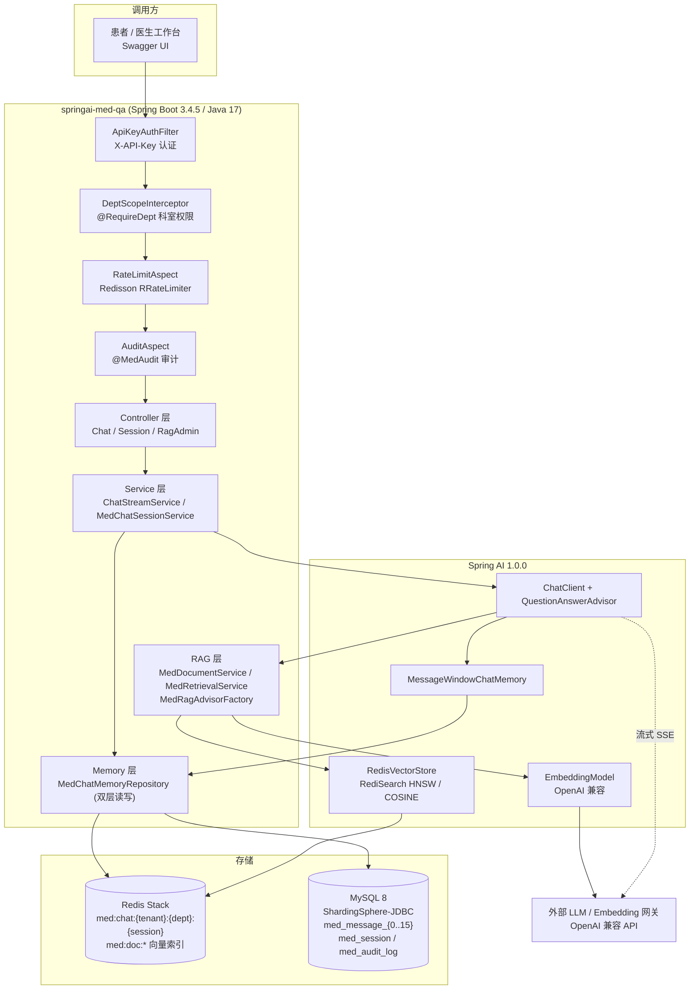

# springai-med-qa

<div align="center">

[](https://github.com/xxinjie21/springai-med-qa/actions/workflows/ci.yml)
[](https://github.com/xxinjie21/springai-med-qa/actions/workflows/docker-publish.yml)
[](https://github.com/xxinjie21/springai-med-qa/pkgs/container/springai-med-qa)
[](https://openjdk.org/)
[](https://spring.io/projects/spring-boot)
[](https://spring.io/projects/spring-ai)
[](./LICENSE)

基于 **Spring Boot 3 + Spring AI** 的医院生产级 AI 问诊后端服务。

[English](./README.en.md) ｜ **简体中文**

</div>

> 医疗 AI 知识问答 + 分布式会话记忆存储的「前端业务系统」。会话存储规范、字段定义、序列化协议与
> [`med-langchain-memory`](https://github.com/xxinjie21/med-langchain-memory)（Python 底层中间件）严格对齐，
> 两仓库数据可互读互迁，但代码完全独立、零依赖。

---

## 目录

- [核心定位](#核心定位)
- [架构图](#架构图)
- [技术栈与组件选型](#技术栈与组件选型)
- [模块结构](#模块结构)
- [统一存储对接规范](#统一存储对接规范)
- [API 一览](#api-一览)
- [错误码](#错误码)
- [环境变量](#环境变量)
- [快速开始](#快速开始)
- [测试与覆盖率](#测试与覆盖率)
- [CI/CD](#cicd)
- [部署](#部署)
- [迭代进度](#迭代进度)
- [License](#license)

---

## 核心定位

| 维度 | 说明 |
|---|---|
| 角色 | AI 问诊问答后端（面向患者 / 医生的工作系统） |
| 存储底座 | 复用同一套医疗会话存储规范（Redis 键、MySQL 16 分表、Protobuf） |
| 能力 | SSE 流式问诊、RAG 医疗知识检索、患者归属与科室权限、操作审计、隐私脱敏、限流 |
| 技术路线 | **全面使用成熟商业化 / 主流开源组件**，不重复造底层轮子 |

---

## 架构图


```mermaid
flowchart TB
    subgraph Client["调用方"]
        WEB["患者 / 医生工作台<br/>Swagger UI"]
    end

    subgraph App["springai-med-qa (Spring Boot 3.4.5 / Java 17)"]
        FILTER["ApiKeyAuthFilter<br/>X-API-Key 认证"]
        INTERCEPTOR["DeptScopeInterceptor<br/>@RequireDept 科室权限"]
        RATELIMIT["RateLimitAspect<br/>Redisson RRateLimiter"]
        AUDIT["AuditAspect<br/>@MedAudit 审计"]
        CTRL["Controller 层<br/>Chat / Session / RagAdmin"]
        SVC["Service 层<br/>ChatStreamService / MedChatSessionService"]
        MEM["Memory 层<br/>MedChatMemoryRepository (双层读写)"]
        RAG["RAG 层<br/>MedDocumentService / MedRetrievalService<br/>MedRagAdvisorFactory"]
    end

    subgraph AI["Spring AI 1.0.0"]
        CC["ChatClient + QuestionAnswerAdvisor"]
        EM["EmbeddingModel<br/>OpenAI 兼容"]
        VS["RedisVectorStore<br/>RediSearch HNSW / COSINE"]
        CM["MessageWindowChatMemory"]
    end

    subgraph Store["存储"]
        REDIS[("Redis Stack<br/>med:chat:{tenant}:{dept}:{session}<br/>med:doc:* 向量索引")]
        MYSQL[("MySQL 8<br/>ShardingSphere-JDBC<br/>med_message_{0..15}<br/>med_session / med_audit_log")]
    end

    LLM["外部 LLM / Embedding 网关<br/>OpenAI 兼容 API"]

    WEB --> FILTER --> INTERCEPTOR --> RATELIMIT --> AUDIT --> CTRL
    CTRL --> SVC
    SVC --> CC
    SVC --> MEM
    CC --> CM --> MEM
    CC --> RAG
    RAG --> VS
    RAG --> EM --> LLM
    CC -.流式 SSE.-> LLM
    MEM --> REDIS
    MEM --> MYSQL
    VS --> REDIS
```

**请求链路要点**

1. 认证（`ApiKeyAuthFilter`）→ 科室权限（`@RequireDept`）→ 限流（`@RateLimit`）→ 审计（`@MedAudit`），四道横切关注点全部由框架机制（Filter / HandlerInterceptor / AOP）承载；
2. 问诊走 `ChatClient` + `QuestionAnswerAdvisor`，上下文由 `MessageWindowChatMemory` 提供，短期记忆经自定义 `ChatMemoryRepository` 落到双层存储；
3. RAG 只做向量相似度检索 + `tenant_id / dept_id / patient_id` 三个 TAG 过滤，**不解析文本、不抽取实体**；
4. MySQL 是真相源，Redis 是缓存窗口；缓存读失败降级为 miss（回源 MySQL），缓存写/删失败必须上抛。

---

## 技术栈与组件选型

| 能力 | 组件 | 说明 |
|---|---|---|
| 基础框架 | Spring Boot 3.4.5 | Web / IOC / AOP / 优雅停机 |
| AI 调用与流式 | Spring AI 1.0.0 | `ChatClient`、SSE 流式、`EmbeddingModel` |
| 向量存储与 RAG | Spring AI `RedisVectorStore` + `QuestionAnswerAdvisor` | HNSW + COSINE 相似度检索，元数据 TAG 过滤 |
| MySQL 分表 | ShardingSphere-JDBC 5.5.2 | 仅自写 `crc32(session_id) % 16` 分片算法插件，路由交给框架 |
| 分布式锁 / 限流 | Redisson 3.45.1（`RLock` / `RRateLimiter`） | 会话并发锁（看门狗续期）、注解式限流 |
| ORM / 迁移 | MyBatis 3.0.4 + Flyway | 数据访问与版本化建表（V1–V3） |
| 序列化 | Protobuf 4.29.3 | 跨语言统一会话协议，二进制落库 |
| 脱敏 | Hutool `DesensitizedUtil` 5.8.37 | 身份证 / 手机号 / 病历号字段掩码（Jackson 注解触发） |
| 接口文档 | SpringDoc OpenAPI 2.8.5 | Swagger UI，chat / session / rag 三组分组 |
| 健康检查 | Spring Boot Actuator | `/actuator/health`（含 MySQL/Redis 分组件探针）+ `/actuator/info` 版本矩阵，K8s liveness/readiness 探针组 |
| 指标与告警 | Micrometer + Prometheus + Alertmanager | `/actuator/prometheus` 抓取端点；`com.med.qa.alert` 推送告警（日志 + `med_qa_alert_total`），规则与路由见 `deploy/` |
| 测试 | JUnit 5 + Mockito + H2 + Testcontainers | 单测离线全绿；集成测试在无 Docker 时自动跳过 |
| 覆盖率 | JaCoCo 0.8.13 | 绑定 `verify` 阶段，报告上传为 CI 产物；`check` 门禁低于阈值即构建失败 |

---

## 模块结构

```
src/main/java/com/med/qa/
├── common/            # 统一响应 ApiResult/PageResult、ErrorCode/BizException、全局异常处理
│   └── ratelimit/     # @RateLimit 注解 + Redisson RRateLimiter 切面
├── config/            # Redis/Redisson/VectorStore/Embedding/ChatMemory/Security/OpenAPI 等装配
├── domain/            # 实体 ChatMessageDO/ChatSessionDO/AuditLogDO + RoleType/SessionStatus/AuditOutcome
├── memory/            # 官方 ChatMemory 仓储桥接 + 双层读写 + 缓存 + 锁 + 分片算法 + Protobuf 编解码
├── rag/               # 文档入库、标签过滤检索、QuestionAnswerAdvisor 工厂
├── mapper/            # MyBatis Mapper（走 ShardingSphere 数据源）+ TypeHandler
├── service/           # 业务编排：ChatStreamService / MedChatSessionService / AuditService
├── security/          # ApiKeyAuthFilter、PatientAccessGuard、@RequireDept 科室注解权限
├── audit/             # @MedAudit 注解 + AOP 切面 + 审计落库
├── privacy/           # @Desensitize 注解 + Jackson 序列化器 + MaskType
├── actuator/          # MedStorageHealthIndicator（MySQL/Redis 探针）+ MedComponentInfoContributor（版本矩阵）
├── alert/             # 告警链路：存储监控 → 策略/去重 → 日志 + Micrometer 双 sink
├── controller/        # REST / SSE 接口层 + DTO
└── MedQaApplication.java

src/main/resources/
├── application.yml             # 公共配置（含全部环境变量占位符）
├── application-dev.yml / -prod.yml
├── sharding/med-sharding.yaml  # ShardingSphere 分片规则（SHARDING + SINGLE）
├── mapper/*.xml                # MyBatis SQL
├── db/migration/               # Flyway V1–V3 建表脚本
└── META-INF/services/...       # 分片算法 SPI 注册

docs/                            # 部署手册等运维文档
docker/mysql/init/               # Compose MySQL 初始化脚本（建库 + 最小权限账号）
deploy/prometheus/               # Prometheus 抓取配置 + 告警规则
deploy/alertmanager/             # Alertmanager 路由与抑制规则
scripts/verify-docker-build.sh   # 真实镜像构建验证
```

---

## 统一存储对接规范（与 med-langchain-memory 互通）

| 项 | 规则 |
|---|---|
| Redis 键 | `med:chat:{tenant}:{dept}:{session}` |
| MySQL 分表 | `med_message_{crc32(session_id) % 16}`（共 16 张表） |
| 消息字段 | `message_id(UUIDv7)` / `session_id` / `tenant_id` / `dept_id` / `patient_id` / `role` / `content` / `token_count` / `masked` / `created_at(epoch millis)` / `metadata` |
| 角色枚举 | `PATIENT=0` / `DOCTOR=1` / `ASSISTANT=2` / `SYSTEM=3` |
| 序列化 | Protobuf（`med_session.proto`，跨语言统一协议）落库；API 层 DTO 用 JSON |

由此保证：两套系统写入的会话数据可互读互迁，字段、键、分表路由、编码完全一致。

---

## API 一览

所有接口均需请求头 `X-API-Key`（默认，可由 `MED_SECURITY_HEADER` 覆盖）。
Swagger UI：`http://localhost:8080/swagger-ui.html` ｜ OpenAPI 文档：`/v3/api-docs`。

| 方法 | 路径 | 说明 | 备注 |
|---|---|---|---|
| `POST` | `/api/chat/stream` | SSE 流式问诊（`text/event-stream`） | `@RateLimit` + 身份取自 API Key（D41） |
| `POST` | `/api/sessions` | 创建问诊会话 | `@RateLimit` |
| `GET` | `/api/sessions/{sessionId}` | 查询单个会话 | 患者仅可查本人 |
| `POST` | `/api/sessions/{sessionId}/close` | 关闭会话（幂等） | |
| `POST` | `/api/sessions/{sessionId}/archive` | 归档会话（幂等） | 归档后不可再关闭 |
| `GET` | `/api/sessions` | 会话分页列表 | `tenantId` / `deptId` / `patientId` / `page` / `size` |
| `POST` | `/api/rag/documents/ingest` | 医疗文档批量入库 | `@RateLimit`，仅 STAFF；身份取自 API Key（D42） |
| `POST` | `/api/rag/documents/delete` | 按隔离 scope 删除 | 仅 STAFF；部门级删除需 `confirmDepartmentWide=true`（D42） |
| `POST` | `/api/rag/documents/search` | 标签隔离检索预览 | 仅 STAFF；透传 `topK` / `threshold` / `includeShared`（D42） |
| `GET` | `/actuator/health` | 健康检查 | 容器 / 编排探针 |
| `GET` | `/actuator/prometheus` | Prometheus 指标 | 监控栈抓取端点 |

统一响应体：

```json
{ "code": 0, "message": "success", "data": { } }
```

科室级文档的 `patient_id` 使用保留值 `__shared__`；患者检索时过滤表达式为
`patient_id IN [patient, __shared__]`，租户与科室为等值 AND 条件。

#### 标识符转义（D36）

RediSearch 的 `TAG` 查询语法保留了一批字符（`-`、`.`、`:` 等），而官方
`RedisFilterExpressionConverter` 会把拿到的值**原样**写进查询串。因此 `MedRetrievalFilters`
在构造过滤表达式时统一调用 `escapeTagValue`：标识符里的保留字符加反斜杠，
`patient-1` 变成 `patient\-1`。

这一步不是可选项。D36 在真实 Redis Stack 上实测到两种症状：

| 场景 | 未转义的结果 |
|---|---|
| 等值过滤 `tenant_id == tenant-rag-a` | 查询被 RediSearch 拒绝：`Syntax error at offset 24 near a`，整个科室的检索全部失败 |
| `IN` 过滤 `patient_id IN [patient-rag-1, __shared__]` | **不报错**，但只返回 `__shared__`：患者自己的病历被静默丢掉，医生拿到的答案只基于科室指南 |

转义只作用于**查询**。索引里写入的元数据仍是原始标识符，`MedRetrievalFilters.matches`
的兜底校验也仍按原始值比对——`escapeTagValue` 的职责边界就在查询语法这一层。
只由字母、数字、`_` 组成的标识符转义后与原值完全一致，常见场景的查询串没有任何变化。

#### 流式问诊的身份来源（D41）

`POST /api/chat/stream` 的 tenant / dept / patient **取自认证身份，不取自请求体**。API Key 由
`ApiKeyAuthFilter` 解析成 `MedPrincipal`，`ChatStreamService` 用它构造会话坐标
（`med:chat:{tenant}:{dept}:{session}`）与 RAG 隔离 scope，请求体里的 `tenant` / `dept` / `patientId`
降级为**一致性声明**，由 `RequestIdentityGuard` 校验：

| 请求体声明 | 结果 |
|---|---|
| 缺省或空白 | 合法。身份完全来自 principal，客户端不必重复自己是谁 |
| 与 principal 一致（允许首尾空白） | 合法，按 principal 的身份执行 |
| 与 principal 不一致 | **403**（`tenant mismatch` / `department mismatch` / `patient mismatch`） |

规则细节：STAFF 是科室级的，可以点名本科室的任意患者（医生打开患者问诊就是这条）；PATIENT
只能指向自己，且**没有 patientId 的 patient principal 直接 403**，不会被放宽成科室级 scope。
解析结果收敛成一个值对象 `MedCallerScope`（tenant/dept/patient 三元组），会话坐标与 RAG 隔离 scope
都从它构造，因此不可能出现「坐标用一个来源、过滤用另一个来源」的错配。

在触达模型之前，这个端点还会依次执行 `PatientAccessGuard.assertScope`（作用域级授权）与
`MedChatSessionService.requireWritableSession`（会话存在、属于调用者、且仍可写入——已关闭/已归档的
会话绝不增长）。**授权先于能力**，任何一步失败都不会产生 LLM 调用。

同步失败一律在 SSE 打开之前以对应状态码 + 单个 `error` 事件返回，不落到全局异常处理器：
`403`（身份/归属越权）、`404`（会话不存在）、`400`（`session`/`message` 缺失、scope 组合非法）、
`503`（模型未配置）。原因很实际——`text/event-stream` 的响应协商渲染不了全局处理器的 JSON 信封，
放过去只会变成一个语义不明的协商错误。跨组件契约由 `StreamingIdentityContractTest` 守住：
它让真实的 API Key → principal → 控制器 → 服务 → 守卫整条链跑起来，断言请求体声明的他人身份会被拒绝、
且身份缺省时到达会话层的是 **principal 的坐标**。审查报告里「1389 个测试全是单组件测试、抓不到
『守卫没被调用』」正是这类缺陷的成因。

**这个契约测试当场查出了一个缺陷**（D41）：`ChatStreamService` 的注释承诺「没有 `ChatClient.Builder`
时抛 `LLM_SERVICE_ERROR`」，但 Spring AI 的 builder bean 带一个**必需**的 `ChatModel` 参数，而
`ObjectProvider.getIfAvailable()` **不会吞掉实例化失败**——于是「模型未配置」的部署拿到的是
bean 创建栈 + `500`，而不是文档承诺的 503。修法是把 `BeansException` 与「返回 null」折叠成同一个
业务错误（`resolveChatClientBuilder`）。这正是审查归纳的「注释承诺与代码实际行为相反」那一类缺陷，
而它只有在测试真的驱动**真实** `ObjectProvider`（而不是 mock）时才暴露——mock 永远返回 null，
所以 1389 个测试都没看到它。

#### RAG 管理端的授权来源（D42）

`/api/rag/**` 三个端点（ingest / delete / search）的 tenant / dept / patient **同样取自 API Key**，
请求体里的身份字段只是一致性声明，由同一个 `RequestIdentityGuard` 校验：缺省即按 principal 取值，
与 principal 不一致即拒绝。改动前这三个端点把 body 里的 scope 当作权威，于是任何 STAFF Key 只要在
JSON 里写上别人的 `deptId`，就能**跨科室读、写、甚至物理删除**别人的向量（2026-09-25 审查 P0-3）。

| 变更 | 原因 |
|---|---|
| 请求体的 tenant/dept/patient 由「权威」降级为「声明」 | 让请求体决定「谁能看到什么」是 P0-3 的成因；现在 scope 只能来自认证身份 |
| 删除不再支持 `ids` | 向量库用 id 做 key、隔离标签在 JSON 值里、RediSearch 不索引 key，因此「这批 id **且** 属于我的 scope」无法表达成一个过滤表达式；而无 scope 谓词的 `VectorStore#delete(List)` 永远做不成 scope 安全。**删掉这个原语，而不是给它加守卫** |
| 部门级删除必须 `confirmDepartmentWide=true` | 部门级 scope 会连该科室的共享指南一起删掉，之后该科室的每次问诊都在缺少诊疗规范的语料上作答。破坏性动作要显式确认（与 D38 的「两道开关」同源） |
| 控制器自己再判一次 STAFF | `MED_SECURITY_DEPT_SCOPE_ENABLED=false` 会让 `@RequireDept` 拦截器整体跳过，而认证过滤器仍在工作；补一次角色判断让这个面自己 fail closed |

拒绝的线上表现有两种，都是既有约定：**拦截器**写出的拒绝是真实 HTTP `403`；**处理器内部**抛出的
`BizException`（身份声明不一致、未确认的部门级删除）按项目统一约定返回 HTTP `200` + `ApiResult`
信封里的业务码 `40300` / `40000`——**判定以业务码为准，不要只看状态行**。

跨组件契约由 `RagAdminAuthorizationContractTest` 守住：真实 API Key → 拦截器 → 控制器 → 守卫 → 服务
整条链跑起来，断言「声明他人身份被拒且服务零交互」与「声明缺省时到达服务的是 principal 的坐标」。
按项目惯例这条守卫**先被亲眼看过它变红**：把 scope 改回「body 优先」后，两个测试类共 12 个用例失败。

---

## 错误码

| Code | 含义 | 典型场景 |
|---|---|---|
| `0` | 成功 | |
| `40000` | 参数校验失败 | `session` / `message` 缺失、topK 越界（身份字段是可选的一致性声明，见 D41）；未确认的部门级 RAG 删除（见 D42） |
| `40100` | 未认证 | 缺少或无效的 `X-API-Key` |
| `40300` | 无权限 | 患者跨会话访问、跨科室访问、请求体声明的身份与 API Key 不一致（D41 / D42）、非 STAFF 调用 `/api/rag/**` |
| `40400` | 资源不存在 | 会话不存在 |
| `40500` | 方法不允许 | |
| `40900` | 会话锁占用 | 并发写入同一会话，稍后重试 |
| `42900` | 触发限流 | Redisson `RRateLimiter` 令牌耗尽 |
| `50000` | 内部错误 | |
| `50201` | LLM / Embedding 服务不可用 | 模型网关超时或返回错误 |
| `50301` | 存储不可用 | MySQL / Redis 故障 |

> 失败语义分层：`IllegalArgumentException` = 调用方编程错误；`BizException`（带 ErrorCode）= 业务错误。
> 缓存读降级为 miss（MySQL 是真相源）；锁与限流绝不静默降级。

---

## 环境变量

| 变量 | 默认值 | 说明 |
|---|---|---|
| `SPRING_PROFILES_ACTIVE` | `dev` | 生效 profile（`dev` / `prod`） |
| `SERVER_PORT` | `8080` | 服务端口 |
| `REDIS_HOST` / `REDIS_PORT` / `REDIS_DATABASE` | `localhost` / `6379` / `0` | 缓存、锁、限流、向量索引共用 |
| `MED_MYSQL_HOST` / `MED_MYSQL_PORT` / `MED_MYSQL_DATABASE` | `127.0.0.1` / `3306` / `med_qa` | ShardingSphere 数据源 + Flyway 迁移目标（同一套坐标） |
| `MED_MYSQL_USERNAME` / `MED_MYSQL_PASSWORD` | `med_qa` / `med_qa` | 应用账号 + 迁移账号 |
| `MED_MIGRATION_URL` | 空 | 可选，整串 JDBC URL 覆盖（留空则用上面的坐标拼装） |
| `MED_MIGRATION_LOCATIONS` | `classpath:db/migration` | Flyway 迁移脚本位置 |
| `OPENAI_BASE_URL` / `OPENAI_API_KEY` | `https://api.openai.com` / 空 | 兼容任意 OpenAI 协议网关 |
| `MED_EMBEDDING_MODEL` / `MED_EMBEDDING_DIMENSIONS` | `text-embedding-3-small` / `1536` | 需与索引向量宽度一致 |
| `MED_SECURITY_ENABLED` / `MED_SECURITY_REQUIRE_AUTH` | `true` / `true` | API Key 认证开关 |
| `MED_SECURITY_DEPT_SCOPE_ENABLED` | `true` | 科室注解权限开关 |
| `MED_SECURITY_HEADER` | `X-API-Key` | 认证头 |
| `MED_RATE_LIMIT_ENABLED` | `true` | 限流开关（离线测试置 `false`） |
| `MED_AUDIT_ENABLED` | `true` | 审计落库开关 |
| `MED_CACHE_TTL` / `MED_CACHE_MAX_MESSAGES` | `30m` / `200` | 会话缓存窗口 |
| `MED_CHAT_MAX_MESSAGES` | `20` | 短期记忆窗口 |
| `MED_CHAT_STREAM_HEARTBEAT` / `MED_CHAT_STREAM_TIMEOUT` | `15` / `120` | SSE 心跳与超时（秒） |
| `MED_LOCK_WAIT_TIME` / `MED_LOCK_LEASE_TIME` / `MED_LOCK_WATCHDOG_TIMEOUT` | `3s` / `0s` / `30s` | 会话锁（lease 0 = 看门狗续期） |
| `MED_RAG_INDEX_NAME` / `MED_RAG_KEY_PREFIX` | `med-doc-index` / `med:doc:` | 向量索引 |
| `MED_RAG_TOP_K` / `MED_RAG_MAX_TOP_K` / `MED_RAG_SIMILARITY_THRESHOLD` | `4` / `50` / `0.0` | 检索参数 |
| `MED_RAG_INGEST_BATCH_SIZE` / `MED_RAG_INGEST_MAX_DOCUMENTS` | `25` / `500` | 入库上限 |
| `MED_RAG_INDEX_ENABLED` | `true` | 向量索引健康探针开关（非 Redis Stack 部署必须置 `false`） |
| `MED_RAG_INDEX_CHECK_INTERVAL` / `MED_RAG_INDEX_INITIAL_DELAY` | `5m` / `1m` | 索引探针轮询间隔与启动宽限期 |
| `MED_ALERT_ENABLED` | `true` | 告警链路总开关（`false` 时不注册任何告警 Bean） |
| `MED_ALERT_CHECK_INTERVAL` / `MED_ALERT_INITIAL_DELAY` | `60s` / `30s` | 存储探针轮询间隔与启动宽限期 |
| `MED_ALERT_COOLDOWN` | `10m` | 同一 `code:component` 指纹的抑制窗口（`0` 关闭去重） |
| `MED_ALERT_MINIMUM_SEVERITY` | `INFO` | 告警级别下限（提到 `WARNING` 可静默恢复通知） |
| `MED_ALERT_KEY_PREFIX` | `med:alert:` | 去重 Map 的 Redis 命名空间 |

完整运维说明见 [部署手册](./docs/DEPLOYMENT.md)。

---

## 快速开始

### 方式一：Docker Compose 全栈（推荐）

```bash
# 一条命令拉起 mysql + redis-stack + app（应用依赖两个存储健康检查通过后才启动）
docker compose up -d

# 观察启动日志
docker compose logs -f app

# 验证
curl http://localhost:8080/actuator/health
open http://localhost:8080/swagger-ui.html
```

> Compose 默认关闭认证 / 限流（`MED_SECURITY_ENABLED=false` 等），开箱即跑；生产部署请见部署手册。

### 方式二：本地 Maven 开发

```bash
# 使用内置 Maven Wrapper，无需预装 Maven；JDK 17+
./mvnw clean verify          # 编译 + 全量单测 + JaCoCo 覆盖率

# 只起 Redis Stack（缓存 + 向量索引），MySQL 用本地实例
docker compose up -d redis-stack

# 启动应用
./mvnw spring-boot:run
```

> 单测使用 H2 内存库与 Mockito 替身，无需任何中间件即可全绿；
> Testcontainers 集成测试在无 Docker 守护时自动跳过。

### 首次体验（可选）

```bash
# 1) 建会话
curl -X POST http://localhost:8080/api/sessions \
  -H 'Content-Type: application/json' \
  -d '{"tenantId":"t-1001","deptId":"dept-cardio","patientId":"pat-7731","title":"高血压复诊"}'

# 2) 流式问诊（SSE）
curl -N -X POST http://localhost:8080/api/chat/stream \
  -H 'Content-Type: application/json' \
  -d '{"tenant":"t-1001","dept":"dept-cardio","session":"sess-9f2c1a","patientId":"pat-7731","message":"服用 ACE 抑制剂期间能吃布洛芬吗？"}'
```

---

## 测试与覆盖率

| 项 | 说明 |
|---|---|
| 单测 | JUnit 5 + Mockito，外部依赖全部 mock 或 H2 替身，`mvn test` 离线全绿 |
| 构建类守护测试 | 解析 `pom.xml` / `Dockerfile` / `docker-compose.yml` / `.github/workflows/*.yml` 断言关键契约 |
| 跨组件契约测试 | 断言**组件之间**真的接上了，而不是只测单个组件：`ApplicationProfileContractTest`（按 profile 优先级绑定实际生效的配置值，D40）、`StreamingIdentityContractTest`（真实 API Key → principal → 控制器 → 服务 → 守卫整条链，D41）、`RagAdminAuthorizationContractTest`（同一套链路在 `/api/rag/**` 上重跑一遍，D42）。2026-09-25 的审查发现「1389 个全绿测试漏掉 3 个 P0」的根因就是缺这一层 |
| 集成测试 | `src/test/java/com/med/qa/integration`：Testcontainers 拉起真实 MySQL + Redis Stack，跑通存储/锁链路（D30）、RAG 标签检索链路（D36）、向量索引健康探针（D37）与受控索引重建（D38） |
| 集成测试跳过开关 | 无 Docker 时默认整类禁用（本地便利）；一旦声明 Docker 必需则改为**硬失败**，见下表 |
| 覆盖率 | JaCoCo 绑定 `verify`，报告位于 `target/site/jacoco/index.html` |
| 覆盖率门禁 | `jacoco-coverage-gate` 执行（`verify` 阶段，`haltOnFailure`）：指令 ≥ 90%、分支 ≥ 80%、行 ≥ 90%，阈值以 `jacoco.min.*` 属性声明；不达标直接 BUILD FAILURE，CI 无法合入 |

```bash
./mvnw clean verify          # 全量单测 + 覆盖率报告 + 门禁校验
./mvnw clean test            # 仅跑单测（不触发门禁）
./mvnw test -Dtest='com.med.qa.integration.*IntegrationTest' -DfailIfNoTests=true   # 仅跑集成测试
```

### 集成测试「不许静默跳过」开关（D35）

集成套件曾经可以**悄悄把自己跳过**：Docker 探测返回 false 时 `DockerAvailableCondition` 直接把整个测试类标为 skipped，构建依然全绿，真实中间件断言一次都没跑。D34 查出的两个「服务在任何环境都起不来」的缺陷正是这样躲过了每一次构建。

因此跳过行为被显式化：只有**没人声明 Docker 必需**时才允许跳过。

| 开关 | 形式 | 默认 | 说明 |
|---|---|---|---|
| `med.test.integration.required` | JVM 系统属性（优先级高） | 未设置 | `-Dmed.test.integration.required=true` 声明 Docker 必需 |
| `MED_TEST_INTEGRATION_REQUIRED` | 环境变量 | 未设置 | CI 集成阶段用它置位 |

取值 `true` / `1` / `yes` / `on`（大小写不敏感）为真。系统属性一旦出现就覆盖环境变量，所以本机可以用 `-Dmed.test.integration.required=false` 强制退回「可跳过」。声明必需而 Docker 不可用时，集成测试在 `@BeforeAll` 抛出 `IllegalStateException` 并直接点名这个开关，而不是报告 skipped。

被门禁守护的构建契约同样有单测覆盖：`com.med.qa.ci.CoverageGateConfigTest` 用 DOM 解析 `pom.xml`，断言门禁执行存在、绑定 `verify`、三个计数器阈值均来自属性且落在 `[0,1]` 区间；`com.med.qa.ci.CiIntegrationStageConfigTest` 解析 `.github/workflows/ci.yml`，断言集成阶段存在、导出必需开关、限定 `-Dtest` 选择集合并开启 `failIfNoSpecifiedTests` / `failIfNoTests`、镜像层缓存键随镜像坐标变化、且全程没有 `continue-on-error` 逃生口。

### RAG 标签检索的真实中间件验证（D36）

`MedRagRetrievalIntegrationTest` 用 Testcontainers 起一个真实 Redis Stack，把 RAG 链路整条接上去：`VectorStoreConfig.buildVectorStore` 造出的官方 `RedisVectorStore`、它 `FT.CREATE` 出来的索引、写进 Redis 的 JSON 文档、由官方 store 翻译的 TAG 过滤，以及 `MedDocumentService` / `MedRetrievalService` / `MedRagAdvisorFactory` 装配的官方 `QuestionAnswerAdvisor`。断言覆盖：科室/患者 TAG 过滤、租户隔离、跨科室隔离、科室级检索只返回指南不返回病历、`QuestionAnswerAdvisor` 只把范围内的证据拼进提示词、以及 `deleteByScope` 的删除边界。

唯一被替身顶掉的是 Embedding 网关（`DeterministicEmbeddingModel`）：真实 `EmbeddingModel` 是打外部模型 API 的 HTTP 客户端，测试里既拿不到凭据也无法保证可复现。替身只做「文本 → 向量」这一件事，相似度计算、Top-K、排序与过滤求值全部仍然发生在 Redis Stack 里——所以检索行为本身依然是被真实验证的。

这条测试上线当天就查出了上面那个 TAG 转义缺陷：集成用例用的标识符带连字符（`dept-cardio`、`patient-rag-1`），而此前所有离线单测的标识符都是 `hosp1` / `p9001` 这类纯字母数字，恰好绕开了 RediSearch 的保留字符。

### 向量索引健康与 Schema 漂移检测（D37）

D36 证明了 RAG 链路在真实 Redis Stack 上**能**工作，但没有任何机制回答「此刻它**是否还**在工作」。`MedStorageHealthIndicator` 只回答「Redis 通不通」——这两件事并不等价，而它们之间的空隙正是检索层失败时**不报错**的地方：

| 现场 | 表现 | 医生看到什么 |
|---|---|---|
| 索引不存在（被手工删除，或 Redis 不是 Stack 版导致 `FT.CREATE` 从未成功） | 接口 200，检索为空 | 只用模型自身知识拼出来的答案 |
| 索引存在但 TAG 字段与配置漂移（字段改名/新增后旧索引没跟着变） | 接口 200，过滤表达式匹配不到任何文档 | 同上 |

两者都不抛异常，所以永远不会被任何连通性探针发现。`MedVectorIndexProbe` 通过官方 Jedis 的 `FT.LIST` / `FT.INFO` 读出索引的**存在性、文档数、扫描前缀与 TAG 字段**（只读元数据，不做任何向量或检索计算），`MedVectorIndexHealthIndicator` 把它变成一个显式的健康组件：

| `reason` | 触发条件 |
|---|---|
| `index-missing` | `FT.LIST` 未报告该索引 |
| `schema-drift` | 索引存在，但未声明 `med.rag.index.expected-tag-fields` 中的某个 TAG 字段 |
| `unreachable` | 探针本身抛异常，无法得出结论 |

`MedVectorIndexAlertMonitor` 复用既有 `MedAlertNotifier` 链路把状态变化推出去：降级为 `WARNING`（问诊仍可用，只是证据变少，不该直接呼叫值班）、恢复为 `INFO`、探针异常为 `CRITICAL`；Prometheus 规则 `MedQaRagIndexDegraded` 消费 `med_qa_alert_total{code="rag-index-degraded"}`。

> `med.rag.index.expected-tag-fields` 必须与 `med.rag.vector-store.metadata-fields` 里的 `TAG` 项保持一致——探针只能发现「你让它去找」的漂移。
> 缓存跑在非 Redis Stack 版 Redis 上的部署必须置 `MED_RAG_INDEX_ENABLED=false`：该部署下 RAG 本就不可用，探针会如实把 Pod 判为不健康。

`MedVectorIndexProbeIntegrationTest` 在真实 Redis Stack 上验证探针读到的正是官方 `RedisVectorStore` 建出的索引（TAG 字段、前缀、文档数随入库增长），并断言索引被 `FT.DROPINDEX` 后结论翻转为 `index-missing` 而不是抛异常。这条用例存在的另一个理由：`FT.INFO` 的嵌套结构在 Jedis 5.x 里返回的是**扁平交替列表**而非 Map，只用离线手写报文无法证明解码器匹配真实客户端；一旦两者错位，所有索引都会被读成「零个 TAG 字段」，与要检测的漂移无法区分。

### 受控的索引重建（D38）

D37 让坏掉的索引**可见**，但没有让它**可修**。它检测到的两种故障（索引不存在 / TAG Schema 漂移）修复动作是同一个：把索引删掉、按当前配置重建。在此之前这只能由运维手工在生产 Redis 上敲 `FT.DROPINDEX`——没有互斥（两个运维、或运维与定时任务同时删）、没有「重建后是否真的可用」的校验、也没有任何记录说明是谁删的。

`MedVectorIndexRebuilder` 把这件事变成一个有互斥、有校验、有报告的操作，全程复用官方组件而不是自研：

| 步骤 | 复用的组件 |
|---|---|
| 加锁 | Redisson `RLock`，键 `med:lock:rag:index:rebuild:{index}`（与 `med:lock:chat:` 会话锁不同命名空间） |
| 删除索引 | 官方 Jedis `FT.DROPINDEX` / `FT.DROPINDEX … DD` |
| 重建 Schema | `RedisVectorStore#afterPropertiesSet()`——官方生命周期钩子，由 `med.rag.vector-store.*` 发出 `FT.CREATE`；项目内没有一处手写 `FT.CREATE` |
| 回写入库 | `MedDocumentService.ingestAll`，即普通入库路径，Embedding 与 TAG 打标完全一致 |
| 验收 | `MedVectorIndexProbe`——重建成功的判据与 `/actuator/health` 用的是同一个「能否按标签检索」 |

两种模式，安全的那种是默认：

| 模式 | 动作 | 用途 |
|---|---|---|
| `INDEX_ONLY`（默认） | `FT.DROPINDEX`，**保留文档** | 修复 Schema 漂移。重建索引时 RediSearch 会把前缀下已存在的 JSON 文档全部重新索引，所以**一条文档不丢、一次 Embedding 也不调** |
| `DROP_AND_REINGEST` | `FT.DROPINDEX … DD`，连文档一起删，再回写调用方给的语料 | 语料本身损坏或被替换。**破坏性**，因此需要两道开关：请求显式指定该模式，且部署置 `MED_RAG_INDEX_REBUILD_ALLOW_DELETE=true` |

重建能力默认是**关闭**的（`MED_RAG_INDEX_REBUILD_ENABLED` 默认 `false`）——与项目里其它 RAG 开关相反。理由是它是服务里唯一能删除搜索索引、也是唯一能删除已入库文档的代码路径：默认不装配意味着一个配错的部署根本不存在这条路径，而不是存在一条有防护的路径。`allow-document-deletion` 与 `enabled` 是**两把独立的钥匙**——启用重建是修复漂移的常规动作，授权删除整份语料不是，能触发重建的人不应该因此获得第二项权限。

结果通过 `MedIndexRebuildReport` 返回（`outcome` ∈ `completed` / `verification-failed` / `failed` / `skipped-lock-held` / `refused`，并带 `documentsBefore → documentsAfter`、回写条数、批次数与耗时），同时经既有 `MedAlertNotifier` 链路推出：成功 `INFO`、被跳过/被拒绝 `WARNING`、失败 `CRITICAL`（失败可能让索引消失或为空，比它要修的漂移更糟，所以这条规则直接呼叫值班）。Prometheus 规则 `MedQaRagIndexRebuildFailed` 消费 `med_qa_alert_total{code="rag-index-rebuild-failed"}`。重建过程中每个阶段与每个批次都会发布一个 `MedIndexRebuildProgress` 快照（`currentProgress()`），只含计数与阶段名，可安全打日志。

> 重建**不经过 HTTP 暴露**：回写语料需要语料本身，而语料不在本服务的库里（文档只存在于向量索引中，也就是正要被删掉的那个对象）。触发方式由调用方决定，触发入口属于后续迭代——同时它也避免了在 `RagAdminController` 的授权边界修复之前扩大攻击面。

`MedIndexRebuildIntegrationTest` 在真实 Redis Stack 上验证的是「单测证明不了」的那一半：把索引 `FT.DROPINDEX`（不带 `DD`）后用 `INDEX_ONLY` 重建，文档仍在 Redis 中、`FT.CREATE` 把它们全部重新索引、按科室/患者标签的检索恢复可用；`DROP_AND_REINGEST` 后旧文档的键确实消失、新语料可检索；另一个 Redisson 客户端持锁时重建返回 `skipped-lock-held` 且索引状态一字未改。

### 检索质量回归基线（D39）

D37 让坏索引**可见**、D38 让它**可修**，但两者回答的都是「索引这一层是否正常」。真正交付给医生的是**检索质量**：同一个问题，昨天能召回的病历今天还在不在、排序有没有变差、范围内该返回的是不是还在。这三件事出问题时，不会有任何探针变红——服务健康、接口 200、索引存在且 TAG Schema 一致，只是召回的证据少了或排序塌了。

D39 把这件事变成 CI 里会失败的断言：一份**冻结的金标问题集**（`src/test/resources/rag/retrieval-baseline.json`）配一份**冻结的语料**（`MedRetrievalBaselineIntegrationTest` 内的 corpus），在真实 Redis Stack 上把整个集合跑一遍，任何一条不达预期就让构建失败。

每个用例可以断言三件事，分别对应一类不会报错的回归：

| 断言 | 字段 | 防的是哪一类回归 |
|---|---|---|
| 召回 | `expectedDocumentIds` + `minRecall` | 过滤条件吃掉本该返回的文档（D36 的 `IN` 静默丢弃病历就是这一类） |
| 排序 | `expectedTopDocumentId` | 文档都在，但最相关的那条不在第一位——只看「有没有」的基线抓不到 |
| 隔离 | `forbiddenDocumentIds` | 不该出现的文档出现了（跨患者 / 跨科室 / 跨租户泄漏） |

`expectedDocumentIds` 为空是合法的，那是**反向用例**：只断言「什么都别返回」。它必须同时声明 `minRecall: 0.0` 与非空的 `forbiddenDocumentIds`，否则它什么也没断言。这类用例专门抓「标签过滤失效」——一旦过滤条件不再生效，该作用域会突然返回别的租户或科室的文档。

组件分工（沿用「不自研底层组件」，全部只做测量）：

| 类 | 职责 |
|---|---|
| `MedRetrievalBaselineCase` / `MedRetrievalBaseline` | 金标用例与集合；不可变值对象，构造即校验 |
| `MedRetrievalBaselineLoader` | 读 JSON；**拒绝未知字段**（Jackson 默认是忽略，那会让写错的键名静默退化成「没有断言」），错误信息带 JSON 路径如 `$.cases[3].minRecall` |
| `MedRetrievalBaselineEvaluator` | 把每个用例交给生产的 `MedRetrievalService` 执行，再把结果交给结果对象比对；不做任何相似度计算 |
| `MedRetrievalBaselineCaseResult` / `MedRetrievalBaselineReport` | 召回率、首个命中排名、MRR、泄漏列表与失败摘要 |

> 相似度、Top-K、排序与过滤求值仍然全部由官方 `RedisVectorStore` 在 Redis 内完成；评测器只比较**文档 ID**，不读文档内容、不看分数、不重排。检索本身出错（Embedding 不可用、Redis 报错、返回越权文档）会直接向上抛，而不是记成「召回率 0」——故障与质量回归必须区分开。

用例里的问题文本**不会**出现在日志、报告或 `toString()` 里（与 `MedRetrievalQuery` 同一条规则）：金标集可能被指向真实问诊问题，而问题文本一旦落盘就是患者数据，报告只用用例名定位。

三条防「基线退化」的自检在 `MedRetrievalBaselineResourceTest` 里离线运行：① 集合结构合法（有名字、有版本、用例名唯一、至少 5 条）；② **每条用例都能失败**（期望或禁止非空，且每条至少禁止一份文档）；③ **集合不是空转的**——用「什么都不返回」与「返回全部」两个替身各跑一遍，必须失败。

`MedRetrievalBaselineIntegrationTest` 另外守住「金标集与语料不漂移」：用生产的 `MedRetrievalFilters.matches` 逐条校验期望文档确实落在该用例的作用域内、禁止文档确实落在作用域外。ID 写错或作用域写反会在这里直接失败，而不是伪装成一次「检索质量暴跌」。

跑法：`.\mvnw.cmd "-Dtest=MedRetrievalBaselineIntegrationTest" test`（需要 Docker；CI 的 `integration` job 已经会跑到它）。

---

## CI/CD

| Workflow | 触发 | 动作 |
|---|---|---|
| `ci.yml` / `verify` job | push / PR 到 `main` | Temurin JDK 17 + Maven 缓存 → `./mvnw verify` → 上传 JaCoCo 与 Surefire 报告 |
| `ci.yml` / `integration` job | push / PR 到 `main` | Temurin JDK 17 + 中间件镜像层缓存 → `MED_TEST_INTEGRATION_REQUIRED=true` 下只跑 `com.med.qa.integration.*IntegrationTest`（真实 MySQL 8.0 + Redis Stack），失败即阻断 |
| `docker-publish.yml` | push tag `v*` / 手动 `workflow_dispatch` | 容器内多阶段构建 → 登录 GHCR → 推送镜像 `ghcr.io/xxinjie21/springai-med-qa` |

集成阶段有三道互相独立的锁，专门堵住「静默跳过」：① 环境变量把「没有 Docker」变成硬失败；② `-Dtest` 限定 + `failIfNoSpecifiedTests` / `failIfNoTests`，测试类被改名或删掉时直接失败；③ runner 用 `ubuntu-latest`，自带 Docker 守护进程。中间件镜像用 `docker save` / `docker load` 归档并走 `actions/cache` 复用镜像层，缓存键里写死了 `mysql-8.0.36` 与 `redis-stack-7.4.0-v3`——镜像 tag 变了而缓存键没变，守护测试会失败。

---

## 部署

完整部署手册（镜像获取、环境变量全表、健康检查与告警、日志排障、备份回滚、安全加固）见
**[`docs/DEPLOYMENT.md`](./docs/DEPLOYMENT.md)**。

**告警**：`/actuator/prometheus` 为抓取端点，规则与路由在 [`deploy/`](./deploy) 下；
`docker compose --profile observability up -d` 可拉起 Prometheus + Alertmanager 观测栈（默认不启动）。

> **profile 里的暴露列表是「覆盖」而非「合并」（D40）**：Spring Boot 对 list 属性不做合并，而
> `Dockerfile` 与 `docker-compose.yml` 都激活 `prod`，所以生产环境的暴露列表实际由
> `application-prod.yml` 决定。它一旦漏掉 `prometheus`，Prometheus 就抓不到 `med_qa_alert_total`，
> `deploy/prometheus/` 下全部告警规则永不触发——服务照常返回 200，故障完全静默。
> 该契约由 `ApplicationProfileContractTest` 守住（按 profile 优先级合并配置后绑定实际生效值）。

**健康组件**：`/actuator/health` 除 MySQL / Redis 连通性外，还包含 `med-vector-index`（D37）——
索引存在性与 TAG 字段一致性。`reason` 取值 `index-missing` / `schema-drift` / `unreachable`，
非 Redis Stack 部署用 `MED_RAG_INDEX_ENABLED=false` 移除该组件。

**索引重建**：`MED_RAG_INDEX_REBUILD_ENABLED=true` 才会装配 `MedVectorIndexRebuilder`（默认关闭）。
`INDEX_ONLY` 模式删索引但保留文档，是修复 Schema 漂移的推荐动作；`DROP_AND_REINGEST` 会删除已入库文档，
另需 `MED_RAG_INDEX_REBUILD_ALLOW_DELETE=true`。

**构建验证**：`scripts/verify-docker-build.sh` 执行一次真实 `docker build` 并断言 OCI 标签、非 root 用户、
分层布局与入口类，无 Docker 守护时自动跳过。

---

## 迭代进度

按 [`ROADMAP.md`](./ROADMAP.md) 分阶段推进，每日一个迭代「编码 → 单测 → commit → 推送」闭环：

| 阶段 | 迭代 | 状态 |
|---|---|---|
| 阶段 0 工程基建 | D1–D5 | 已完成 |
| 阶段 1 会话记忆层 | D6–D12 | 已完成 |
| 阶段 2 RAG 检索层 | D13–D18 | 已完成 |
| 阶段 3 业务能力 | D19–D26 | 已完成 |
| 阶段 4 部署与收尾 | D27–D31 | 已完成 |
| 阶段 5 运维加固 | D32–D33 | 已完成 |
| 阶段 6 生产启动与真实中间件验证 | D34–D36 | 已完成（D34 迁移链路、D35 CI 集成阶段、D36 RAG 检索验证） |
| 阶段 7 RAG 索引运维与检索可观测 | D37–D39 | 已完成（D37 索引健康与漂移检测、D38 受控索引重建、D39 检索质量回归基线） |
| 阶段 8 安全边界与生产配置契约 | D40–D43 | 进行中（D40 已完成：prod profile 暴露契约 + `ApplicationProfileContractTest` 跨文件契约测试；D41 已完成：流式问诊身份取自 principal + `RequestIdentityGuard` + `StreamingIdentityContractTest` 跨组件契约测试；D42 已完成：RAG 管理端 scope 取自 principal、删除只保留 scope 模式 + `RagAdminAuthorizationContractTest`；D43 告警投递顺序） |

---

## License

[MIT](./LICENSE)
