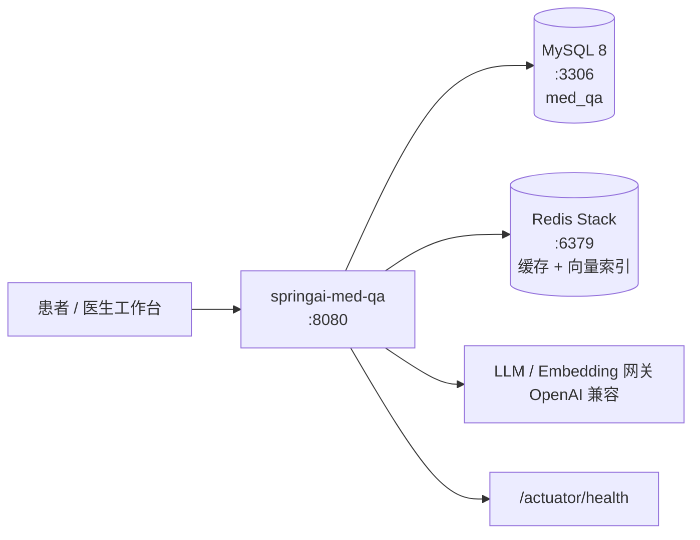

# 部署手册 — springai-med-qa

> 面向运维 / 交付场景的部署与运维说明。快速开始请见仓库根目录 [`README.md`](../README.md)。

---

## 目录

- [1. 部署拓扑与前置条件](#1-部署拓扑与前置条件)
- [2. 获取镜像](#2-获取镜像)
- [3. Docker Compose 全栈部署](#3-docker-compose-全栈部署)
- [4. 独立部署（外部 MySQL / Redis）](#4-独立部署外部-mysql--redis)
- [5. 环境变量全表](#5-环境变量全表)
- [6. 数据库与索引初始化](#6-数据库与索引初始化)
- [7. 健康检查与探针](#7-健康检查与探针)
- [8. 日志与故障排查](#8-日志与故障排查)
- [9. 备份与回滚](#9-备份与回滚)
- [10. 安全加固清单](#10-安全加固清单)
- [11. 容量与调优建议](#11-容量与调优建议)

---

## 1. 部署拓扑与前置条件



| 组件 | 版本要求 | 用途 |
|---|---|---|
| Docker + Docker Compose | Docker 24+ / Compose v2 | 全栈编排（推荐方式） |
| JDK | 17（运行 jar 部署时） | 应用运行时 |
| MySQL | 8.0.x | 真相源：16 张 `med_message_{0..15}` 分表 + `med_session` + `med_audit_log` |
| Redis | Redis Stack 7.x（**必须带 RediSearch + RedisJSON**） | 会话缓存、Redisson 锁/限流、向量索引 |
| LLM / Embedding 网关 | OpenAI 兼容协议 | 问诊生成与文档向量化 |

> Redis **必须**是 Redis Stack（或挂载 RediSearch/RedisJSON 模块）。普通 Redis 无法创建向量索引，
> `RedisVectorStore` 初始化会失败。

**端口占用**

| 端口 | 服务 | 说明 |
|---|---|---|
| `8080` | app | HTTP API / Swagger UI / Actuator |
| `3306` | mysql | 仅本地调试建议映射，生产可不暴露 |
| `6379` | redis-stack | Redis 协议 |
| `8001` | redis-stack | RedisInsight UI，生产建议关闭映射 |

---

## 2. 获取镜像

### 2.1 从 GHCR 拉取（推荐生产）

镜像由 `.github/workflows/docker-publish.yml` 在推送 `v*` tag 时自动构建并发布：

```bash
# 按语义化版本拉取
docker pull ghcr.io/xxinjie21/springai-med-qa:v1.0.0

# 或拉取 main 分支最新构建
docker pull ghcr.io/xxinjie21/springai-med-qa:main
```

发布流程（维护者）：

```bash
git tag v1.0.0
git push origin v1.0.0      # 触发 docker-publish → GHCR
```

### 2.2 本地构建

复用 D27 的多阶段 `Dockerfile`（JDK builder → 分层 JRE runtime，非 root `medqa` 用户）：

```bash
docker build -t springai-med-qa:local .
```

分层结构保证代码变更只重建最小的 `application` 层，依赖层命中缓存。

镜像携带 OCI 元数据（`org.opencontainers.image.*`），发布流水线会把版本号、Git revision 与构建时间
通过 `--build-arg` 写入，因此 `docker inspect` 即可确认手上这个镜像来自哪次提交。

### 2.3 真实构建验证（D33）

单测只能解析 `Dockerfile` 文本，不能证明镜像真的能跑起来。仓库提供一键验证脚本：

```bash
scripts/verify-docker-build.sh                 # 默认 tag springai-med-qa:verify
scripts/verify-docker-build.sh my-registry/med-qa:check
```

脚本会执行一次真实 `docker build`，随后逐项断言运行时契约：

| 断言 | 说明 |
|---|---|
| OCI 标签齐全 | `title` / `source` / `licenses` / `revision` 非空 |
| 非 root 运行 | `Config.User` 必须等于 `medqa` |
| 分层布局 | `BOOT-INF/classes/application.yml`、`BOOT-INF/lib/*.jar`、`org/springframework/boot/loader/**` 均存在 |
| 入口类 | entrypoint 使用 Spring Boot 3.x `JarLauncher`，且该 class 真的在镜像里 |
| 启动冒烟 | 真实启动容器一次，要求 Spring Boot 打出启动横幅或失败分析器横幅（不允许出现 `Could not find or load main class`） |

无 Docker 守护或未安装 Docker 时脚本以退出码 `2` 直接跳过，不会阻断流水线；任一项断言失败以退出码 `1` 失败。
启动冒烟的超时可用环境变量 `BOOT_TIMEOUT`（默认 150 秒）覆盖。

> **这条链路第一次跑就抓到过两个真实缺陷**：
> 1. D27 的 `Dockerfile` 只写了 `extract --layers` 而漏了 `--launcher`，于是 `spring-boot-loader/` 层是空的、
>    镜像里根本没有 `JarLauncher`，容器一启动就 `Could not find or load main class`；
> 2. `sharding/med-sharding.yaml` 的 JDBC URL 写了 `characterEncoding=utf8mb4`。`characterEncoding` 要的是
>    **Java** 字符集名，`utf8mb4` 是 MySQL 服务端字符集，Connector/J 会直接抛
>    `UnsupportedEncodingException: utf8mb4`，导致任何环境下都连不上 MySQL。
>
> 两处都只有「真实构建 + 真实启动」才暴露（纯文本断言当时全绿）。现已修复，并分别加了
> `--launcher` 与「characterEncoding 必须是可被 `Charset` 解析的 Java 字符集名」守护断言。

---

## 3. Docker Compose 全栈部署

仓库根 `docker-compose.yml` 定义了 `redis-stack` + `mysql` + `app` 三服务。

```bash
# 1)（可选）准备 .env 覆盖默认口令与模型凭据
cat > .env <<'EOF'
MED_MYSQL_ROOT_PASSWORD=<强口令>
MED_MYSQL_PASSWORD=<应用账号口令>
OPENAI_BASE_URL=https://your-gateway/v1
OPENAI_API_KEY=<密钥>
MED_EMBEDDING_MODEL=text-embedding-3-small
MED_SECURITY_ENABLED=true
MED_RATE_LIMIT_ENABLED=true
EOF

# 2) 拉起全栈（app 会等待 mysql / redis-stack 健康检查通过后才启动）
docker compose up -d

# 3) 查看状态与日志
docker compose ps
docker compose logs -f app

# 4) 验证
curl -fsS http://localhost:8080/actuator/health

# 5) 停止 / 清栈
docker compose down            # 保留数据卷
docker compose down -v         # 连数据卷一起删除（不可恢复）
```

**Compose 关键契约**

| 约定 | 值 |
|---|---|
| compose project name | `springai-med-qa` |
| app 镜像 | 本地构建 `springai-med-qa:local`（生产替换为 GHCR 镜像） |
| app profile | `SPRING_PROFILES_ACTIVE=prod` |
| 依赖顺序 | `app` → `mysql`(service_healthy) + `redis-stack`(service_healthy) |
| 数据卷 | `mysql-data`、`redis-stack-data` |
| 重启策略 | `unless-stopped` |

> 开箱默认值：Compose 内置 `MED_SECURITY_ENABLED=false`、`MED_SECURITY_DEPT_SCOPE_ENABLED=false`、
> `MED_RATE_LIMIT_ENABLED=false`，便于一键体验。**生产必须显式置为 `true` 并挂载真实密钥。**

---

## 4. 独立部署（外部 MySQL / Redis）

不依赖 Compose 时，直接运行 jar 或镜像，通过环境变量指向既有中间件：

```bash
java -jar target/springai-med-qa-0.0.1-SNAPSHOT.jar \
  --spring.profiles.active=prod \
  --server.port=8080
```

或以容器方式：

```bash
docker run -d --name med-qa-app \
  -p 8080:8080 \
  -e SPRING_PROFILES_ACTIVE=prod \
  -e MED_MYSQL_HOST=mysql.internal -e MED_MYSQL_PORT=3306 -e MED_MYSQL_DATABASE=med_qa \
  -e MED_MYSQL_USERNAME=med_qa -e MED_MYSQL_PASSWORD='<pwd>' \
  -e REDIS_HOST=redis.internal -e REDIS_PORT=6379 \
  -e OPENAI_BASE_URL=https://your-gateway/v1 -e OPENAI_API_KEY='<key>' \
  -e MED_SECURITY_ENABLED=true -e MED_RATE_LIMIT_ENABLED=true \
  ghcr.io/xxinjie21/springai-med-qa:v1.0.0
```

Kubernetes 探针可直接使用 Actuator 的探针组（已通过 `management.endpoint.health.probes.enabled` 开启）：

```yaml
readinessProbe:
  httpGet: { path: /actuator/health/readiness, port: 8080 }
  initialDelaySeconds: 30
  periodSeconds: 10
livenessProbe:
  httpGet: { path: /actuator/health/liveness, port: 8080 }
  initialDelaySeconds: 60
  periodSeconds: 15
```

**健康探针的判定口径**

| 端点 | 语义 |
|---|---|
| `/actuator/health` | 聚合状态：MySQL（经 ShardingSphere 数据源执行 `SELECT 1`）与 Redis（`PING`）同时可达才为 `UP` |
| `/actuator/health/liveness` | 进程存活，任一存储不可用时为 `DOWN`（运维可直接看 `redis` / `mysql` 分组件原因；对外 `show-details: never` 不泄露细节） |
| `/actuator/health/readiness` | 同上，用于摘除流量 |
| `/actuator/info` | `components` 版本矩阵：Java / Spring Boot / Spring Framework / Spring AI / ShardingSphere / Redisson / MyBatis / Protobuf，取自 jar manifest，便于现场核对实例版本 |

> 探针只做连通性校验，绝不执行业务 SQL，可安全高频轮询。

---

## 5. 环境变量全表

### 5.1 应用与中间件

| 变量 | 默认 | 说明 |
|---|---|---|
| `SPRING_PROFILES_ACTIVE` | `dev` | 生效 profile，`prod` 为生产调优 |
| `SERVER_PORT` | `8080` | 监听端口 |
| `REDIS_HOST` | `localhost` | 缓存 / 锁 / 限流 / 向量索引共用 |
| `REDIS_PORT` | `6379` | |
| `REDIS_DATABASE` | `0` | |
| `MED_MYSQL_HOST` | `127.0.0.1` | ShardingSphere 数据源主机，同时是 Flyway 迁移目标 |
| `MED_MYSQL_PORT` | `3306` | |
| `MED_MYSQL_DATABASE` | `med_qa` | 由 init 脚本创建 |
| `MED_MYSQL_USERNAME` | `med_qa` | 最小权限应用账号（需有建表权限，迁移要用） |
| `MED_MYSQL_PASSWORD` | `med_qa` | **生产必须覆盖** |
| `MED_MYSQL_ROOT_PASSWORD` | `med_qa_root` | 仅 Compose MySQL 容器使用 |
| `MED_MIGRATION_URL` | 空 | 可选，整串 JDBC URL 覆盖（留空则用上面的 `MED_MYSQL_*` 坐标拼装） |
| `MED_MIGRATION_LOCATIONS` | `classpath:db/migration` | Flyway 迁移脚本位置 |

### 5.2 模型服务

| 变量 | 默认 | 说明 |
|---|---|---|
| `OPENAI_BASE_URL` | `https://api.openai.com` | 兼容任意 OpenAI 协议网关（含院内私有模型服务） |
| `OPENAI_API_KEY` | 空 | **绝不写入仓库**，由环境/密钥管理注入 |
| `OPENAI_EMBEDDINGS_PATH` | `/v1/embeddings` | |
| `MED_EMBEDDING_MODEL` | `text-embedding-3-small` | |
| `MED_EMBEDDING_DIMENSIONS` | `1536` | 必须与索引向量宽度一致，否则装配期 fail-fast |
| `MED_EMBEDDING_MAX_INPUT_TOKENS` | `8191` | 分批嵌入上限 |

### 5.3 安全 / 合规

| 变量 | 默认 | 说明 |
|---|---|---|
| `MED_SECURITY_ENABLED` | `true` | API Key 认证总开关 |
| `MED_SECURITY_REQUIRE_AUTH` | `true` | 缺失密钥时是否拒绝 |
| `MED_SECURITY_DEPT_SCOPE_ENABLED` | `true` | `@RequireDept` 科室权限拦截器 |
| `MED_SECURITY_HEADER` | `X-API-Key` | 认证头，同时决定 Swagger Authorize 头 |
| `MED_RATE_LIMIT_ENABLED` | `true` | 注解式限流开关 |
| `MED_RATE_LIMIT_DEFAULT_RATE` | `10` | 默认令牌数 |
| `MED_RATE_LIMIT_DEFAULT_DURATION` | `1` | 默认窗口（秒） |
| `MED_AUDIT_ENABLED` | `true` | 审计落库；关闭会丢失访问证据，仅限本地 |

### 5.4 存储与会话

| 变量 | 默认 | 说明 |
|---|---|---|
| `MED_CACHE_TTL` | `30m` | 会话缓存 TTL |
| `MED_CACHE_MAX_MESSAGES` | `200` | 缓存窗口消息数 |
| `MED_CHAT_MAX_MESSAGES` | `20` | 短期记忆窗口 |
| `MED_CHAT_STREAM_HEARTBEAT` | `15` | SSE 心跳间隔（秒） |
| `MED_CHAT_STREAM_TIMEOUT` | `120` | SSE 超时（秒） |
| `MED_LOCK_WAIT_TIME` | `3s` | 会话锁等待时间 |
| `MED_LOCK_LEASE_TIME` | `0s` | `0` = 看门狗自动续期 |
| `MED_LOCK_WATCHDOG_TIMEOUT` | `30s` | 看门狗超时 |
| `MED_SESSION_DEFAULT_PAGE_SIZE` | `20` | 会话分页默认页大小 |
| `MED_SESSION_MAX_PAGE_SIZE` | `100` | 单页上限 |

### 5.5 RAG

| 变量 | 默认 | 说明 |
|---|---|---|
| `MED_RAG_INDEX_NAME` | `med-doc-index` | RediSearch 索引名 |
| `MED_RAG_KEY_PREFIX` | `med:doc:` | 禁止与 `med:chat:` 命名空间重叠 |
| `MED_RAG_VECTOR_ALGORITHM` | `HNSW` | 小语料可切 `FLAT` 做精确检索 |
| `MED_RAG_INITIALIZE_SCHEMA` | `true` | 启动时建索引 |
| `MED_RAG_TOP_K` / `MED_RAG_MAX_TOP_K` | `4` / `50` | 单次召回上限 |
| `MED_RAG_SIMILARITY_THRESHOLD` | `0.0` | `0` = 接受全部，避免"指南看起来不存在" |
| `MED_RAG_MAX_QUERY_LENGTH` | `1000` | 查询长度上限 |
| `MED_RAG_INGEST_BATCH_SIZE` | `25` | 入库批处理大小 |
| `MED_RAG_INGEST_MAX_CONTENT_LENGTH` | `20000` | 单文档字符上限 |
| `MED_RAG_INGEST_MAX_DOCUMENTS` | `500` | 单次请求文档数上限 |
| `MED_RAG_ADVISOR_ORDER` | `1` | `QuestionAnswerAdvisor` 链序 |

---

## 6. 数据库与索引初始化

| 层次 | 归属 | 内容 |
|---|---|---|
| 数据库 + 账号 | `docker/mysql/init/01-create-db.sql`（Compose 首次启动执行一次，幂等） | 建 `med_qa` 库（utf8mb4）、建 `med_qa@%` / `med_qa@localhost` 账号并授权 |
| 表结构 | Flyway V1–V3（应用启动时执行，**直连物理 MySQL**） | V1：`med_message_{0..15}` 16 张分表；V2：`med_session`；V3：`med_audit_log` |
| 向量索引 | Spring AI `RedisVectorStore`（`initialize-schema=true`） | RediSearch 索引 `med-doc-index`，TAG 字段 `tenant_id` / `dept_id` / `patient_id` |

分片规则见 `src/main/resources/sharding/med-sharding.yaml`：
`med_message` 按 `session_id` 经 `MED_CRC32_MOD` 算法插件路由到 16 张物理表；
`med_session` / `med_audit_log` 走 `!SINGLE` 规则落在同一数据源。

> 独立部署（不用 Compose）时，请自行执行 `docker/mysql/init/01-create-db.sql` 等价语句；
> 表结构无需手工建，Flyway 会迁移。

**迁移为什么直连物理 MySQL，而不是走 `spring.datasource`：** `spring.datasource` 指向的是
ShardingSphere 代理，它把 `med_message_0..15` 这 16 张物理分表**藏起来**只暴露逻辑表
`med_message`；而 V1 迁移脚本要建的正是这 16 张物理表。经代理执行会连续失败两次：
Flyway 先通过代理读 `information_schema` 判断库不存在、于是执行 `CREATE DATABASE`，被 MySQL
以 `1007 Can't create database ... database exists` 拒绝；即便关掉建库，第一条 `CREATE TABLE`
也会以 `Load actual table metadata 'med_message_0' failed` 中断。
因此 Boot 自带的 `FlywayAutoConfiguration` 在 `spring.autoconfigure.exclude` 中被排除，
改由 `config/MedFlywayConfig` 用一套**独立的迁移连接池**（`med.storage.migration.*`，
坐标默认与 `MED_MYSQL_*` 同源）执行迁移；该连接池**刻意不注册为 `DataSource` Bean**——
一旦容器里出现第二个 `DataSource`，MyBatis 的 `@ConditionalOnSingleCandidate(DataSource.class)`
会失去唯一候选，`SqlSessionTemplate` 无法装配，整个上下文启动失败。

- 迁移开关就是 `spring.flyway.enabled`（默认 `true`，离线测试置 `false`）；
- 迁移在上下文刷新期执行，**失败即启动失败**，不会带着未迁移的 schema 对外提供服务；
- 只增不改：回滚到旧版本前请确认旧版本能兼容当前 schema。

> **这条链路第一次真正跑起来（D34）就抓到三个问题**，在此之前它们对构建完全不可见：
> 1. 依赖里只有 `flyway-core`。Flyway 10 把各数据库支持拆成了独立模块，缺 `flyway-mysql`
>    时迁移直接 `FlywayException: Unsupported Database: MySQL 8.0`，服务连不上库；
> 2. 迁移原本走 Boot 自带的 `FlywayAutoConfiguration`，也就是走 ShardingSphere 代理，于是
>    撞上上面的 `1007` / `Load actual table metadata` 两个失败；
> 3. Testcontainers 1.20.6 使用的 Docker API 版本回退值低于当前 Docker Engine 的下限，
>    导致 `DockerAvailableCondition` 判定"本机没有 Docker"，**D30 集成测试整套被静默跳过**——
>    前两个问题正是因此长期藏在"全绿"的构建里。现已把 Testcontainers 升到 1.21.x，
>    并由 `TestcontainersVersionTest` 守住版本下限，防止再次退化成"静默跳过"。
>
> 三处都只有「真实启动 + 真实中间件」才暴露（纯文本断言当时全绿），
> 现由 `MedFlywayConfigTest` 与 `MedProductionStartupIntegrationTest` 覆盖。

---

## 7. 健康检查与探针

| 检查 | 命令 | 期望 |
|---|---|---|
| 应用存活 | `curl -fsS http://localhost:8080/actuator/health` | HTTP 200 |
| Compose 服务状态 | `docker compose ps` | `app` / `mysql` / `redis-stack` 均 `healthy` |
| 向量索引就绪 | `docker exec med-qa-redis-stack redis-cli FT.INFO med-doc-index` | 返回索引信息 |
| 指标暴露 | `curl -fsS http://localhost:8080/actuator/prometheus` | Prometheus 文本格式指标 |
| API 文档 | 浏览器打开 `http://localhost:8080/swagger-ui.html` | 可看到 chat / session / rag 三组 |

Actuator 暴露范围由 `application.yml` 控制：`management.endpoints.web.exposure.include=health,info,prometheus`，
`show-details=never`（不向外部泄露细节）。

### 7.1 告警链路（D33）

Actuator 只能回答「有人来问」时的健康状态。`com.med.qa.alert` 补上了推送侧：

```
MedStorageAlertMonitor（@Scheduled 轮询既有 MedStorageHealthIndicator）
        └─> MedAlertNotifier（策略过滤 + Redisson TTL Map 去重）
                ├─> LoggingMedAlertSink   → 应用日志（key=value 结构化行）
                └─> MetricsMedAlertSink   → med_qa_alert_total（Micrometer）
```

- **策略**：`med.alert.*`（开关、轮询间隔、冷却窗口、最低级别、静音码），全部可在 `.env` 覆盖；
- **去重**：以 `code:component` 为指纹写入 `med:alert:dedupe`（Redisson `RMapCache`，TTL = cooldown），
  多副本共享同一个抑制窗口，一次故障只响一次；
- **失败开放**：去重存储不可达时**照常派发**——因为 Redis 挂掉本身就是需要告警的场景；
- **恢复通知**：组件恢复会补一条 `INFO`（`storage-recovered`），避免「还在坏」与「早已恢复」无法区分。

### 7.2 监控栈（可选）

`docker-compose.yml` 中 Prometheus 与 Alertmanager 位于 `observability` profile，默认**不启动**：

```bash
docker compose --profile observability up -d
# Prometheus  UI: http://localhost:9090   （Targets / Rules / Alerts）
# Alertmanager UI: http://localhost:9093
```

| 文件 | 作用 |
|---|---|
| `deploy/prometheus/prometheus.yml` | 抓取 `app:8080/actuator/prometheus`，15s 间隔，加载规则并指向 Alertmanager |
| `deploy/prometheus/med-qa-alerts.yml` | 规则：`MedQaTargetDown` / `MedQaStorageUnavailable` / `MedQaStorageProbeFailed` / `MedQaAlertStorm` / `MedQaHighServerErrorRate` / `MedQaConsultationLatencyHigh` / `MedQaRateLimitStorm` |
| `deploy/alertmanager/alertmanager.yml` | 按 `alertname` + `component` 分组；`critical` 走独立接收器与更短的重复间隔；抑制规则避免「整体不可达」时重复刷屏 |

> **必须替换**：`alertmanager.yml` 中的 `webhook_configs.url` 是占位地址（Alertmanager 不支持在配置里
> 展开环境变量）。接入企业微信 / 钉钉 / PagerDuty 时改成真实中继地址即可；未替换前告警仍可在
> Alertmanager UI 看到，只是不会推到手机上。

自定义应用指标：`med_qa_alert_total{severity,code,component}`（计数器）与
`med_qa_alert_last_epoch_seconds`（最近一次告警时间戳，可用于 dead-man's-switch 规则）。

---

## 8. 日志与故障排查

```bash
docker compose logs -f app            # 应用日志
docker compose logs -f mysql redis-stack
```

| 现象 | 原因 | 处理 |
|---|---|---|
| `app` 反复重启，`/actuator/health` 不通 | MySQL / Redis 未就绪或凭据错误 | 查 `MED_MYSQL_*` / `REDIS_*`，确认 `docker compose ps` 两个依赖 healthy |
| 启动报向量索引创建失败 | Redis 不是 Stack（缺 RediSearch） | 换成 `redis/redis-stack` 镜像或加载模块 |
| 启动报维度不匹配 | `MED_EMBEDDING_DIMENSIONS` 与已有索引宽度不一致 | 对齐维度后重建索引（删索引 → 重新入库） |
| 全部请求 401 | `MED_SECURITY_ENABLED=true` 但未配置 API Key | 关闭开关（仅本地）或注入密钥映射 |
| 请求 403 | 患者跨会话 / 跨科室访问 | 预期行为，检查 `patient_id` / `dept_id` 归属 |
| 返回 `40900` | 并发写入同一会话，Redisson 锁未获取 | 客户端重试；或调大 `MED_LOCK_WAIT_TIME` |
| 返回 `42900` | 触发限流 | 调整 `MED_RATE_LIMIT_DEFAULT_RATE` / `DURATION` |
| 返回 `50201` | LLM / Embedding 网关不可达 | 检查 `OPENAI_BASE_URL` / `OPENAI_API_KEY` 与网络 |
| 返回 `50301` | MySQL / Redis 故障 | 检查中间件连通性与连接池 |
| SSE 连接中途断开 | 超过 `MED_CHAT_STREAM_TIMEOUT` 或网络中断 | 调大超时；客户端实现重连 |

---

## 9. 备份与回滚

**备份**

```bash
# MySQL 逻辑备份（含 16 张分表 + 会话 + 审计）
docker exec med-qa-mysql mysqldump -uroot -p"$MED_MYSQL_ROOT_PASSWORD" \
  --single-transaction --routines --triggers med_qa > med_qa_$(date +%F).sql

# Redis 持久化（已在 compose 中开启 AOF：--appendonly yes --save 60 1000）
docker compose exec redis-stack redis-cli BGSAVE
```

**回滚**

```bash
# 1) 回退镜像版本
docker compose down
# 修改 .env / compose 中 app 的 image 标签为上一个版本
docker compose up -d

# 2) 若迁移不兼容，先恢复数据
docker compose exec -T mysql mysql -uroot -p"$MED_MYSQL_ROOT_PASSWORD" med_qa < med_qa_<date>.sql
```

> Flyway 迁移只增不改；回滚到旧版本前请确认旧版本能兼容当前 schema。

---

## 10. 安全加固清单

- [ ] `MED_SECURITY_ENABLED=true` 并注入真实 API Key 映射（绝不写进仓库或镜像层）
- [ ] `MED_SECURITY_DEPT_SCOPE_ENABLED=true`（科室越权 403 由拦截器直接写出，不经异常处理器）
- [ ] `MED_RATE_LIMIT_ENABLED=true`，按科室/患者维度设置合理阈值
- [ ] `MED_AUDIT_ENABLED=true`，审计表保留周期符合院内合规要求
- [ ] 修改 Compose 默认口令（`MED_MYSQL_ROOT_PASSWORD` / `MED_MYSQL_PASSWORD`）
- [ ] 生产不映射 `8001`（RedisInsight）与 `3306`（MySQL）到公网
- [ ] 镜像以非 root `medqa` 用户运行（Dockerfile 已固定）
- [ ] 敏感字段经 `@Desensitize` 输出；审计与日志只记录标识符，不记录问诊文本
- [ ] LLM / Embedding 出网走院内网关，密钥由密钥管理系统注入

---

## 11. 容量与调优建议

| 维度 | 建议 |
|---|---|
| JVM | 容器内已设 `MaxRAMPercentage=75.0` + `ExitOnOutOfMemoryError`，按 cgroup 限制自动伸缩 |
| MySQL 连接池 | `sharding/med-sharding.yaml`：`minimumIdle=4` / `maximumPoolSize=32`，按并发问诊量调整 |
| Redis 缓存窗口 | `MED_CACHE_MAX_MESSAGES` 控制单会话缓存条数；读 miss 会自动回源 MySQL 并回填 |
| 会话锁 | `MED_LOCK_LEASE_TIME=0`（看门狗）适配慢 LLM 往返；崩溃节点最迟 `MED_LOCK_WATCHDOG_TIMEOUT` 释放 |
| 向量检索 | 语量小可切 `MED_RAG_VECTOR_ALGORITHM=FLAT` 做精确检索；量大保持 `HNSW` |
| 限流 | 默认 10 次/秒/调用方；可按接口用 `@RateLimit(rate=..., durationSeconds=...)` 细调 |
| 水平扩容 | 应用无状态（会话与锁在 Redis、数据在 MySQL），可直接多副本 + 负载均衡 |

---

**相关文档**：[README（总览与快速开始）](../README.md) ｜ [ROADMAP（迭代路线）](../ROADMAP.md)
