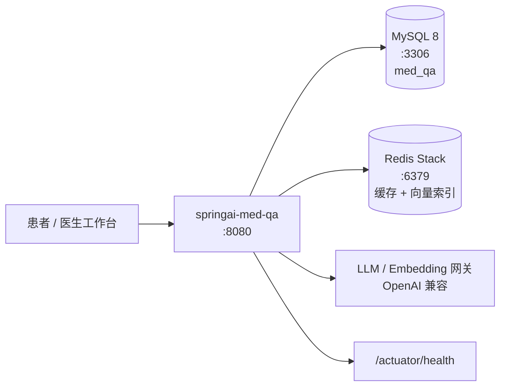

# 部署手册 — springai-med-qa

> 面向运维 / 交付场景的部署与运维说明。快速开始请见仓库根目录 [`README.md`](../README.md)。

---

## 目录

- [1. 部署拓扑与前置条件](#1-部署拓扑与前置条件)
- [2. 获取镜像](#2-获取镜像)
- [3. Docker Compose 全栈部署](#3-docker-compose-全栈部署)
- [4. 独立部署（外部 MySQL / Redis）](#4-独立部署外部-mysql--redis)
- [5. 环境变量全表](#5-环境变量全表)
- [6. 数据库与索引初始化](#6-数据库与索引初始化)
- [7. 健康检查与探针](#7-健康检查与探针)
- [8. 日志与故障排查](#8-日志与故障排查)
- [9. 备份与回滚](#9-备份与回滚)
- [10. 安全加固清单](#10-安全加固清单)
- [11. 容量与调优建议](#11-容量与调优建议)

---

## 1. 部署拓扑与前置条件


```mermaid
flowchart LR
    CLIENT["患者 / 医生工作台"] --> APP["springai-med-qa<br/>:8080"]
    APP --> MYSQL[("MySQL 8<br/>:3306<br/>med_qa")]
    APP --> REDIS[("Redis Stack<br/>:6379<br/>缓存 + 向量索引")]
    APP --> LLM["LLM / Embedding 网关<br/>OpenAI 兼容"]
    APP --> ACT["/actuator/health"]
```

| 组件 | 版本要求 | 用途 |
|---|---|---|
| Docker + Docker Compose | Docker 24+ / Compose v2 | 全栈编排（推荐方式） |
| JDK | 17（运行 jar 部署时） | 应用运行时 |
| MySQL | 8.0.x | 真相源：16 张 `med_message_{0..15}` 分表 + `med_session` + `med_audit_log` |
| Redis | Redis Stack 7.x（**必须带 RediSearch + RedisJSON**） | 会话缓存、Redisson 锁/限流、向量索引 |
| LLM / Embedding 网关 | OpenAI 兼容协议 | 问诊生成与文档向量化 |

> Redis **必须**是 Redis Stack（或挂载 RediSearch/RedisJSON 模块）。普通 Redis 无法创建向量索引，
> `RedisVectorStore` 初始化会失败。

**MySQL 字符集是硬前置条件，不是可选项（D46）**

Flyway V1 的建表语句**刻意不 pin `ENGINE` / `DEFAULT CHARSET`**——同一份脚本还要跑在 H2 的 MySQL 兼容模式
（测试替身）上，所以它只写可移植的列定义。代价是**库的默认字符集必须由部署方保证为 `utf8mb4`**：

- Compose 部署由两处兜住：`docker-compose.yml` 的 `--character-set-server=utf8mb4
  --collation-server=utf8mb4_unicode_ci`，以及 `docker/mysql/init/01-create-db.sql` 建库时的字符集声明。
- **自建 MySQL 若库默认不是 `utf8mb4`，中文病历会静默存成乱码**——不报错、不告警、健康检查全绿，
  只有医生在问诊记录里看到问号。上线前请核对：

  ```sql
  SHOW VARIABLES LIKE 'character_set_server';   -- 期望 utf8mb4
  SHOW CREATE DATABASE med_qa;                  -- 期望 DEFAULT CHARACTER SET utf8mb4
  ```

- 连接串一侧是另一个陷阱：`characterEncoding` 取的是 **Java** 字符集名，必须写 `UTF-8`。
  写成 MySQL 侧的 `utf8mb4` 会让 Hikari 建池时抛 `UnsupportedEncodingException: utf8mb4`，
  服务连不上库（D33 真机冒烟测试抓到，现由 `ShardingRuleConfigTest` / `MedMigrationPropertiesTest` 守住）。

**H2 留在生产 classpath 上是已记录的权衡（D46）**

`pom.xml` 里 H2 的 scope 是 `runtime` 而**不是** `test`：收窄为 `test` 会让 ShardingSphere-JDBC
在启动时找不到驱动类而失败。它只作为测试替身存在，因此：

- **H2 Web Console 在任何配置文件中都没有开启**，`spring.h2.console.*` 在整个仓库里不存在，也不允许开启——
  那是未鉴权的进程内 SQL 控制台，等于把数据库直接暴露给任何能访问该端口的人；
- 这条约束由 `DeploymentPrerequisiteTest` 直接扫描 Spring 自己的配置文件（`src/main/resources` 下的
  `application*.yml` / `application*.yaml` / `application*.properties`）守住，而不是靠"记得别开"——
  它把 YAML 里的嵌套写法与点号写法归一成同一个属性名，所以换个写法也绕不过去。

**端口占用**

| 端口 | 服务 | 说明 |
|---|---|---|
| `8080` | app | HTTP API / Swagger UI / Actuator |
| `3306` | mysql | 仅本地调试建议映射，生产可不暴露 |
| `6379` | redis-stack | Redis 协议 |
| `8001` | redis-stack | RedisInsight UI，生产建议关闭映射 |

---

## 2. 获取镜像

### 2.1 从 GHCR 拉取（推荐生产）

镜像由 `.github/workflows/docker-publish.yml` 在推送 `v*` tag 时自动构建并发布：

```bash
# 按语义化版本拉取
docker pull ghcr.io/xxinjie21/springai-med-qa:v1.0.0

# 或拉取 main 分支最新构建
docker pull ghcr.io/xxinjie21/springai-med-qa:main
```

发布流程（维护者）：

```bash
git tag v1.0.0
git push origin v1.0.0      # 触发 docker-publish → GHCR
```

### 2.2 本地构建

复用 D27 的多阶段 `Dockerfile`（JDK builder → 分层 JRE runtime，非 root `medqa` 用户）：

```bash
docker build -t springai-med-qa:local .
```

分层结构保证代码变更只重建最小的 `application` 层，依赖层命中缓存。

镜像携带 OCI 元数据（`org.opencontainers.image.*`），发布流水线会把版本号、Git revision 与构建时间
通过 `--build-arg` 写入，因此 `docker inspect` 即可确认手上这个镜像来自哪次提交。

### 2.3 真实构建验证（D33）

单测只能解析 `Dockerfile` 文本，不能证明镜像真的能跑起来。仓库提供一键验证脚本：

```bash
scripts/verify-docker-build.sh                 # 默认 tag springai-med-qa:verify
scripts/verify-docker-build.sh my-registry/med-qa:check
```

脚本会执行一次真实 `docker build`，随后逐项断言运行时契约：

| 断言 | 说明 |
|---|---|
| OCI 标签齐全 | `title` / `source` / `licenses` / `revision` 非空 |
| 非 root 运行 | `Config.User` 必须等于 `medqa` |
| 分层布局 | `BOOT-INF/classes/application.yml`、`BOOT-INF/lib/*.jar`、`org/springframework/boot/loader/**` 均存在 |
| 入口类 | entrypoint 使用 Spring Boot 3.x `JarLauncher`，且该 class 真的在镜像里 |
| 启动冒烟 | 真实启动容器一次，要求 Spring Boot 打出启动横幅或失败分析器横幅（不允许出现 `Could not find or load main class`） |

无 Docker 守护或未安装 Docker 时脚本以退出码 `2` 直接跳过，不会阻断流水线；任一项断言失败以退出码 `1` 失败。
启动冒烟的超时可用环境变量 `BOOT_TIMEOUT`（默认 150 秒）覆盖。

> **这条链路第一次跑就抓到过两个真实缺陷**：
> 1. D27 的 `Dockerfile` 只写了 `extract --layers` 而漏了 `--launcher`，于是 `spring-boot-loader/` 层是空的、
>    镜像里根本没有 `JarLauncher`，容器一启动就 `Could not find or load main class`；
> 2. `sharding/med-sharding.yaml` 的 JDBC URL 写了 `characterEncoding=utf8mb4`。`characterEncoding` 要的是
>    **Java** 字符集名，`utf8mb4` 是 MySQL 服务端字符集，Connector/J 会直接抛
>    `UnsupportedEncodingException: utf8mb4`，导致任何环境下都连不上 MySQL。
>
> 两处都只有「真实构建 + 真实启动」才暴露（纯文本断言当时全绿）。现已修复，并分别加了
> `--launcher` 与「characterEncoding 必须是可被 `Charset` 解析的 Java 字符集名」守护断言。

### 2.4 集成测试阶段与「不许静默跳过」开关（D35）

`ci.yml` 现在有两个互相独立的 job：`verify`（离线全量单测 + JaCoCo 门禁）与 `integration`
（真实 MySQL 8.0 + Redis Stack）。上线前若想在本地复现集成阶段：

```bash
# 本机有 Docker：只跑集成测试
./mvnw test -Dtest='com.med.qa.integration.*IntegrationTest' -DfailIfNoTests=true

# 声明 Docker 必需：Docker 不可用时直接失败，而不是报告 skipped
./mvnw test -Dtest='com.med.qa.integration.*IntegrationTest' \
            -DfailIfNoTests=true -Dmed.test.integration.required=true
```

| 开关 | 形式 | 默认 | 说明 |
|---|---|---|---|
| `med.test.integration.required` | JVM 系统属性（优先级高于环境变量） | 未设置 | `true` / `1` / `yes` / `on` 表示 Docker 必需 |
| `MED_TEST_INTEGRATION_REQUIRED` | 环境变量 | 未设置 | CI 集成阶段置为 `true` |

**排障**：集成阶段报 `Docker is required for the Testcontainers integration suite but no usable
daemon is reachable` 说明 runner 上没有可用 Docker，或 Testcontainers 版本低于 1.21.0
（`TestcontainersVersionTest` 守这条下限）。若本机确实没有 Docker，去掉该开关即可退回「可跳过」。

**镜像层缓存**：集成阶段用 `docker save` / `docker load` 归档 `mysql:8.0.36` 与
`redis/redis-stack:7.4.0-v3` 并交给 `actions/cache` 复用；缓存键里写死了这两个 tag。
升级镜像版本时**必须同时改缓存键**，否则会还原出旧镜像——`CiIntegrationStageConfigTest` 会拦住这种漂移。

### 2.5 RAG 标签检索的真实中间件验证（D36）

`MedRagRetrievalIntegrationTest` 复用同一个 `redis/redis-stack:7.4.0-v3` 镜像，把 RAG 链路接到真实
Redis Stack 上：官方 `RedisVectorStore`、它建出来的索引、写进 Redis 的 JSON 文档、官方 store 翻译的
TAG 过滤，以及 `MedDocumentService` / `MedRetrievalService` / `QuestionAnswerAdvisor`。

唯一被替身顶掉的是 Embedding 网关（`DeterministicEmbeddingModel`）：真实 `EmbeddingModel` 要打外部模型
API，测试环境既没有凭据也无法保证可复现。替身只做「文本 → 向量」，相似度计算、Top-K、排序与过滤求值
仍全部发生在 Redis Stack 里。因此**部署到现场时，RAG 检索行为与这条测试验证的是同一套代码路径**，
但索引里的向量由真实网关生成——两者的差异仅在向量数值本身。

> **这条链路第一次接上真实索引（D36）就抓到一个「检索不可用」的缺陷：标识符未转义。**
>
> RediSearch 的 `TAG` 查询语法保留了一批字符（`-`、`.`、`:` 等），而官方
> `RedisFilterExpressionConverter` 把值原样写进查询串。两种症状都实测到了：
>
> | 场景 | 未转义的结果 |
> |---|---|
> | 等值过滤 `tenant_id == tenant-rag-a` | `Syntax error at offset 24 near a`，该科室全部检索失败 |
> | `IN` 过滤 `patient_id IN [patient-rag-1, __shared__]` | **不报错**，但只返回 `__shared__`——患者自己的病历被静默丢弃 |
>
> 第二种更危险：医生拿到的答案只基于科室指南，而系统没有任何异常信号。现场标识符（UUID、`dept-cardio`
> 这类）几乎必然带连字符，也就是说这条路径此前在真实环境里根本不可用。
> 修复方式是 `MedRetrievalFilters.escapeTagValue`：**只转义查询**，索引里仍写原始标识符，
> 兜底校验 `MedRetrievalFilters.matches` 也仍按原始值比对。
>
> 此前所有离线单测的标识符都是 `hosp1` / `p9001` 这类纯字母数字，恰好绕开了全部保留字符，
> 所以纯文本断言一直是绿的。现由 `MedRetrievalFiltersTest` 的转义用例与
> `MedRagRetrievalIntegrationTest` 的连字符标识符共同守住。

### 2.6 检索质量回归基线（D39）

D36 证明 RAG 链路**能**工作，D37/D38 守住索引这一层；D39 守住真正交付的东西——**检索质量**。同一个问题，
昨天能召回的病历今天还在不在、最相关的那条还在不在第一位、范围内不该出现的文档有没有冒出来。这三类变化
都不会让任何探针变红：服务健康、接口 200、索引存在且 TAG Schema 一致。

金标集固定在 `src/test/resources/rag/retrieval-baseline.json`，语料固定在同名集成测试里，两者一起构成
「这个语料 + 这些问题 = 这些答案」的冻结契约。**改动检索路径（索引拓扑、入库元数据、过滤表达式）后必须重跑它**：

```bash
# 需要 Docker（Testcontainers 起真实 Redis Stack）
./mvnw -Dtest=MedRetrievalBaselineIntegrationTest test

# Windows PowerShell：每个 -D 参数都要加双引号
$env:JAVA_HOME="F:\jdk17"; .\mvnw.cmd "-Dtest=MedRetrievalBaselineIntegrationTest" test
```

失败时的排查顺序：

| 失败形态 | 失败摘要里的关键字 | 先看哪里 |
|---|---|---|
| 召回下降 | `recall ... is below the required ...; missing [...]` | 该用例作用域内是否有文档被过滤条件吃掉；确认 `med.rag.vector-store.metadata-fields` 与入库时写入的元数据键一致 |
| 排序变化 | `the best-ranked document is '...' but '...' was expected` | 换过 Embedding 模型或向量算法（`vector-algorithm` / `distance-metric`）都会改变排序；确认是有意为之再更新金标集 |
| 越权泄漏 | `out-of-scope documents were returned: [...]` | **最高优先级**：过滤表达式或索引 TAG 定义出了问题，等价于 D36 的静默丢弃缺陷，先按 §7.1 检查索引健康 |

> 金标集是**数据**，更新它是正常的迭代动作（加问题、加禁止文档、收紧 `minRecall`）；但一次「因为改了检索
> 实现所以顺手改了期望」的更新，必须同时把 `version` 递增，让 CI 历史里能区分「基线推进」与「基线被迁就」。
>
> 集合本身的结构自检（`MedRetrievalBaselineResourceTest`）离线运行，不需要 Docker：它保证用例都能失败、
> 集合不是空转的，以及租户/科室两个隔离维度都有覆盖。

---

## 3. Docker Compose 全栈部署

仓库根 `docker-compose.yml` 定义了 `redis-stack` + `mysql` + `app` 三服务。

```bash
# 1)（可选）准备 .env 覆盖默认口令与模型凭据
cat > .env <<'EOF'
MED_MYSQL_ROOT_PASSWORD=<强口令>
MED_MYSQL_PASSWORD=<应用账号口令>
OPENAI_BASE_URL=https://your-gateway/v1
OPENAI_API_KEY=<密钥>
MED_EMBEDDING_MODEL=text-embedding-3-small
MED_SECURITY_ENABLED=true
MED_RATE_LIMIT_ENABLED=true
EOF

# 2) 拉起全栈（app 会等待 mysql / redis-stack 健康检查通过后才启动）
docker compose up -d

# 3) 查看状态与日志
docker compose ps
docker compose logs -f app

# 4) 验证
curl -fsS http://localhost:8080/actuator/health

# 5) 停止 / 清栈
docker compose down            # 保留数据卷
docker compose down -v         # 连数据卷一起删除（不可恢复）
```

**Compose 关键契约**

| 约定 | 值 |
|---|---|
| compose project name | `springai-med-qa` |
| app 镜像 | 本地构建 `springai-med-qa:local`（生产替换为 GHCR 镜像） |
| app profile | `SPRING_PROFILES_ACTIVE=prod` |
| 依赖顺序 | `app` → `mysql`(service_healthy) + `redis-stack`(service_healthy) |
| 数据卷 | `mysql-data`、`redis-stack-data` |
| 重启策略 | `unless-stopped` |

> 开箱默认值：Compose 内置 `MED_SECURITY_ENABLED=false`、`MED_SECURITY_DEPT_SCOPE_ENABLED=false`、
> `MED_RATE_LIMIT_ENABLED=false`，便于一键体验。**生产必须显式置为 `true` 并挂载真实密钥。**

---

## 4. 独立部署（外部 MySQL / Redis）

不依赖 Compose 时，直接运行 jar 或镜像，通过环境变量指向既有中间件：

```bash
java -jar target/springai-med-qa-0.0.1-SNAPSHOT.jar \
  --spring.profiles.active=prod \
  --server.port=8080
```

或以容器方式：

```bash
docker run -d --name med-qa-app \
  -p 8080:8080 \
  -e SPRING_PROFILES_ACTIVE=prod \
  -e MED_MYSQL_HOST=mysql.internal -e MED_MYSQL_PORT=3306 -e MED_MYSQL_DATABASE=med_qa \
  -e MED_MYSQL_USERNAME=med_qa -e MED_MYSQL_PASSWORD='<pwd>' \
  -e REDIS_HOST=redis.internal -e REDIS_PORT=6379 \
  -e OPENAI_BASE_URL=https://your-gateway/v1 -e OPENAI_API_KEY='<key>' \
  -e MED_SECURITY_ENABLED=true -e MED_RATE_LIMIT_ENABLED=true \
  ghcr.io/xxinjie21/springai-med-qa:v1.0.0
```

Kubernetes 探针可直接使用 Actuator 的探针组（已通过 `management.endpoint.health.probes.enabled` 开启）：

```yaml
readinessProbe:
  httpGet: { path: /actuator/health/readiness, port: 8080 }
  initialDelaySeconds: 30
  periodSeconds: 10
livenessProbe:
  httpGet: { path: /actuator/health/liveness, port: 8080 }
  initialDelaySeconds: 60
  periodSeconds: 15
```

**健康探针的判定口径**

| 端点 | 语义 |
|---|---|
| `/actuator/health` | 聚合状态：MySQL（经 ShardingSphere 数据源执行 `SELECT 1`）与 Redis（`PING`）同时可达才为 `UP` |
| `/actuator/health/liveness` | 进程存活，任一存储不可用时为 `DOWN`（运维可直接看 `redis` / `mysql` 分组件原因；对外 `show-details: never` 不泄露细节） |
| `/actuator/health/readiness` | 同上，用于摘除流量 |
| `/actuator/info` | `components` 版本矩阵：Java / Spring Boot / Spring Framework / Spring AI / ShardingSphere / Redisson / MyBatis / Protobuf，取自 jar manifest，便于现场核对实例版本 |

> 探针只做连通性校验，绝不执行业务 SQL，可安全高频轮询。

---

## 5. 环境变量全表

### 5.1 应用与中间件

| 变量 | 默认 | 说明 |
|---|---|---|
| `SPRING_PROFILES_ACTIVE` | `dev` | 生效 profile，`prod` 为生产调优 |
| `SERVER_PORT` | `8080` | 监听端口 |
| `REDIS_HOST` | `localhost` | 缓存 / 锁 / 限流 / 向量索引共用 |
| `REDIS_PORT` | `6379` | |
| `REDIS_DATABASE` | `0` | |
| `MED_MYSQL_HOST` | `127.0.0.1` | ShardingSphere 数据源主机，同时是 Flyway 迁移目标 |
| `MED_MYSQL_PORT` | `3306` | |
| `MED_MYSQL_DATABASE` | `med_qa` | 由 init 脚本创建 |
| `MED_MYSQL_USERNAME` | `med_qa` | 最小权限应用账号（需有建表权限，迁移要用） |
| `MED_MYSQL_PASSWORD` | `med_qa` | **生产必须覆盖** |
| `MED_MYSQL_ROOT_PASSWORD` | `med_qa_root` | 仅 Compose MySQL 容器使用 |
| `MED_MIGRATION_URL` | 空 | 可选，整串 JDBC URL 覆盖（留空则用上面的 `MED_MYSQL_*` 坐标拼装） |
| `MED_MIGRATION_LOCATIONS` | `classpath:db/migration` | Flyway 迁移脚本位置 |

### 5.2 模型服务

| 变量 | 默认 | 说明 |
|---|---|---|
| `OPENAI_BASE_URL` | `https://api.openai.com` | 兼容任意 OpenAI 协议网关（含院内私有模型服务） |
| `OPENAI_API_KEY` | 空 | **绝不写入仓库**，由环境/密钥管理注入 |
| `OPENAI_EMBEDDINGS_PATH` | `/v1/embeddings` | |
| `MED_EMBEDDING_MODEL` | `text-embedding-3-small` | |
| `MED_EMBEDDING_DIMENSIONS` | `1536` | 必须与索引向量宽度一致，否则装配期 fail-fast |
| `MED_EMBEDDING_MAX_INPUT_TOKENS` | `8191` | 分批嵌入上限 |

### 5.3 安全 / 合规

| 变量 | 默认 | 说明 |
|---|---|---|
| `MED_SECURITY_ENABLED` | `true` | API Key 认证总开关 |
| `MED_SECURITY_REQUIRE_AUTH` | `true` | 缺失密钥时是否拒绝 |
| `MED_SECURITY_DEPT_SCOPE_ENABLED` | `true` | `@RequireDept` 科室权限拦截器 |
| `MED_SECURITY_HEADER` | `X-API-Key` | 认证头，同时决定 Swagger Authorize 头 |
| `MED_RATE_LIMIT_ENABLED` | `true` | 注解式限流开关 |
| `MED_RATE_LIMIT_DEFAULT_RATE` | `10` | 默认令牌数 |
| `MED_RATE_LIMIT_DEFAULT_DURATION` | `1` | 默认窗口（秒） |
| `MED_AUDIT_ENABLED` | `true` | 审计落库；关闭会丢失访问证据，仅限本地 |

### 5.4 存储与会话

| 变量 | 默认 | 说明 |
|---|---|---|
| `MED_CACHE_TTL` | `30m` | 会话缓存 TTL |
| `MED_CACHE_MAX_MESSAGES` | `200` | 缓存窗口消息数（有界缓存，调小只影响缓存，不影响落库轨迹，见 7.6） |
| `MED_CHAT_MAX_MESSAGES` | `20` | 短期记忆窗口：只影响送进模型的消息条数，**不影响落库轨迹**（见 7.6） |
| `MED_CHAT_STREAM_HEARTBEAT` | `15` | SSE 心跳间隔（秒） |
| `MED_CHAT_STREAM_TIMEOUT` | `120` | SSE 超时（秒） |
| `MED_LOCK_WAIT_TIME` | `3s` | 会话锁等待时间 |
| `MED_LOCK_LEASE_TIME` | `0s` | `0` = 看门狗自动续期 |
| `MED_LOCK_WATCHDOG_TIMEOUT` | `30s` | 看门狗超时 |
| `MED_SESSION_DEFAULT_PAGE_SIZE` | `20` | 会话分页默认页大小 |
| `MED_SESSION_MAX_PAGE_SIZE` | `100` | 单页上限 |

### 5.5 RAG

| 变量 | 默认 | 说明 |
|---|---|---|
| `MED_RAG_INDEX_NAME` | `med-doc-index` | RediSearch 索引名 |
| `MED_RAG_KEY_PREFIX` | `med:doc:` | 禁止与 `med:chat:` 命名空间重叠 |
| `MED_RAG_VECTOR_ALGORITHM` | `HNSW` | 小语料可切 `FLAT` 做精确检索 |
| `MED_RAG_INITIALIZE_SCHEMA` | `true` | 启动时建索引 |
| `MED_RAG_TOP_K` / `MED_RAG_MAX_TOP_K` | `4` / `50` | 单次召回上限 |
| `MED_RAG_SIMILARITY_THRESHOLD` | `0.0` | `0` = 接受全部，避免"指南看起来不存在" |
| `MED_RAG_MAX_QUERY_LENGTH` | `1000` | 查询长度上限 |
| `MED_RAG_INGEST_BATCH_SIZE` | `25` | 入库批处理大小 |
| `MED_RAG_INGEST_MAX_CONTENT_LENGTH` | `20000` | 单文档字符上限 |
| `MED_RAG_INGEST_MAX_DOCUMENTS` | `500` | 单次请求文档数上限 |
| `MED_RAG_ADVISOR_ORDER` | `1` | `QuestionAnswerAdvisor` 链序 |
| `MED_RAG_INDEX_ENABLED` | `true` | 向量索引健康探针开关（**非 Redis Stack 部署必须置 `false`**，否则 Pod 会被判为不健康） |
| `MED_RAG_INDEX_CHECK_INTERVAL` / `MED_RAG_INDEX_INITIAL_DELAY` | `5m` / `1m` | 索引探针轮询间隔与启动宽限期 |
| `MED_RAG_INDEX_REBUILD_ENABLED` | `false` | 受控索引重建开关（D38）。**默认关闭**：这是唯一能删除搜索索引的代码路径，需要时再显式打开 |
| `MED_RAG_INDEX_REBUILD_ALLOW_DELETE` | `false` | 是否允许 `DROP_AND_REINGEST`（连已入库文档一起删）。与上一项独立，默认拒绝 |
| `MED_RAG_INDEX_REBUILD_BATCH_SIZE` | `50` | 重建回写批大小；不得超过 `MED_RAG_INGEST_MAX_DOCUMENTS`（矛盾在启动时报错） |
| `MED_RAG_INDEX_REBUILD_MAX_DOCUMENTS` | `5000` | 单次重建语料上限，超出即拒绝（避免误触发全量重嵌入） |
| `MED_RAG_INDEX_REBUILD_LOCK_WAIT` / `..._LOCK_LEASE` | `5s` / `10m` | 重建互斥等待与租约；租约 `0` 表示交给 Redisson 看门狗续期 |

---

## 6. 数据库与索引初始化

| 层次 | 归属 | 内容 |
|---|---|---|
| 数据库 + 账号 | `docker/mysql/init/01-create-db.sql`（Compose 首次启动执行一次，幂等） | 建 `med_qa` 库（utf8mb4）、建 `med_qa@%` / `med_qa@localhost` 账号并授权 |
| 表结构 | Flyway V1–V3（应用启动时执行，**直连物理 MySQL**） | V1：`med_message_{0..15}` 16 张分表；V2：`med_session`；V3：`med_audit_log` |
| 向量索引 | Spring AI `RedisVectorStore`（`initialize-schema=true`） | RediSearch 索引 `med-doc-index`，TAG 字段 `tenant_id` / `dept_id` / `patient_id` |

分片规则见 `src/main/resources/sharding/med-sharding.yaml`：
`med_message` 按 `session_id` 经 `MED_CRC32_MOD` 算法插件路由到 16 张物理表；
`med_session` / `med_audit_log` 走 `!SINGLE` 规则落在同一数据源。

> 独立部署（不用 Compose）时，请自行执行 `docker/mysql/init/01-create-db.sql` 等价语句；
> 表结构无需手工建，Flyway 会迁移。

> **字符集（D46）**：V1 的 DDL 不含 `ENGINE` / `DEFAULT CHARSET`，所以**库的默认字符集必须是
> `utf8mb4`**（见第 1 节）。独立部署时，等价建库语句里也要显式写
> `CHARACTER SET utf8mb4 COLLATE utf8mb4_unicode_ci`，否则中文病历会**静默**乱码——这是
> 「不报错、不告警、健康检查全绿」的一类故障，只能靠上线前核对字符集变量发现。

**迁移为什么直连物理 MySQL，而不是走 `spring.datasource`：** `spring.datasource` 指向的是
ShardingSphere 代理，它把 `med_message_0..15` 这 16 张物理分表**藏起来**只暴露逻辑表
`med_message`；而 V1 迁移脚本要建的正是这 16 张物理表。经代理执行会连续失败两次：
Flyway 先通过代理读 `information_schema` 判断库不存在、于是执行 `CREATE DATABASE`，被 MySQL
以 `1007 Can't create database ... database exists` 拒绝；即便关掉建库，第一条 `CREATE TABLE`
也会以 `Load actual table metadata 'med_message_0' failed` 中断。
因此 Boot 自带的 `FlywayAutoConfiguration` 在 `spring.autoconfigure.exclude` 中被排除，
改由 `config/MedFlywayConfig` 用一套**独立的迁移连接池**（`med.storage.migration.*`，
坐标默认与 `MED_MYSQL_*` 同源）执行迁移；该连接池**刻意不注册为 `DataSource` Bean**——
一旦容器里出现第二个 `DataSource`，MyBatis 的 `@ConditionalOnSingleCandidate(DataSource.class)`
会失去唯一候选，`SqlSessionTemplate` 无法装配，整个上下文启动失败。

- 迁移开关就是 `spring.flyway.enabled`（默认 `true`，离线测试置 `false`）；
- 迁移在上下文刷新期执行，**失败即启动失败**，不会带着未迁移的 schema 对外提供服务；
- 只增不改：回滚到旧版本前请确认旧版本能兼容当前 schema。

> **这条链路第一次真正跑起来（D34）就抓到三个问题**，在此之前它们对构建完全不可见：
> 1. 依赖里只有 `flyway-core`。Flyway 10 把各数据库支持拆成了独立模块，缺 `flyway-mysql`
>    时迁移直接 `FlywayException: Unsupported Database: MySQL 8.0`，服务连不上库；
> 2. 迁移原本走 Boot 自带的 `FlywayAutoConfiguration`，也就是走 ShardingSphere 代理，于是
>    撞上上面的 `1007` / `Load actual table metadata` 两个失败；
> 3. Testcontainers 1.20.6 使用的 Docker API 版本回退值低于当前 Docker Engine 的下限，
>    导致 `DockerAvailableCondition` 判定"本机没有 Docker"，**D30 集成测试整套被静默跳过**——
>    前两个问题正是因此长期藏在"全绿"的构建里。现已把 Testcontainers 升到 1.21.x，
>    并由 `TestcontainersVersionTest` 守住版本下限，防止再次退化成"静默跳过"。
>
> 三处都只有「真实启动 + 真实中间件」才暴露（纯文本断言当时全绿），
> 现由 `MedFlywayConfigTest` 与 `MedProductionStartupIntegrationTest` 覆盖。

---

## 7. 健康检查与探针

| 检查 | 命令 | 期望 |
|---|---|---|
| 应用存活 | `curl -fsS http://localhost:8080/actuator/health` | HTTP 200 |
| Compose 服务状态 | `docker compose ps` | `app` / `mysql` / `redis-stack` 均 `healthy` |
| 向量索引就绪 | `docker exec med-qa-redis-stack redis-cli FT.INFO med-doc-index` | 返回索引信息 |
| 指标暴露 | `curl -fsS http://localhost:8080/actuator/prometheus` | Prometheus 文本格式指标 |
| API 文档 | 浏览器打开 `http://localhost:8080/swagger-ui.html` | 可看到 chat / session / rag 三组 |

Actuator 暴露范围由 `application.yml` 控制：`management.endpoints.web.exposure.include=health,info,prometheus`，
`show-details=never`（不向外部泄露细节）。

> **D40：profile 里的暴露列表是「覆盖」而不是「合并」。** Spring Boot 对 list 属性不做合并——只要
> `application-prod.yml` 重新声明了 `management.endpoints.web.exposure.include`，base 里那一份就被整段替换。
> 而 `Dockerfile`（`ENV SPRING_PROFILES_ACTIVE="prod"`）与 `docker-compose.yml`（`SPRING_PROFILES_ACTIVE: prod`）
> 激活的都是 `prod`，所以**生产环境的暴露列表实际由 `application-prod.yml` 决定**。此前该文件写的是
> `include: health,info`，于是 `/actuator/prometheus` 在生产环境返回 404，Prometheus 抓不到
> `med_qa_alert_total`，`deploy/prometheus/med-qa-alerts.yml` 里**全部**告警规则永不触发——整条可观测性
> 链路静默失效，而服务看起来一切正常。现已修正为 `health,info,prometheus`，并由跨文件契约测试
> `ApplicationProfileContractTest` 守住：它用 Spring Boot 自己的 `YamlPropertySourceLoader` 按 profile
> 优先级合并配置、再用 `Binder` 绑定**实际生效值**，断言「任何 profile 都不得移除 base 已暴露的端点」，
> 同时锁定 profile 集合与镜像/compose 实际激活的 profile，避免断言因 profile 改名而空转。
> 改动任一 profile 文件前请先跑 `mvnw.cmd test "-Dtest=ApplicationProfileContractTest"`。

健康组件（`/actuator/health`，`show-details=never` 时只暴露聚合状态，组件明细需 `show-details: always` 才可见）：

| 组件 | 判定 |
|---|---|
| `med-storage` | `mysql` / `redis` 各自连通性，明细值 `available` |
| `med-vector-index`（D37） | RAG 向量索引的存在性与 TAG 字段一致性，`reason` ∈ `index-missing` / `schema-drift` / `unreachable` |

### 7.1 向量索引健康与 Schema 漂移（D37）

`med-storage` 只回答「Redis 通不通」。**Redis 通 ≠ 检索可用**：索引可以被手工删掉，或因为实例不是
Redis Stack 版而从未建成功；也可以存在、但 TAG 字段与配置漂移（字段改名后旧索引没跟着变）。
两种情况都**不抛异常**——接口照样 200，只是召回变少——所以任何连通性探针都发现不了。

`MedVectorIndexProbe` 通过官方 Jedis 的 `FT.LIST` / `FT.INFO` 读出索引的存在性、文档数、扫描前缀
与 TAG 字段（**只读元数据**，不做任何向量或检索计算），`MedVectorIndexHealthIndicator` 据此给出：

| `reason` | 触发条件 | 现场处置 |
|---|---|---|
| `index-missing` | `FT.LIST` 未报告索引 | 确认 Redis 是 Redis Stack 版；用 `RagAdminController` 重新入库或执行 D38 的重建 |
| `schema-drift` | 索引未声明 `med.rag.index.expected-tag-fields` 中的 TAG 字段 | 比对 `med.rag.vector-store.metadata-fields`，重建索引 |
| `unreachable` | 探针本身抛异常 | 先按 Redis 故障处理，此时索引结论不可信 |

> `med.rag.index.expected-tag-fields`（默认 `tenant_id` / `dept_id` / `patient_id`）必须与
> `med.rag.vector-store.metadata-fields` 中的 `TAG` 项保持一致——探针只能发现「你让它去找」的漂移。
> 只监控、不重建：重建属 D38，探针永远不会写 Redis。

`MedVectorIndexAlertMonitor` 复用 `med.alert.*` 链路推送：降级 `WARNING`（`rag-index-degraded`）、
恢复 `INFO`（`rag-index-recovered`）、探测失败 `CRITICAL`（`rag-index-probe-failed`）。
Prometheus 规则 `MedQaRagIndexDegraded` 消费 `med_qa_alert_total{code="rag-index-degraded"}`。

> **`unreachable` 与另外两种 `reason` 不是同一件事（D43）**：`index-missing` / `schema-drift` 是
> 「探针跑完了，结论是索引需要修」，所以只报 `WARNING`；`unreachable` 是「探针根本没拿到结论」，
> 按 `CRITICAL` 处理并触发 `MedQaRagIndexProbeFailed` 规则。这个分流必须做在
> `MedVectorIndexHealthIndicator` 里——`AbstractHealthIndicator#health()` 是 `final` 且把异常吞成
> 普通 `DOWN`，调用方无法用 `try/catch` 区分「探针挂了」与「索引坏了」。详见 §7.5。

### 7.2 索引重建（D38）

D37 只监控、不重建；D38 补上受控的修复动作。`MedVectorIndexRebuilder` 把「删索引 → 按当前配置重建 → 回写语料
→ 校验」变成一次带分布式互斥、带验收、带报告的操作，全部复用官方组件：

| 步骤 | 复用组件 |
|---|---|
| 互斥 | Redisson `RLock`，键 `med:lock:rag:index:rebuild:{index}` |
| 删除 | 官方 Jedis `FT.DROPINDEX`（保留文档）或 `FT.DROPINDEX … DD`（连文档一起删） |
| 重建 Schema | `RedisVectorStore#afterPropertiesSet()`，即官方生命周期钩子，由 `med.rag.vector-store.*` 发 `FT.CREATE` |
| 回写 | `MedDocumentService.ingestAll`（普通入库路径，Embedding 与 TAG 打标一致） |
| 验收 | `MedVectorIndexProbe`：重建成功的判据与 `/actuator/health` 相同 |

两种模式：

| 模式 | 动作 | 用途 / 风险 |
|---|---|---|
| `INDEX_ONLY`（默认） | 删索引、**保留文档** | 修复 Schema 漂移。重建时 RediSearch 会重新索引前缀下已存在的 JSON 文档，因此**不丢文档、不调 Embedding** |
| `DROP_AND_REINGEST` | 删索引 + 删文档，再回写调用方给的语料 | 语料损坏/替换。**破坏性**，需要 `MED_RAG_INDEX_REBUILD_ALLOW_DELETE=true`，否则请求在接触 Redis 之前就被拒绝 |

```bash
# 打开重建能力（默认关闭）
MED_RAG_INDEX_REBUILD_ENABLED=true
# 仅在确实要整体替换语料时才打开第二把钥匙
MED_RAG_INDEX_REBUILD_ALLOW_DELETE=false
# 批大小不得超过 MED_RAG_INGEST_MAX_DOCUMENTS（默认 50 vs 500），矛盾会在启动时直接失败
MED_RAG_INDEX_REBUILD_BATCH_SIZE=50
# 单次重建语料上限与互斥等待/租约
MED_RAG_INDEX_REBUILD_MAX_DOCUMENTS=5000
MED_RAG_INDEX_REBUILD_LOCK_WAIT=5s
MED_RAG_INDEX_REBUILD_LOCK_LEASE=10m
```

现场处置（对应 `MedVectorIndexHealthIndicator` 的三种 `reason`）：

| `reason` | 动作 |
|---|---|
| `index-missing` | 先确认 Redis 是 Redis Stack 版；再以 `INDEX_ONLY` 重建（索引不存在时它就是「建索引」，不会删除任何东西） |
| `schema-drift` | 用 `INDEX_ONLY` 重建：删掉旧索引、按当前 `med.rag.vector-store.metadata-fields` 重新 `FT.CREATE`，已入库文档会被自动重新索引，**无需重新入库** |
| `unreachable` | 按 Redis 故障处理；此时不要重建（连不上就无法加锁，重建会直接以 `failed` 收尾） |

结果与告警：

- `MedIndexRebuildReport.outcome` ∈ `completed` / `verification-failed` / `failed` / `skipped-lock-held` / `refused`，
  并带 `documentsBefore → documentsAfter`、回写条数、批次数与耗时；
- 告警码：`rag-index-rebuild-completed`（INFO）、`rag-index-rebuild-skipped`（WARNING，含被拒绝）、
  `rag-index-rebuild-failed`（CRITICAL）；
- Prometheus 规则 `MedQaRagIndexRebuildFailed`（`severity: critical`）：重建失败可能让索引消失或为空，
  比它要修的漂移更糟，因此直接呼叫值班；
- 进度：每个阶段与每个批次发布一个 `MedIndexRebuildProgress` 快照（`currentProgress()`），
  只含计数与阶段名，可安全打日志。

> **重建不经 HTTP 暴露**：回写语料需要语料本身，而语料不在本服务库里（文档只存在于向量索引中）。
> 触发方式由调用方决定；同时这也避免了在 `RagAdminController` 的授权边界修复前扩大攻击面。
> **重建前请先确认 `med.rag.vector-store.initialize-schema=true`**：置 `false` 时没有任何东西会在删除后
> 重建索引，该组合会在启动时直接失败，而不是等到重建时才报错。

### 7.3 告警链路（D33）

Actuator 只能回答「有人来问」时的健康状态。`com.med.qa.alert` 补上了推送侧：

```
MedStorageAlertMonitor（@Scheduled 轮询既有 MedStorageHealthIndicator）
MedVectorIndexAlertMonitor（@Scheduled 轮询 MedVectorIndexHealthIndicator，D37）
        └─> MedAlertNotifier（策略过滤 + Redisson TTL Map 去重）
                ├─> LoggingMedAlertSink   → 应用日志（key=value 结构化行）
                └─> MetricsMedAlertSink   → med_qa_alert_total（Micrometer）
```

- **策略**：`med.alert.*`（开关、轮询间隔、冷却窗口、最低级别、静音码），全部可在 `.env` 覆盖；
- **去重**：以 `code:component` 为指纹写入 `med:alert:dedupe`（Redisson `RMapCache`，TTL = cooldown），
  多副本共享同一个抑制窗口，一次故障只响一次。**指纹在「至少一个 sink 接收成功」之后才写**（D43，
  见 §7.5）——先写再投会把「可能失败的投递」标成已送达；
- **失败开放**：去重存储不可达时**照常派发**——因为 Redis 挂掉本身就是需要告警的场景；
- **恢复通知**：组件恢复会补一条 `INFO`（`storage-recovered` / `rag-index-recovered`），
  避免「还在坏」与「早已恢复」无法区分。

### 7.4 监控栈（可选）

`docker-compose.yml` 中 Prometheus 与 Alertmanager 位于 `observability` profile，默认**不启动**：

```bash
docker compose --profile observability up -d
# Prometheus  UI: http://localhost:9090   （Targets / Rules / Alerts）
# Alertmanager UI: http://localhost:9093
```

| 文件 | 作用 |
|---|---|
| `deploy/prometheus/prometheus.yml` | 抓取 `app:8080/actuator/prometheus`，15s 间隔，加载规则并指向 Alertmanager |
| `deploy/prometheus/med-qa-alerts.yml` | 规则：`MedQaTargetDown` / `MedQaStorageUnavailable` / `MedQaStorageProbeFailed` / `MedQaRagIndexDegraded` / `MedQaRagIndexProbeFailed` / `MedQaRagIndexRebuildFailed` / `MedQaAlertStorm` / `MedQaHighServerErrorRate` / `MedQaConsultationLatencyHigh` / `MedQaRateLimitStorm` |
| `deploy/alertmanager/alertmanager.yml` | 按 `alertname` + `component` 分组；`critical` 走独立接收器与更短的重复间隔；抑制规则避免「整体不可达」时重复刷屏 |

> **必须替换**：`alertmanager.yml` 中的 `webhook_configs.url` 是占位地址（Alertmanager 不支持在配置里
> 展开环境变量）。接入企业微信 / 钉钉 / PagerDuty 时改成真实中继地址即可；未替换前告警仍可在
> Alertmanager UI 看到，只是不会推到手机上。

自定义应用指标：`med_qa_alert_total{severity,code,component}`（计数器）与
`med_qa_alert_last_epoch_seconds`（最近一次告警时间戳，可用于 dead-man's-switch 规则）。

### 7.5 告警投递顺序与探测失败信号（D43）

告警链路有两处「注释承诺的行为与代码实际行为相反」的缺陷，共同点是**不会让任何测试变红**，
只会让告警在最需要它的时刻消失。两处都在 D43 收敛：

| 缺陷 | 现场表现 | 修法与排查方式 |
|---|---|---|
| 先写冷却指纹、再投递（P1-5） | `MedAlertNotifier` 原先用 `putIfAbsent` 的返回值同时回答「之前投过吗」与「现在就占位」。所有 sink 同时失败时（日志卷满、指标采集器不可达），指纹已经落进 `med:alert:dedupe`，该告警在**整个冷却窗口内被静默丢弃**——恰恰是告警最该出现的场景 | 判定改为**只读**（`RMapCache#containsKey`，Redisson 在 Lua 里一并判断条目 TTL），指纹只在 `dispatch` 返回「至少一个 sink 接受」**之后**才写。现场排查：如果某个故障持续存在却只在日志里出现过一次，先用 `redis-cli --scan --pattern 'med:alert:dedupe*'` 看指纹是否被提前写入 |
| `INDEX_PROBE_FAILED` 分支不可达（P1-6） | `AbstractHealthIndicator#health()` 是 `final` 且把异常吞成 `DOWN`，所以「用 `try/catch` 包住 `health()`」在生产路径上永不触发。Redis 全挂时监控只报 `WARNING` 的 `rag-index-degraded`，与「索引可修复」共用同一级别，**关键故障被降级成普通告警** | 把「探测本身失败」做成**显式信号**：`reason=unreachable` 由 `MedVectorIndexHealthIndicator` 自己写入（它包住了 `probe()` 调用），`MedVectorIndexAlertMonitor.isProbeFailure` 读该 `reason` 分流。现场排查：`curl -s localhost:8080/actuator/health \| jq '.components."med-vector-index".details.reason'` —— `unreachable` 按 Redis 故障处理，`index-missing` / `schema-drift` 按索引修复处理 |

对应的 Prometheus 规则：`rag-index-degraded` → `MedQaRagIndexDegraded`（warning），
`rag-index-probe-failed` → `MedQaRagIndexProbeFailed`（critical）。两者必须是两条规则，
否则「Redis 全挂」会被合并进「索引漂移」的告警里。

跨组件契约由 `AlertDeliveryContractTest` 守住（真实探针 → 健康组件 → 监控 → 通知器 → sink 整条链），
断言 Redis 不可达时出来的是 `CRITICAL` 的 `rag-index-probe-failed`、索引只是缺失时仍是 `WARNING`、
以及「全部 sink 失败 → 指纹未写 → 下一次轮询重新告警」。按项目惯例这条守卫**先被亲眼看过它变红**：
还原两处缺陷后共 6 个用例失败（3 个测试类）。

### 7.6 会话轨迹的持久化契约（D44）

三层存储各管一段，**不要把它们混为一谈**：

| 层 | 保存什么 | 边界 | 调优变量 |
|---|---|---|---|
| MySQL `med_message_{crc32(session_id)%16}` | **完整病历轨迹**，每轮只增不删 | 无上限 | — |
| Redis `med:chat:{tenant}:{dept}:{session}` | 最近一段消息（未命中回源 MySQL） | `MED_CACHE_MAX_MESSAGES` | `MED_CACHE_TTL` / `MED_CACHE_MAX_MESSAGES` |
| `MessageWindowChatMemory` | 送进模型的最近消息 | `MED_CHAT_MAX_MESSAGES` | `MED_CHAT_MAX_MESSAGES` |

**`MED_CHAT_MAX_MESSAGES` 只影响送进模型的消息条数，不影响落库轨迹。** D1–D43 的写路径是
「先 `deleteSession` 再 `appendAll`」，而 Spring AI 的 `saveAll` 交进来的正是裁剪后的窗口，于是每写
一轮都会把窗口外的历史消息物理删除——一场几十轮的会诊在库里只剩最后 20 条。D44 改为
`insertIfAbsent`（`INSERT … ON DUPLICATE KEY UPDATE message_id = message_id`）的幂等追加，
`MedChatMemoryRepository.saveWindow` 不再有任何删除路径，写完后把该窗口发布到 Redis 缓存；
冷缓存回源时按 `MED_CACHE_MAX_MESSAGES` 截断，避免完整轨迹被整段灌进模型 prompt。

运维含义：

- 调小 `MED_CHAT_MAX_MESSAGES` 只会让模型少看几轮上下文，**不会**删数据；调小
  `MED_CACHE_MAX_MESSAGES` 只会让缓存窗口变窄，读未命中时回源 MySQL。
- 写路径由 `med:lock:chat:{tenant}:{dept}:{session}` 串行化，并发轮次会以 `SESSION_LOCKED`
  （业务码 `40900`）快速失败；看到该码说明同一会话真的在被并发写入，而不是数据损坏。
- **患者归属来自会话**：`med_message.patient_id` 是 `NOT NULL`，而 Spring AI 的消息不带任何项目身份
  （患者 id 不在会话 id 里，助手消息由框架构造），所以桥接层写入前会用会话行解析患者；会话不存在或
  没有患者时以 `STORAGE_ERROR` 拒绝写入。**排查**：若日志出现
  `Column 'patient_id' cannot be null` 或 `does not exist, so its messages cannot be attributed`，
  说明写入的会话在 `med_session` 里查不到——先确认会话是否真的创建过、是否被清理过。
- 全量轨迹核查（绕开 ShardingSphere，直接看物理分表）：

  ```bash
  # 按会话统计真实行数：分片 = crc32(session_id) % 16
  docker compose exec mysql mysql -umed_qa -pmed_qa med_qa \
    -e "SELECT COUNT(*) FROM med_message_7 WHERE session_id='<sessionId>';"
  ```

  若该计数小于医生实际看到的轮数，说明有人在 D44 之前删过数据（历史行为），新写入不再有此问题。
- 跨组件契约：`ChatMemoryWindowIntegrationTest`（离线，窗口 2 条 vs 轨迹 5 条）与
  `MedStorageAndLockIntegrationTest#memoryWindowTrimsButTranscriptKeepsEveryTurn`（真实 MySQL +
  Redis Stack，窗口 4 条 vs 分表 10 行）。
- **口径与代码注释同源（D46）**：这三层的行为写在三个类的 javadoc 里，改行为时请一并改注释——
  `MedChatMemoryRepository`（`findAll` 返回的是有界窗口、`reload` 是全仓库唯一返回完整轨迹的读）、
  `RedisMessageCache#windowSize()`（读路径回源时的截断上界）、
  `MedCacheProperties`（`med.cache.max-messages` 只约束缓存，不约束轨迹）。
  `reload` 虽然返回全量，但它回填的缓存仍会被原生 `LTRIM` 裁到窗口内；
  而 **`MED_CACHE_MAX_MESSAGES=0` 会同时解除缓存截断与回源截断**，等于把整段历史交给模型 prompt——
  这是运维风险，不是常规调优项。

### 7.7 隔离标签不进入向量文本（D45）

`spring.ai.openai.embedding.metadata-mode` 必须是 **`NONE`**，这不是调优项而是硬要求：

- Spring AI 1.0.0 的 `OpenAiEmbeddingModel.embed(Document)` 先按该模式格式化文档
  （`Document#getFormattedContent(MetadataMode)`），而 `DefaultContentFormatter` 把 `EMBED` 解释为
  「**全部元数据键** 减去 `excludedEmbedMetadataKeys`」。也就是说 `EMBED` 会把 `tenant_id` /
  `dept_id` / `patient_id` 拼进送进 embedding 接口的文本——相似度被标签污染，隔离标签本身也被写进向量。
- `EMBED` 还是 Spring AI 自己 `OpenAiEmbeddingProperties.metadataMode` 字段的**默认值**。所以
  **「这个键没配」不等于安全**：把配置项清空或删掉，行为会退回 `EMBED`。代码侧的回落值
  （`EmbeddingModelConfig.SAFE_METADATA_MODE`）同样收敛为 `NONE`，使「没配」fail-safe。
- 该键**刻意不做成环境变量**：部署方不应该有能力把隔离标签重新塞回向量里。
- 关掉 `EMBED` **不影响过滤**：标签仍然留在文档的 JSON 值里，RediSearch 仍按
  `med.rag.vector-store.metadata-fields` 把三个标签索引成 `TAG` 字段，`med.rag.index.expected-tag-fields`
  仍与之一致（否则 D37 的探针会把重建好的索引误报为 `schema-drift`）。

运维含义：

- **不要**为了「提升检索质量」把它调回 `EMBED`。若真的怀疑检索质量下降，用 D39 的金标集
  （`MedRetrievalBaseline*`）量化，而不是动这个开关——调回 `EMBED` 只会让相似度被标签污染，
  并且把科室/患者标识写进向量库。
- 排查命令（`/actuator/env` 刻意未暴露，因此直接读镜像里的配置）：

  ```bash
  docker compose exec app sh -c "grep -A2 'metadata-mode' /app/BOOT-INF/classes/application.yml"
  ```

  输出应为 `metadata-mode: NONE`；若为 `EMBED` 或该键缺失，说明镜像里的配置被改过或退回框架默认值。
- 跨组件契约：`EmbeddingMetadataContractTest` 用 `YamlPropertySourceLoader` + `Binder` 绑定**实际生效值**
  （逐 profile 叠加），并用真实的 Spring AI formatter 演示同一个 `Document` 在 `NONE` 与 `EMBED` 下
  嵌入文本的差别，同时断言守卫会拒绝 `EMBED` 与「属性缺失」两种情形。

---

## 8. 日志与故障排查

```bash
docker compose logs -f app            # 应用日志
docker compose logs -f mysql redis-stack
```

| 现象 | 原因 | 处理 |
|---|---|---|
| `app` 反复重启，`/actuator/health` 不通 | MySQL / Redis 未就绪或凭据错误 | 查 `MED_MYSQL_*` / `REDIS_*`，确认 `docker compose ps` 两个依赖 healthy |
| 启动报向量索引创建失败 | Redis 不是 Stack（缺 RediSearch） | 换成 `redis/redis-stack` 镜像或加载模块 |
| 启动报维度不匹配 | `MED_EMBEDDING_DIMENSIONS` 与已有索引宽度不一致 | 对齐维度后重建索引（删索引 → 重新入库） |
| 全部请求 401 | `MED_SECURITY_ENABLED=true` 但未配置 API Key | 关闭开关（仅本地）或注入密钥映射 |
| 请求 403 | 患者跨会话 / 跨科室访问 | 预期行为，检查 `patient_id` / `dept_id` 归属 |
| 返回 `40900` | 并发写入同一会话，Redisson 锁未获取 | 客户端重试；或调大 `MED_LOCK_WAIT_TIME` |
| 返回 `42900` | 触发限流 | 调整 `MED_RATE_LIMIT_DEFAULT_RATE` / `DURATION` |
| 返回 `50201` | LLM / Embedding 网关不可达 | 检查 `OPENAI_BASE_URL` / `OPENAI_API_KEY` 与网络 |
| 返回 `50301` | MySQL / Redis 故障 | 检查中间件连通性与连接池 |
| SSE 连接中途断开 | 超过 `MED_CHAT_STREAM_TIMEOUT` 或网络中断 | 调大超时；客户端实现重连 |

---

## 9. 备份与回滚

**备份**

```bash
# MySQL 逻辑备份（含 16 张分表 + 会话 + 审计）
docker exec med-qa-mysql mysqldump -uroot -p"$MED_MYSQL_ROOT_PASSWORD" \
  --single-transaction --routines --triggers med_qa > med_qa_$(date +%F).sql

# Redis 持久化（已在 compose 中开启 AOF：--appendonly yes --save 60 1000）
docker compose exec redis-stack redis-cli BGSAVE
```

**回滚**

```bash
# 1) 回退镜像版本
docker compose down
# 修改 .env / compose 中 app 的 image 标签为上一个版本
docker compose up -d

# 2) 若迁移不兼容，先恢复数据
docker compose exec -T mysql mysql -uroot -p"$MED_MYSQL_ROOT_PASSWORD" med_qa < med_qa_<date>.sql
```

> Flyway 迁移只增不改；回滚到旧版本前请确认旧版本能兼容当前 schema。

---

## 10. 安全加固清单

- [ ] `MED_SECURITY_ENABLED=true` 并注入真实 API Key 映射（绝不写进仓库或镜像层）
- [ ] `MED_SECURITY_DEPT_SCOPE_ENABLED=true`（科室越权 403 由拦截器直接写出，不经异常处理器）
- [ ] `MED_RATE_LIMIT_ENABLED=true`，按科室/患者维度设置合理阈值
- [ ] `MED_AUDIT_ENABLED=true`，审计表保留周期符合院内合规要求
- [ ] 修改 Compose 默认口令（`MED_MYSQL_ROOT_PASSWORD` / `MED_MYSQL_PASSWORD`）
- [ ] 生产不映射 `8001`（RedisInsight）与 `3306`（MySQL）到公网
- [ ] 镜像以非 root `medqa` 用户运行（Dockerfile 已固定）
- [ ] 敏感字段经 `@Desensitize` 输出；审计与日志只记录标识符，不记录问诊文本
- [ ] LLM / Embedding 出网走院内网关，密钥由密钥管理系统注入
- [ ] 客户端不要依赖请求体里的身份字段：`/api/chat/stream` 的 tenant/dept/patientId 只是**一致性声明**，与 API Key 不一致即 403（D41，见 10.1）
- [ ] 运维脚本不要用「按 documentId 删除」的旧姿势：`/api/rag/documents/delete` 已**只支持按隔离 scope 删除**，且部门级删除必须显式带 `confirmDepartmentWide=true`（D42，见 10.2）
- [ ] **不开启 H2 Web Console**（`spring.h2.console.*` 不得出现在任何配置文件中）；H2 只是 `runtime` scope 的测试替身，收窄为 `test` 会让 ShardingSphere 启动失败（D46，见第 1 节）
- [ ] **MySQL 库默认字符集为 `utf8mb4`**，并在上线前用 `SHOW CREATE DATABASE med_qa` 核对；连接串 `characterEncoding` 必须写 Java 字符集名 `UTF-8`（D46，见第 1 节）

### 10.1 流式问诊的身份来源与拒绝语义（D41）

**排障第一原则：`/api/chat/stream` 的身份只来自 API Key。** 请求体里的 `tenant` / `dept` /
`patientId` 是可选的**一致性声明**，`RequestIdentityGuard` 只做校验、不提供授权。因此：

| 现场现象 | 真实原因 | 处置 |
|---|---|---|
| 同一份 JSON 昨天能用、今天 403 `tenant mismatch` | 客户端换过 Key，或 Key 的 tenant 与请求体写的不一致 | 对比 `MedPrincipal`（Key 映射）与请求体；让客户端**删掉**请求体身份字段即可彻底避免 |
| 403 `department mismatch` | 请求体的 dept 不是该 Key 所属科室（跨科室） | 同上；注意患者与医生 Key 都绑定单一科室 |
| 403 `patient mismatch` | 请求体 patientId 不是该患者自己的 | 患者端不要传 patientId，身份由 Key 决定 |
| 403 `authentication required` | 没带 `X-API-Key`，或 `MED_SECURITY_REQUIRE_AUTH` 下缺失 | 见 5.3；注意 `MED_SECURITY_ENABLED=false` 会让 principal 为空，**此时流式端点会一律 403**，只适用于本地开发 |
| 404 | 会话在该 tenant/dept 下不存在（跨科室的会话一律按「不存在」回答，不确认它存在别处） | 核对 `med_session` 与 sessionId |
| 400 | `session` / `message` 缺失；或会话已 CLOSED / ARCHIVED（`requireWritableSession`） | 归档会话需要新开一个 session |
| 503 + `50201` | 没有可用模型（`spring.ai.model.chat` 未启用或没有 API Key） | 见 5.2 |
| 请求体只带 session/message 也成功 | **这是设计**：身份完全来自 principal | 无需修改客户端 |

> **D41 的真实收获**：写上面这张表时，跨组件契约测试当场查出「模型未配置」的现场表现与文档不符——
> Spring AI 的 `ChatClient.Builder` bean 带一个**必需**的 `ChatModel` 参数，`ObjectProvider.getIfAvailable()`
> **不会吞掉实例化失败**，于是未配模型的部署拿到的是 bean 创建栈 + `500`，而不是 `503 + 50201`。
> 代码已修（把 `BeansException` 与「返回 null」折叠成同一个 `LLM_SERVICE_ERROR`）。
> 提示：本机没有模型时的启动/探活**不会**报错——builder 是 prototype bean，只有第一个流式请求才触发，
> 所以这类问题只会在上线后第一次问诊时暴露。

拒绝一律发生在 SSE 打开之前，返回对应 HTTP 状态 + 单个 `error` 事件（`<code> <message>`），
不会留下半开连接。这些错误**不经过全局异常处理器**——`text/event-stream` 渲染不了它的 JSON 信封，
放过去只会变成语义不明的协商错误。

排查顺序（与代码一致）：身份解析 → `PatientAccessGuard.assertScope` → `requireWritableSession` →
模型可用性。**授权先于能力**，任何一步失败都不会产生 LLM 调用，所以日志里看不到模型侧痕迹时，
问题一定在前面三步。跨组件契约由 `StreamingIdentityContractTest` 守住（真实 API Key 链路上验证
「声明他人身份被拒」与「声明缺省时到达会话层的是 principal 的坐标」）。

---

### 10.2 RAG 管理端的授权与删除语义（D42）

**排障第一原则：`/api/rag/**` 的 tenant / dept / patient 也只来自 API Key。** 请求体里的
`tenantId` / `deptId` / `patientId` 是可选的**一致性声明**，由同一个 `RequestIdentityGuard` 校验；
**判定以业务码为准**——拦截器写出的拒绝是真实 HTTP `403`，处理器内部抛出的 `BizException` 按项目
统一约定返回 HTTP `200` + 业务码 `40300` / `40000`。

| 现场现象 | 真实原因 | 处置 |
|---|---|---|
| HTTP 200 但 `code=40300`、`message=department mismatch` | 请求体写的 `deptId` 不是该 Key 所属科室 | 对比 Key 映射与请求体；让调用方**删掉**请求体里的身份字段即可彻底避免 |
| HTTP 200 但 `code=40300`、`message=tenant mismatch` | 请求体写的 `tenantId` 不是该 Key 的租户 | 同上 |
| HTTP 403（拦截器直接写出，非 `ApiResult` 信封） | 用的是 PATIENT Key，或请求**信封**里带了 `deptId` 参数/头 | `/api/rag/**` 仅 STAFF；身份字段请放 body，别放 query/header |
| HTTP 200 但 `code=40000`、`message=deleting the whole department scope ...` | 删除请求没写 `patientId` 又没确认 | 补 `"confirmDepartmentWide": true`，或改成按患者删除 |
| 传了 `ids` 却什么都没删 | **按 id 删除已下线**（D42）：`ids` 不再是已知字段，Jackson 忽略它，请求退化成「未确认的部门级删除」而被拒 | 改用 scope 删除；需要精确删除单个文档时，先删该患者/科室 scope 再重新入库 |
| 删除后该科室问诊「指南不见了」 | 部门级删除会连**共享指南**一起删掉（这是设计） | 重新入库共享指南，或改用按患者删除 |
| `MED_SECURITY_ENABLED=false` 下所有 `/api/rag/**` 都拒绝 | principal 为空，守卫 fail closed | 本地开发才可关闭安全；见 5.3 |

**为什么按 id 删除被移除**（这是 D42 的核心）：向量库用文档 id 作 Redis key、隔离标签存在 JSON
值里、RediSearch **不索引 key**，因此「这批 id **且** 属于我的 scope」无法表达成一个过滤表达式；
而无 scope 谓词的 `VectorStore#delete(List<String>)` 永远做不成 scope 安全——改动前任何 STAFF Key
只要猜到一个 documentId，就能物理删除别的科室的向量。所以 `MedDocumentService` 里这个原语被**删除**
而不是加守卫，并有反射守护测试（`MedDocumentServiceDeleteTest$NoIdBasedDeletion`）钉住「它不存在」。
将来若真需要精确删除，正确做法是把文档 id 作为一个 TAG 元数据字段**显式纳入索引 schema**，
而不是绕过隔离模型。

跨组件契约由 `RagAdminAuthorizationContractTest` 守住（真实 API Key → 拦截器 → 控制器 → 守卫 → 服务）。
按项目惯例，这条守卫先被亲眼看过变红：把 scope 改回「body 优先」后，两个测试类共 12 个用例失败。

---

## 11. 容量与调优建议

| 维度 | 建议 |
|---|---|
| JVM | 容器内已设 `MaxRAMPercentage=75.0` + `ExitOnOutOfMemoryError`，按 cgroup 限制自动伸缩 |
| MySQL 连接池 | `sharding/med-sharding.yaml`：`minimumIdle=4` / `maximumPoolSize=32`，按并发问诊量调整 |
| Redis 缓存窗口 | `MED_CACHE_MAX_MESSAGES` 控制单会话缓存条数；读 miss 会自动回源 MySQL 并回填。**置 `0` 会同时解除缓存与回源截断**，等于把整段历史交给模型 prompt（D46，见 7.6） |
| 会话锁 | `MED_LOCK_LEASE_TIME=0`（看门狗）适配慢 LLM 往返；崩溃节点最迟 `MED_LOCK_WATCHDOG_TIMEOUT` 释放 |
| 向量检索 | 语量小可切 `MED_RAG_VECTOR_ALGORITHM=FLAT` 做精确检索；量大保持 `HNSW` |
| 限流 | 默认 10 次/秒/调用方；可按接口用 `@RateLimit(rate=..., durationSeconds=...)` 细调 |
| 水平扩容 | 应用无状态（会话与锁在 Redis、数据在 MySQL），可直接多副本 + 负载均衡 |

---

**相关文档**：[README（总览与快速开始）](../README.md) ｜ [ROADMAP（迭代路线）](../ROADMAP.md)
